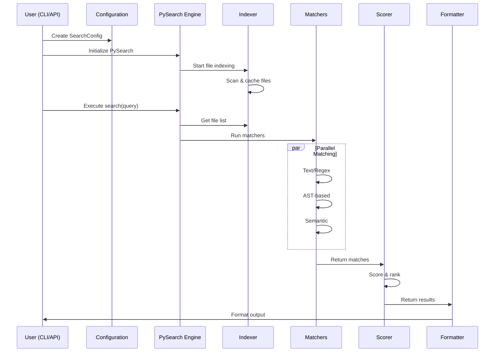

# CLAUDE.md

This file provides guidance to Claude Code (claude.ai/code) when working with code in this repository.

---

## Change Log (Changelog)

### 2026-01-19 - AI Context Documentation System Initial Version
- Generated comprehensive AI context documentation system
- Created module-level CLAUDE.md files for all major components
- Added Mermaid architecture diagrams for visual project understanding
- Established `.claude/index.json` for tracking coverage and gaps

---

## Project Vision

**PySearch** is a high-performance, context-aware search engine for Python codebases that provides engineering-grade retrieval capabilities through multiple search modes (text/regex/AST/semantic), intelligent caching, and extensible architecture.

### Core Goals
- **Performance**: Optimized for large multi-module projects with parallel processing
- **Flexibility**: Multiple search strategies from simple text to advanced semantic analysis
- **Developer Experience**: Both CLI and Python API interfaces
- **Extensibility**: Plugin-ready architecture for custom matchers and integrations

---

## Architecture Overview

### Module Structure Diagram

```mermaid
graph TD
    Root["(root) pysearch"] --> CLI["cli"];
    Root --> Core["core"];
    Root --> Indexing["indexing"];
    Root --> Search["search"];
    Root --> Analysis["analysis"];
    Root --> Utils["utils"];
    Root --> Storage["storage"];
    Root --> Integrations["integrations"];
    Root --> MCP["mcp"];

    Indexing --> Advanced["indexing/advanced"];
    Indexing --> Cache["indexing/cache"];
    Indexing --> Metadata["indexing/metadata"];
    Indexing --> Indexes["indexing/indexes"];

    Core --> Types["core/types"];
    Core --> History["core/history"];
    Core --> CoreIntegrations["core/integrations"];

    Analysis --> GraphRAG["analysis/graphrag"];

    click CLI "./src/pysearch/cli/CLAUDE.md" "View CLI Module Documentation"
    click Core "./src/pysearch/core/CLAUDE.md" "View Core Module Documentation"
    click Indexing "./src/pysearch/indexing/CLAUDE.md" "View Indexing Module Documentation"
    click Search "./src/pysearch/search/CLAUDE.md" "View Search Module Documentation"
    click Analysis "./src/pysearch/analysis/CLAUDE.md" "View Analysis Module Documentation"
    click Utils "./src/pysearch/utils/CLAUDE.md" "View Utils Module Documentation"
    click Storage "./src/pysearch/storage/CLAUDE.md" "View Storage Module Documentation"
    click Integrations "./src/pysearch/integrations/CLAUDE.md" "View Integrations Module Documentation"
    click MCP "./mcp/CLAUDE.md" "View MCP Module Documentation"
```



### Core Components

| Module | Path | Responsibility | Key Classes |
|--------|------|----------------|-------------|
| **Core** | `src/pysearch/core/` | Main API, configuration, types | `PySearch`, `SearchConfig`, `Query` |
| **Indexing** | `src/pysearch/indexing/` | File scanning, caching, metadata | `Indexer`, `CacheManager`, `MetadataIndexer` |
| **Search** | `src/pysearch/search/` | Pattern matching algorithms | `TextMatcher`, `ASTMatcher`, `SemanticMatcher` |
| **Analysis** | `src/pysearch/analysis/` | Code analysis, language detection | `DependencyAnalyzer`, `LanguageDetector` |
| **CLI** | `src/pysearch/cli/` | Command-line interface | `main()` entry point |
| **Utils** | `src/pysearch/utils/` | Utilities, error handling, logging | `ErrorCollector`, `Formatter`, `FileWatcher` |
| **Storage** | `src/pysearch/storage/` | Vector database integration | `QdrantClient`, `VectorStore` |
| **Integrations** | `src/pysearch/integrations/` | External system integrations | `MultiRepoEngine`, `DistributedIndexing` |
| **MCP** | `mcp/` | Model Context Protocol servers | `BasicMCPServer`, `FastMCPServer` |

### Data Flow



---

## Common Development Commands

**Setup and Installation:**
```bash
make dev           # Install dev dependencies (includes pytest, mypy, ruff, black)
make install       # Install package only
```

**Testing:**
```bash
make test          # Run pytest with coverage (also: pytest)
make bench         # Run benchmarks (pytest -q -k benchmark)
```

**Code Quality:**
```bash
make lint          # Run ruff check + black --check
make format        # Run black + ruff --fix
make type          # Run mypy on src and tests
```

**Documentation:**
```bash
make docs          # Build MkDocs documentation
make docs-serve    # Serve documentation locally
```

**Alternative script usage:**
```bash
./scripts/test.sh  # Simple test runner
./scripts/lint.sh  # Combined lint + format check + type check
```

---

## Testing and Coverage

- **Target coverage**: >85% (configured in pyproject.toml)
- **Test structure**: `tests/` directory with comprehensive test suite
- **Test markers**: `unit`, `integration`, `e2e`, `benchmark`, `slow`, `fast`
- **Benchmarks**: `tests/benchmarks/` for performance testing
- **Run single test**: `pytest tests/test_specific.py::test_function`

### Test Organization
```
tests/
├── unit/          # Fast, isolated component tests
│   ├── api/       # API-related tests
│   ├── cli/       # CLI-related tests
│   ├── core/      # Core component tests
│   └── search/    # Search algorithm tests
├── integration/   # Component interaction tests
├── performance/   # Performance benchmarks
└── conftest.py    # Shared test fixtures
```

---

## Configuration

- **Package config**: `pyproject.toml` (includes pytest, coverage, ruff, black, mypy settings)
- **Line length**: 100 characters (black + ruff)
- **Python version**: 3.10+ required
- **Type checking**: mypy with strict settings for new code
- **Documentation**: MkDocs with Material theme

---

## Module Index

| Module | Documentation | Description |
|--------|--------------|-------------|
| [Core](./src/pysearch/core/CLAUDE.md) | `src/pysearch/core/CLAUDE.md` | Main API, configuration, and type system |
| [Indexing](./src/pysearch/indexing/CLAUDE.md) | `src/pysearch/indexing/CLAUDE.md` | File scanning, caching, and metadata management |
| [Search](./src/pysearch/search/CLAUDE.md) | `src/pysearch/search/CLAUDE.md` | Pattern matching and search algorithms |
| [Analysis](./src/pysearch/analysis/CLAUDE.md) | `src/pysearch/analysis/CLAUDE.md` | Code analysis, language detection, GraphRAG |
| [CLI](./src/pysearch/cli/CLAUDE.md) | `src/pysearch/cli/CLAUDE.md` | Command-line interface |
| [Utils](./src/pysearch/utils/CLAUDE.md) | `src/pysearch/utils/CLAUDE.md` | Utilities, error handling, file watching |
| [Storage](./src/pysearch/storage/CLAUDE.md) | `src/pysearch/storage/CLAUDE.md` | Vector database and storage backends |
| [Integrations](./src/pysearch/integrations/CLAUDE.md) | `src/pysearch/integrations/CLAUDE.md` | Multi-repo, distributed, IDE integrations |
| [MCP](./mcp/CLAUDE.md) | `mcp/CLAUDE.md` | Model Context Protocol servers |

---

## Running and Development

### Quick Start
```bash
# Installation
python -m pip install -e ".[dev]"

# Basic search
pysearch find --pattern "def main" --path . --regex

# Python API
python -c "from pysearch import PySearch, SearchConfig; engine = PySearch(SearchConfig(paths=['.'])); print(engine.search('def main'))"
```

### Development Workflow
```bash
# Full validation
make validate

# Run specific test category
pytest -m unit
pytest -m integration
pytest -m "not slow"

# Format before committing
make format
```

---

## Testing Strategy

### Test Categories
- **Unit Tests**: Fast, isolated component tests (`tests/unit/`)
- **Integration Tests**: Component interaction tests (`tests/integration/`)
- **E2E Tests**: Full system tests (`tests/integration/end_to_end/`)
- **Benchmarks**: Performance tests (`tests/performance/`)

### Test Markers
```bash
pytest -m unit           # Unit tests only
pytest -m integration    # Integration tests only
pytest -m "not slow"     # Exclude slow tests
pytest -m benchmark      # Benchmark tests only
```

---

## Code Style and Conventions

### Style Guidelines
- **Line length**: 100 characters
- **Import order**: stdlib → third-party → local (with isort)
- **Type hints**: Required for public APIs
- **Docstrings**: Google-style for all public functions/classes
- **Naming**: `snake_case` for functions/variables, `PascalCase` for classes

### Code Quality Tools
```bash
# Linting
ruff check .           # Fast Python linter
black --check .        # Code formatting check
mypy src/              # Type checking

# Auto-fix
ruff check . --fix     # Auto-fix lint issues
black .                # Auto-format code
```

---

## AI Usage Guidelines

### For AI Assistants Working on This Codebase

1. **Understand the Module Structure**: Start by reading the relevant module's CLAUDE.md file
2. **Follow the Data Flow**: Trace execution from CLI/API → Core → Indexing → Search → Output
3. **Respect Module Boundaries**: Each module has clear responsibilities; avoid cross-module dependencies
4. **Test-First Changes**: Write or update tests before modifying functionality
5. **Maintain Coverage**: Ensure test coverage stays above 85%

### Key Patterns to Follow
- **Configuration**: All configuration goes through `SearchConfig` class
- **Error Handling**: Use `ErrorCollector` for comprehensive error tracking
- **Logging**: Use the `SearchLogger` from `utils.logging_config`
- **Type Safety**: Add type hints to all public APIs
- **Documentation**: Update relevant CLAUDE.md files when making structural changes

---

## Project Maintenance

### Cache Management
- Cache directories (`.mypy_cache`, `.pytest_cache`, `.pysearch-cache`, etc.) are automatically managed
- Use `make clean` to remove all cache files and build artifacts
- Cache files are regenerated automatically when needed

### Virtual Environment
- Project uses `.venv/` for development environment
- No duplicate virtual environments after cleanup

### Build and Release
```bash
make clean         # Clean build artifacts and cache files
make release       # Build package (requires TWINE_* env vars for upload)
```

---

## Key Dependencies

### Core Dependencies
- `regex`: Enhanced regex support
- `rich`/`pygments`: Terminal highlighting
- `orjson`: Fast JSON serialization
- `click`: CLI framework
- `pydantic`: Config validation

### Optional Dependencies
- `[semantic]`: Advanced semantic search with transformers
- `[graphrag]`: Knowledge graph capabilities (requires Qdrant)
- `[vector]`: Vector database support (Qdrant, FAISS)

---

## Troubleshooting

### Common Issues
- **Import failures**: Run `python -m pip install -e .`
- **Cache issues**: Run `make clean` then retry tests
- **Type errors**: Run `make type` to see mypy output
- **Test failures**: Check for missing optional dependencies

### Getting Help
- Check module-specific documentation in `src/pysearch/*/CLAUDE.md`
- Review test files for usage examples
- See `docs/` for comprehensive guides

---

## Additional Resources

- **Architecture Details**: `docs/architecture.md`
- **API Reference**: `docs/api-reference.md`
- **CLI Guide**: `docs/cli-reference.md`
- **Configuration**: `docs/configuration.md`
- **GraphRAG**: `docs/graphrag_guide.md`
- **MCP Integration**: `docs/mcp-overview.md`
