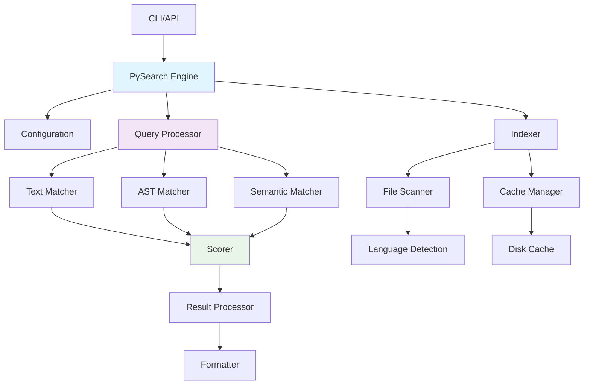
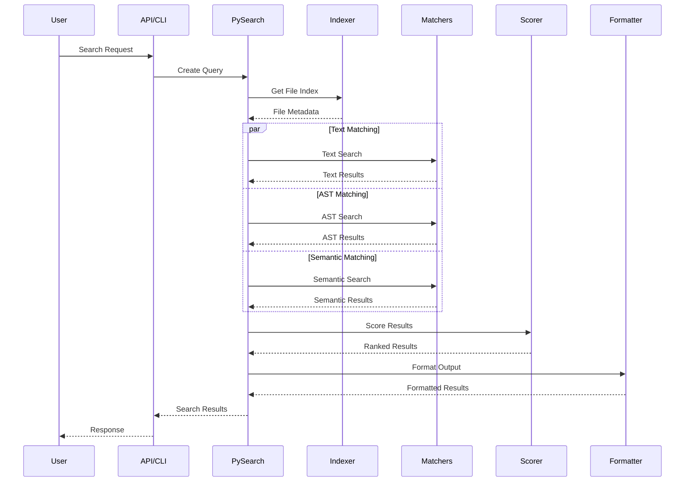
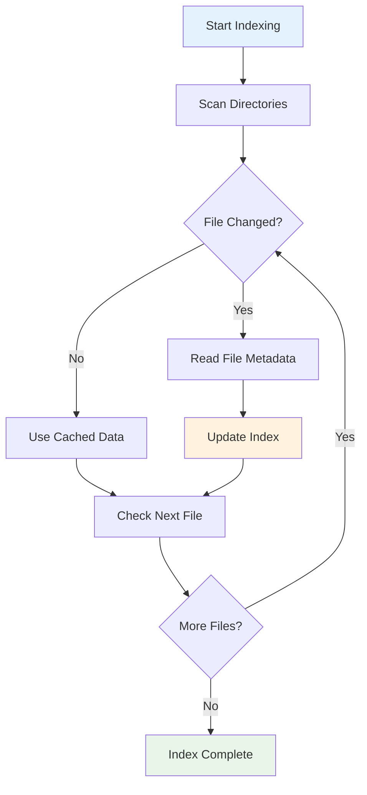
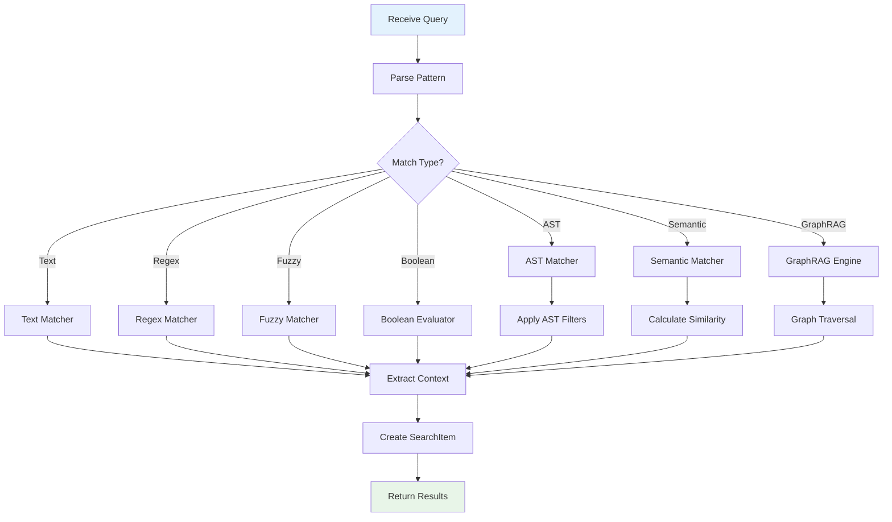

# Architecture Design

This document provides a comprehensive overview of pysearch's internal architecture, design principles, and implementation details for contributors and advanced users.

## Table of Contents

- [Overview](#overview)
- [Core Architecture](#core-architecture)
- [Module Organization](#module-organization)
- [Data Flow](#data-flow)
- [Component Details](#component-details)
- [Performance Design](#performance-design)
- [Extension Points](#extension-points)
- [Design Principles](#design-principles)
- [Future Architecture](#future-architecture)

---

## Overview

pysearch is designed as a modular, high-performance search engine with clear separation of concerns and extensible architecture. The system follows a pipeline-based approach where each component has specific responsibilities.

### Key Design Goals

1. **Performance**: Optimized for large codebases with parallel processing
2. **Modularity**: Clear component boundaries for maintainability
3. **Extensibility**: Plugin-friendly architecture for new features
4. **Reliability**: Robust error handling and graceful degradation
5. **Usability**: Simple API with powerful configuration options

### Architecture Layers

```text
┌───────────────────────────────────────────────────────────────────┐
│                       User Interface Layer                        │
├───────────────────────────────────────────────────────────────────┤
│  CLI (Click)  │  Python API  │  MCP Servers  │  IDE Hooks        │
├───────────────────────────────────────────────────────────────────┤
│                        Core Engine Layer                          │
├───────────────────────────────────────────────────────────────────┤
│  PySearch  │  Query Engine  │  GraphRAG  │  Search History       │
├───────────────────────────────────────────────────────────────────┤
│                      Processing Layer                             │
├───────────────────────────────────────────────────────────────────┤
│  Matchers  │  Fuzzy  │  Boolean  │  Semantic  │  Scorer          │
├───────────────────────────────────────────────────────────────────┤
│                   Indexing & Storage Layer                         │
├───────────────────────────────────────────────────────────────────┤
│  Indexer  │  Cache  │  Vector DB  │  Metadata  │  Chunks         │
├───────────────────────────────────────────────────────────────────┤
│                    Analysis & Intelligence Layer                   │
├───────────────────────────────────────────────────────────────────┤
│  Dependency Analysis  │  Content Addressing  │  Language Support  │
├───────────────────────────────────────────────────────────────────┤
│                       Foundation Layer                             │
├───────────────────────────────────────────────────────────────────┤
│  Language Detection  │  File Watcher  │  Error Handling  │  Utils │
└───────────────────────────────────────────────────────────────────┘
```

---

## Core Architecture

### Component Interaction



### Request Flow

1. **Input Processing**: CLI/API receives user request
2. **Configuration**: Parse and validate search parameters
3. **Indexing**: Scan and cache file metadata
4. **Matching**: Execute search across multiple matchers
5. **Scoring**: Rank and score results
6. **Output**: Format and return results

---

## Module Organization

### `pysearch.core` — Core Engine

#### `pysearch.core.api`

**Purpose**: Main API entry point and orchestration
**Key Classes**: `PySearch`
**Responsibilities**:

- Coordinate all search operations (text, regex, AST, semantic, fuzzy, boolean, GraphRAG)
- Manage component lifecycle and internal managers
- Handle high-level error recovery
- Provide convenience methods (`search()`, `run()`, `graphrag_search()`, etc.)

#### `pysearch.core.config`

**Purpose**: Configuration management and validation
**Key Classes**: `SearchConfig`, `RankStrategy`
**Responsibilities**:

- Define configuration schema with Pydantic validation
- Provide configuration defaults
- Handle environment variable integration
- Support TOML configuration files

#### `pysearch.core.types`

**Purpose**: Type definitions and data structures
**Key Types**: `Query`, `SearchResult`, `SearchItem`, `ASTFilters`, `MetadataFilters`, `GraphRAGQuery`, `GraphRAGResult`, `KnowledgeGraph`, `CodeEntity`, `EntityRelationship`
**Submodules**:

- `basic_types.py`: Core search types (`Query`, `SearchResult`, `SearchItem`, `MatchSpan`, `Language`, etc.)
- `graphrag_types.py`: GraphRAG types (`EntityType`, `RelationType`, `CodeEntity`, `KnowledgeGraph`, etc.)

#### `pysearch.core.history`

**Purpose**: Search history tracking and analytics
**Key Classes**: `SearchHistory`
**Submodules**:

- `history_core.py`: Core history storage and retrieval
- `history_analytics.py`: Search pattern analytics and insights
- `history_bookmarks.py`: Bookmark management for saved searches
- `history_sessions.py`: Session tracking and management

#### `pysearch.core.managers`

**Purpose**: Internal manager modules extending core PySearch functionality
**Key Modules**:

- `hybrid_search.py`: Semantic and hybrid search capabilities
- `graphrag_integration.py`: GraphRAG knowledge graph integration
- `ide_integration.py`: IDE hooks (jump-to-definition, find references, completions, hover, diagnostics)
- `distributed_indexing_integration.py`: Distributed parallel indexing
- `multi_repo_integration.py`: Multi-repository search support
- `dependency_integration.py`: Code dependency analysis integration
- `file_watching.py`: Real-time file monitoring and auto-updates
- `cache_integration.py`: Caching management
- `indexing_integration.py`: Metadata indexing integration
- `parallel_processing.py`: Parallel search execution strategies

---

### `pysearch.search` — Search Strategies

#### `pysearch.search.matchers`

**Purpose**: Content matching and pattern detection
**Responsibilities**:

- Execute text/regex searches via `regex` library
- Parse and match AST structures using Python `ast` module
- Extract match context and spans

#### `pysearch.search.boolean`

**Purpose**: Boolean query parsing and evaluation
**Key Classes**: `BooleanQueryParser`, `BooleanQueryEvaluator`
**Responsibilities**:

- Parse `AND`/`OR`/`NOT` logical expressions
- Evaluate boolean queries against search items
- Extract individual search terms

#### `pysearch.search.fuzzy`

**Purpose**: Fuzzy search with multiple algorithms
**Key Classes**: `FuzzyAlgorithm`, `FuzzyMatch`
**Responsibilities**:

- Levenshtein, Jaro-Winkler, n-gram similarity via `rapidfuzz`
- Typo-tolerant matching with configurable thresholds
- Correction suggestions and fuzzy regex patterns

#### `pysearch.search.scorer`

**Purpose**: Result ranking, deduplication, and clustering
**Key Classes**: `RankingStrategy`
**Responsibilities**:

- Calculate relevance scores with configurable weights
- Deduplicate overlapping results
- Cluster similar results by file and similarity
- Group results by file

#### `pysearch.search.semantic`

**Purpose**: Lightweight semantic search
**Responsibilities**:

- Concept-to-pattern expansion
- Semantic similarity scoring without external models
- Query term expansion based on code semantics

#### `pysearch.search.semantic_advanced`

**Purpose**: Advanced semantic search with transformer models
**Key Classes**: `SemanticSearchEngine`
**Responsibilities**:

- Transformer-based embedding search (optional)
- Multiple embedding backend support
- Semantic indexing and ranking

---

### `pysearch.analysis` — Code Analysis

#### `pysearch.analysis.graphrag`

**Purpose**: GraphRAG (Graph Retrieval-Augmented Generation)
**Key Classes**: `EntityExtractor`, `RelationshipMapper`, `KnowledgeGraphBuilder`, `GraphRAGEngine`
**Responsibilities**:

- Extract code entities (functions, classes, methods, variables, imports)
- Map relationships (calls, inheritance, imports, usage)
- Build and query knowledge graphs
- Combine graph traversal with vector similarity

#### `pysearch.analysis.dependency_analysis`

**Purpose**: Dependency analysis and graph generation
**Key Classes**: `DependencyAnalyzer`, `DependencyGraph`, `CircularDependencyDetector`, `DependencyMetrics`
**Responsibilities**:

- Build import dependency graphs
- Detect circular dependencies
- Calculate coupling and cohesion metrics

#### `pysearch.analysis.language_detection`

**Purpose**: Programming language identification
**Key Functions**: `detect_language`, `get_supported_languages`, `is_text_file`
**Responsibilities**:

- Detect file programming languages (20+ supported)
- Map file extensions to languages
- Identify text vs binary files

#### `pysearch.analysis.language_support`

**Purpose**: Multi-language processing with tree-sitter
**Key Classes**: `LanguageProcessor`, `TreeSitterProcessor`, `LanguageRegistry`, `CodeChunk`
**Responsibilities**:

- Tree-sitter integration for 20+ languages
- Language-specific code chunking
- Entity extraction with metadata (signatures, docstrings, complexity)

#### `pysearch.analysis.content_addressing`

**Purpose**: Content-addressed indexing
**Key Classes**: `ContentAddressedIndexer`, `GlobalCacheManager`, `ContentAddress`, `IndexTag`
**Responsibilities**:

- SHA256-based content addressing for deduplication
- Global cross-branch caching
- Tag-based index management (directory + branch + artifact)

---

### `pysearch.indexing` — Indexing & Caching

#### `pysearch.indexing.indexer`

**Purpose**: Core file indexing with metadata tracking
**Key Classes**: `Indexer`
**Responsibilities**:

- Traverse directory structures with smart pruning
- Track file metadata (size, mtime, hash)
- Incremental indexing based on change detection

#### `pysearch.indexing.advanced`

**Purpose**: Advanced indexing engine
**Key Classes**: `IndexingEngine`, `IndexCoordinator`, `ChunkingEngine`, `CodebaseIndex`, `IndexLock`
**Responsibilities**:

- Code-aware chunking with tree-sitter
- Index coordination and locking
- Integration with search engine (`IndexSearchEngine`)

#### `pysearch.indexing.cache`

**Purpose**: Cache management system
**Key Classes**: `CacheManager`
**Submodules**:

- `backends.py`: Cache storage backends
- `cleanup.py`: Cache eviction and cleanup
- `dependencies.py`: Dependency-aware cache invalidation
- `statistics.py`: Cache hit/miss statistics
- `models.py`: Cache data models

#### `pysearch.indexing.indexes`

**Purpose**: Specialized index implementations
**Submodules**:

- `code_snippets_index.py`: Tree-sitter based entity extraction index
- `full_text_index.py`: SQLite FTS5 full-text search index
- `chunk_index.py`: Intelligent code-aware chunk index
- `vector_index.py`: Semantic vector similarity index

#### `pysearch.indexing.metadata`

**Purpose**: Metadata indexing and database
**Key Classes**: `MetadataIndexer`, `IndexQuery`
**Submodules**:

- `indexer.py`: Metadata extraction and indexing
- `database.py`: SQLite-based metadata storage
- `analysis.py`: Metadata analysis and aggregation
- `models.py`: Metadata data models

---

### `pysearch.integrations` — External Integrations

#### `pysearch.integrations.multi_repo`

**Purpose**: Multi-repository search
**Key Classes**: `MultiRepoSearchEngine`, `MultiRepoSearchResult`, `RepositoryInfo`
**Responsibilities**:

- Coordinate cross-repository searches
- Manage repository priorities and configuration
- Aggregate multi-repo results

#### `pysearch.integrations.distributed_indexing`

**Purpose**: Distributed parallel indexing
**Key Classes**: `DistributedIndexingEngine`, `IndexingWorker`, `WorkQueue`
**Responsibilities**:

- Multi-process indexing with work distribution
- Worker lifecycle management and statistics
- Fault-tolerant batch processing

#### `pysearch.integrations.ide_hooks`

**Purpose**: IDE integration (LSP-like features)
**Key Classes**: `IDEHooks`, `IDEIntegration`, `DefinitionLocation`, `CompletionItem`, `HoverInfo`, `DocumentSymbol`, `Diagnostic`
**Responsibilities**:

- Jump-to-definition and find-references
- Code completion and hover information
- Document symbol listing and diagnostics

---

### `pysearch.storage` — Data Storage

#### `pysearch.storage.vector_db`

**Purpose**: Vector database abstraction layer
**Key Classes**: `VectorDatabase`, `LanceDBProvider`, `QdrantProvider`, `ChromaProvider`, `VectorIndexManager`, `MultiProviderVectorManager`
**Embedding Providers**: `OpenAIEmbeddingProvider`, `HuggingFaceEmbeddingProvider`
**Responsibilities**:

- Unified vector database interface
- Multiple backend support (LanceDB, Qdrant, Chroma)
- Embedding generation and management
- Multi-provider vector management

#### `pysearch.storage.qdrant_client`

**Purpose**: Qdrant vector store client
**Key Classes**: `QdrantVectorStore`, `QdrantConfig`
**Responsibilities**:

- Qdrant-specific vector operations
- Cosine similarity and vector normalization
- Collection management

---

### `pysearch.utils` — Utilities

#### `pysearch.utils.error_handling`

**Purpose**: Error management and reporting
**Key Classes**: `SearchError`, `ErrorCollector`, `FileAccessError`, `EncodingError`, `ParsingError`

#### `pysearch.utils.advanced_error_handling`

**Purpose**: Production-grade error resilience
**Key Classes**: `EnhancedErrorHandler`, `RecoveryManager`, `CircuitBreaker`
**Responsibilities**:

- Circuit breaker pattern for external service calls
- Automatic recovery strategies
- Error categorization and aggregation

#### `pysearch.utils.file_watcher`

**Purpose**: Real-time file change monitoring
**Key Classes**: `FileWatcher`, `WatchManager`, `ChangeProcessor`, `FileEvent`
**Responsibilities**:

- Monitor file system changes via `watchdog`
- Trigger incremental index updates
- Debounced batch change processing

#### `pysearch.utils.performance_monitoring`

**Purpose**: Performance profiling and optimization
**Key Classes**: `PerformanceMonitor`, `PerformanceProfiler`, `MetricsCollector`, `OptimizationEngine`
**Responsibilities**:

- Real-time performance monitoring
- Operation profiling and metrics collection
- Automatic optimization suggestions

#### `pysearch.utils.formatter`

**Purpose**: Output formatting
**Key Functions**: `format_result`, `render_highlight_console`

#### `pysearch.utils.helpers`

**Purpose**: Common utility functions
**Key Functions**: `iter_files`, `read_text_safely`, `file_sha1`, `extract_context`, `iter_python_ast_nodes`

#### `pysearch.utils.metadata_filters`

**Purpose**: Metadata-based filtering
**Key Functions**: `create_metadata_filters`, `apply_metadata_filters`

---

### `pysearch.cli` — Command-Line Interface

**Purpose**: Click-based CLI implementation
**Entry Point**: `pysearch.cli:main`
**Responsibilities**:

- Parse command-line arguments
- Support all search modes (text, regex, AST, semantic, boolean, fuzzy)
- Configuration file and environment variable integration
- Multiple output formats and verbosity levels

---

## Data Flow

### Search Execution Pipeline



### Indexing Process



### Matching Process



---

## Component Details

### PySearch Engine

The central orchestrator that coordinates all search operations.

**Key Responsibilities**:

- Manage component lifecycle
- Handle configuration validation
- Coordinate parallel processing
- Provide error recovery
- Maintain search history

**Design Patterns**:

- **Facade Pattern**: Simplifies complex subsystem interactions
- **Strategy Pattern**: Pluggable matching and scoring strategies
- **Observer Pattern**: File watching and change notifications

### Indexer

Manages file discovery and metadata tracking with incremental updates.

**Key Features**:

- **Incremental Indexing**: Only processes changed files
- **Metadata Caching**: Stores file size, mtime, and hash
- **Directory Pruning**: Skips excluded directories early
- **Parallel Scanning**: Multi-threaded directory traversal

**Performance Optimizations**:

- Lazy file reading (only when needed)
- Efficient change detection
- Memory-mapped file access for large files
- Batch processing for metadata updates

### Matchers

Implement different search strategies with pluggable architecture.

#### Text Matcher

- **Regex Engine**: Uses `regex` library for enhanced features
- **Context Extraction**: Efficiently extracts surrounding lines
- **Match Spans**: Tracks exact match positions
- **Encoding Handling**: Robust text encoding detection

#### AST Matcher

- **Python AST**: Uses built-in `ast` module
- **Node Filtering**: Supports function/class/decorator filters
- **Structural Queries**: Matches code structure patterns
- **Error Recovery**: Handles syntax errors gracefully

#### Semantic Matcher

- **Lightweight Features**: Basic semantic signals
- **Pluggable Backends**: Support for external embeddings
- **Similarity Scoring**: Cosine similarity and other metrics
- **Caching**: Semantic embeddings cache

### Scorer

Implements sophisticated ranking and scoring algorithms.

**Scoring Factors**:

- **Match Quality**: Exact vs. partial matches
- **Context Relevance**: Surrounding code context
- **File Importance**: File size, modification time
- **Structural Weight**: AST vs. text matches
- **Frequency**: Match count and distribution

**Ranking Strategies**:

- **Default**: Balanced scoring across all factors
- **Precision**: Favor exact matches
- **Recall**: Favor broader matches
- **Custom**: User-defined scoring weights

### Formatter

Handles output rendering with multiple format support.

**Output Formats**:

- **Text**: Human-readable console output
- **JSON**: Structured data for programmatic use
- **Highlight**: Syntax-highlighted terminal output
- **HTML**: Web-friendly formatted output (future)

**Features**:

- **Streaming**: Large result set streaming
- **Pagination**: Result chunking for large outputs
- **Compression**: Optional output compression
- **Templating**: Customizable output templates

---

## Performance Design

### Parallel Processing

pysearch uses multiple levels of parallelization:

1. **File-level Parallelism**: Process multiple files concurrently
2. **Matcher Parallelism**: Run different matchers in parallel
3. **I/O Parallelism**: Overlap disk I/O with processing
4. **Pipeline Parallelism**: Stream processing through pipeline stages

### Memory Management

**Strategies**:

- **Lazy Loading**: Load file content only when needed
- **Streaming**: Process large files in chunks
- **Memory Pools**: Reuse memory allocations
- **Garbage Collection**: Explicit cleanup of large objects

**Memory Limits**:

- File size limits to prevent memory exhaustion
- Result set size limits for large searches
- Cache size limits with LRU eviction
- Worker process memory monitoring

### Caching Strategy

**Multi-level Caching**:

1. **In-Memory Cache**: Hot data in RAM
2. **Disk Cache**: Persistent cache across sessions
3. **Index Cache**: File metadata and structure
4. **Result Cache**: Cached search results

**Cache Policies**:

- **TTL-based**: Time-based expiration
- **LRU**: Least recently used eviction
- **Size-based**: Maximum cache size limits
- **Dependency-based**: Invalidate on file changes

### I/O Optimization

**Techniques**:

- **Memory Mapping**: For large file access
- **Batch I/O**: Group small operations
- **Async I/O**: Non-blocking file operations
- **Read-ahead**: Predictive file loading

---

## Extension Points

### Plugin Architecture

pysearch supports extensions through well-defined interfaces:

#### Matcher Plugins

```python
class CustomMatcher(BaseMatcher):
    def match(self, content: str, query: Query) -> list[Match]:
        # Custom matching logic
        pass
```

#### Formatter Plugins

```python
class CustomFormatter(BaseFormatter):
    def format(self, results: SearchResult) -> str:
        # Custom formatting logic
        pass
```

#### Scorer Plugins

```python
class CustomScorer(BaseScorer):
    def score(self, items: list[SearchItem]) -> list[SearchItem]:
        # Custom scoring logic
        pass
```

### Configuration Extensions

New configuration options can be added through:

- **Field Extensions**: Add new fields to `SearchConfig`
- **Validation Hooks**: Custom validation logic
- **Environment Integration**: New environment variables
- **File Format Support**: Additional config file formats

### Language Support

Adding new programming languages:

1. **Extension Mapping**: Map file extensions to languages
2. **Syntax Highlighting**: Add syntax highlighting rules
3. **AST Support**: Implement language-specific AST parsing
4. **Special Handling**: Language-specific processing rules

---

## Design Principles

### SOLID Principles

1. **Single Responsibility**: Each component has one clear purpose
2. **Open/Closed**: Open for extension, closed for modification
3. **Liskov Substitution**: Interfaces are properly substitutable
4. **Interface Segregation**: Small, focused interfaces
5. **Dependency Inversion**: Depend on abstractions, not concretions

### Performance Principles

1. **Lazy Evaluation**: Compute only what's needed
2. **Caching**: Cache expensive operations
3. **Parallelization**: Utilize multiple cores effectively
4. **Memory Efficiency**: Minimize memory allocation and copying
5. **I/O Optimization**: Minimize and optimize disk access

### Reliability Principles

1. **Graceful Degradation**: Continue working with partial failures
2. **Error Isolation**: Contain errors to prevent cascading failures
3. **Resource Management**: Proper cleanup and resource handling
4. **Defensive Programming**: Validate inputs and handle edge cases
5. **Monitoring**: Comprehensive logging and metrics

---

## Future Architecture

### Recently Implemented Features

The following capabilities have been completed and are available in the current release:

- ✅ **Distributed Indexing**: Multi-process parallel indexing via `DistributedIndexingEngine`
- ✅ **Advanced Semantic Search**: Transformer-based embeddings via `SemanticSearchEngine`
- ✅ **Vector Databases**: LanceDB, Qdrant, and Chroma integration via `storage.vector_db`
- ✅ **Real-time File Watching**: Live index updates via `FileWatcher` and `WatchManager`
- ✅ **IDE Integration**: Jump-to-definition, references, completions, hover, diagnostics via `ide_hooks`
- ✅ **GraphRAG**: Knowledge graph search via `GraphRAGEngine`
- ✅ **Fuzzy Search**: Multi-algorithm fuzzy matching via `rapidfuzz`
- ✅ **Boolean Search**: `AND`/`OR`/`NOT` query composition
- ✅ **Multi-language AST**: Tree-sitter integration for 20+ languages
- ✅ **Content-Addressed Caching**: SHA256-based deduplication with cross-branch support
- ✅ **Search History**: Session tracking, bookmarks, and analytics
- ✅ **Performance Monitoring**: Real-time profiling and optimization suggestions
- ✅ **Circuit Breaker**: Production-grade error resilience

### Planned Enhancements

#### Distributed Search (Multi-node)

- **Multi-node Processing**: Distribute search across multiple machines (beyond current single-machine parallelism)
- **Shared Caching**: Distributed cache for team environments
- **Load Balancing**: Distribute search load efficiently across nodes

#### Enhanced IDE Experience

- **Language Server Protocol**: Full LSP server implementation
- **Editor Plugins**: Native VS Code and JetBrains extensions
- **Refactoring Support**: Search-based automated refactoring tools

#### Advanced Intelligence

- **Learning to Rank**: ML-based result ranking with user feedback
- **Query Understanding**: Natural language query processing
- **Code Understanding**: Deep code comprehension beyond pattern matching
- **Personalization**: User-specific search optimization

### Scalability Considerations

#### Horizontal Scaling

- **Microservices**: Break into smaller services for large deployments
- **API Gateway**: Centralized API management for team use
- **Container Orchestration**: Kubernetes deployment support

#### Technology Evolution

- **Cross-language Search**: Search across language boundaries with unified semantics
- **Polyglot Repositories**: Enhanced support for mixed-language monorepos
- **Streaming Results**: Live result streaming for interactive search
- **Collaborative Features**: Team search sharing and annotations

---

## Contributing to Architecture

### Architecture Guidelines

1. **Document Decisions**: Use Architecture Decision Records (ADRs)
2. **Design Reviews**: Peer review of architectural changes
3. **Performance Testing**: Benchmark architectural changes
4. **Backward Compatibility**: Maintain API compatibility
5. **Migration Paths**: Provide clear upgrade paths

### Code Organization

1. **Module Boundaries**: Respect module responsibilities
2. **Interface Design**: Design clean, minimal interfaces
3. **Error Handling**: Consistent error handling patterns
4. **Testing Strategy**: Comprehensive test coverage
5. **Documentation**: Keep architecture docs updated

### Performance Considerations

1. **Profiling**: Profile before optimizing
2. **Benchmarking**: Establish performance baselines
3. **Monitoring**: Add metrics for new components
4. **Resource Usage**: Monitor memory and CPU usage
5. **Scalability Testing**: Test with large datasets

---

## See Also

- [Configuration Guide](../guide/configuration.md) - Detailed configuration options
- [Usage Guide](../guide/usage.md) - How to use pysearch effectively
- [API Reference](../api/index.md) - Complete API documentation
- [Contributing Guide](../../CONTRIBUTING.md) - How to contribute to the project
