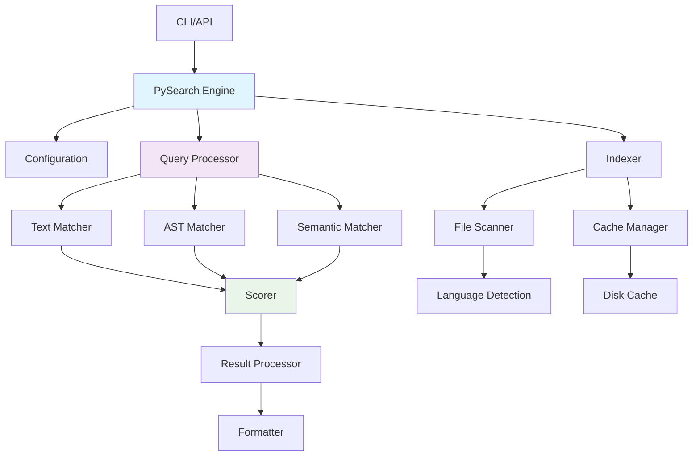
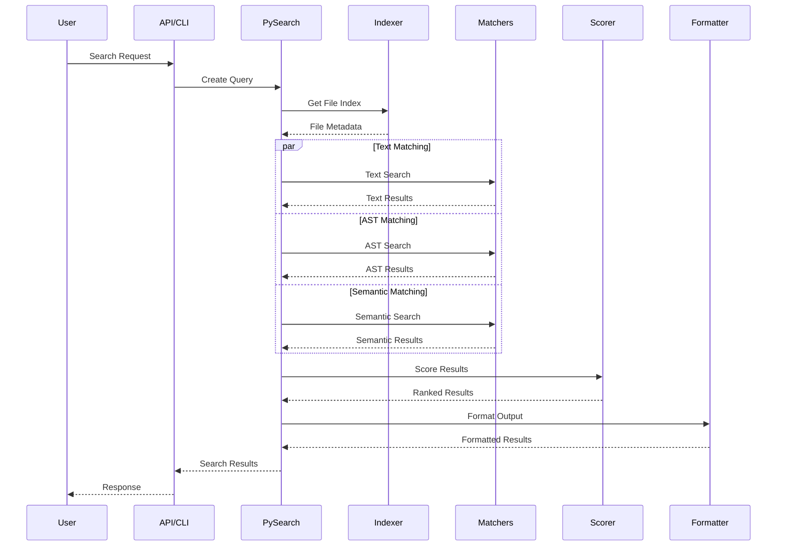
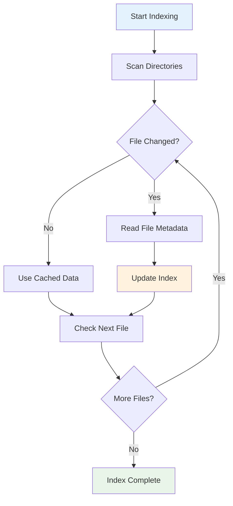
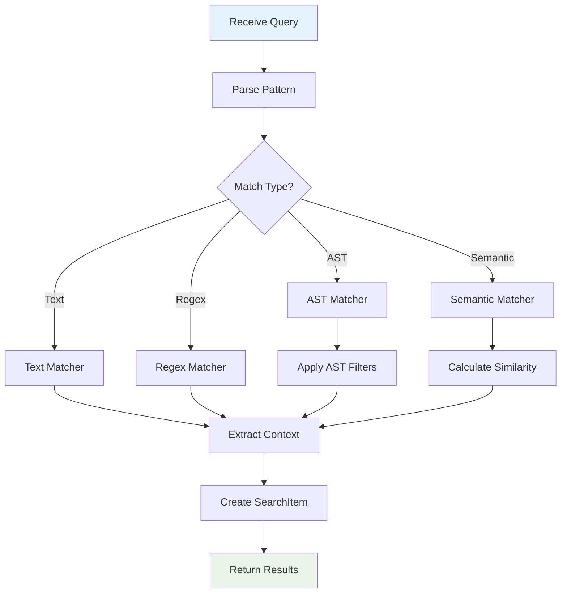

# Architecture Design

This document provides a comprehensive overview of pysearch's internal architecture, design principles, and implementation details for contributors and advanced users.

## Table of Contents

- [Overview](#overview)
- [Core Architecture](#core-architecture)
- [Module Organization](#module-organization)
- [Data Flow](#data-flow)
- [Component Details](#component-details)
- [Performance Design](#performance-design)
- [Extension Points](#extension-points)
- [Design Principles](#design-principles)
- [Future Architecture](#future-architecture)

---

## Overview

pysearch is designed as a modular, high-performance search engine with clear separation of concerns and extensible architecture. The system follows a pipeline-based approach where each component has specific responsibilities.

### Key Design Goals

1. **Performance**: Optimized for large codebases with parallel processing
2. **Modularity**: Clear component boundaries for maintainability
3. **Extensibility**: Plugin-friendly architecture for new features
4. **Reliability**: Robust error handling and graceful degradation
5. **Usability**: Simple API with powerful configuration options

### Architecture Layers

```text
┌─────────────────────────────────────────────────────────────┐
│                    User Interface Layer                     │
├─────────────────────────────────────────────────────────────┤
│  CLI Interface  │  Python API  │  MCP Servers  │  IDE Hooks │
├─────────────────────────────────────────────────────────────┤
│                     Core Engine Layer                       │
├─────────────────────────────────────────────────────────────┤
│  PySearch  │  Query Engine  │  Result Processor  │  Config  │
├─────────────────────────────────────────────────────────────┤
│                   Processing Layer                          │
├─────────────────────────────────────────────────────────────┤
│  Indexer  │  Matchers  │  Scorer  │  Formatter  │  Cache    │
├─────────────────────────────────────────────────────────────┤
│                    Foundation Layer                         │
├─────────────────────────────────────────────────────────────┤
│  File System  │  Language Detection  │  Utils  │  Types    │
└─────────────────────────────────────────────────────────────┘
```

---

## Core Architecture

### Component Interaction



### Request Flow

1. **Input Processing**: CLI/API receives user request
2. **Configuration**: Parse and validate search parameters
3. **Indexing**: Scan and cache file metadata
4. **Matching**: Execute search across multiple matchers
5. **Scoring**: Rank and score results
6. **Output**: Format and return results

---

## Module Organization

### Core Modules

#### `pysearch.api`

**Purpose**: Main API entry point and orchestration
**Key Classes**: `PySearch`
**Responsibilities**:

- Coordinate all search operations
- Manage component lifecycle
- Handle high-level error recovery
- Provide convenience methods

#### `pysearch.config`

**Purpose**: Configuration management and validation
**Key Classes**: `SearchConfig`, `RankStrategy`
**Responsibilities**:

- Define configuration schema
- Validate configuration parameters
- Provide configuration defaults
- Handle environment variable integration

#### `pysearch.indexer`

**Purpose**: File discovery and metadata management
**Key Classes**: `Indexer`, `FileIndex`
**Responsibilities**:

- Traverse directory structures
- Track file metadata (size, mtime, hash)
- Implement incremental indexing
- Handle file change detection

#### `pysearch.matchers`

**Purpose**: Content matching and pattern detection
**Key Classes**: `TextMatcher`, `ASTMatcher`, `SemanticMatcher`
**Responsibilities**:

- Execute text/regex searches
- Parse and match AST structures
- Perform semantic similarity matching
- Extract match context and spans

#### `pysearch.scorer`

**Purpose**: Result ranking and scoring
**Key Classes**: `ResultScorer`, `RankingStrategy`
**Responsibilities**:

- Calculate relevance scores
- Apply ranking strategies
- Deduplicate overlapping results
- Cluster similar results

#### `pysearch.formatter`

**Purpose**: Output rendering and formatting
**Key Classes**: `TextFormatter`, `JSONFormatter`, `HighlightFormatter`
**Responsibilities**:

- Render results in various formats
- Apply syntax highlighting
- Generate structured output
- Handle output streaming

### Support Modules

#### `pysearch.types`

**Purpose**: Type definitions and data structures
**Key Types**: `Query`, `SearchResult`, `SearchItem`, `ASTFilters`
**Responsibilities**:

- Define core data structures
- Provide type annotations
- Implement data validation
- Support serialization

#### `pysearch.utils`

**Purpose**: Common utilities and helpers
**Key Functions**: File I/O, text processing, path handling
**Responsibilities**:

- Provide reusable utilities
- Handle cross-platform compatibility
- Implement common algorithms
- Support debugging and diagnostics

#### `pysearch.language_detection`

**Purpose**: Programming language identification
**Key Functions**: `detect_language`, `get_supported_languages`
**Responsibilities**:

- Detect file programming languages
- Map file extensions to languages
- Support language-specific processing
- Handle special file types

#### `pysearch.error_handling`

**Purpose**: Error management and reporting
**Key Classes**: `SearchError`, `ErrorCollector`
**Responsibilities**:

- Define exception hierarchy
- Collect and aggregate errors
- Provide error context
- Support error recovery

### Advanced Modules

#### `pysearch.cache_manager`

**Purpose**: Advanced caching strategies
**Key Classes**: `CacheManager`, `DiskCache`, `MemoryCache`
**Responsibilities**:

- Implement multi-level caching
- Handle cache eviction policies
- Provide cache statistics
- Support cache persistence

#### `pysearch.file_watcher`

**Purpose**: Real-time file change monitoring
**Key Classes**: `FileWatcher`, `WatchManager`
**Responsibilities**:

- Monitor file system changes
- Trigger incremental updates
- Handle batch change processing
- Support cross-platform watching

#### `pysearch.multi_repo`

**Purpose**: Multi-repository search capabilities
**Key Classes**: `MultiRepoEngine`, `RepositoryInfo`
**Responsibilities**:

- Coordinate cross-repository searches
- Manage repository priorities
- Handle repository-specific configuration
- Aggregate multi-repo results

#### `pysearch.semantic_advanced`

**Purpose**: Advanced semantic search features
**Key Classes**: `SemanticEngine`, `EmbeddingProvider`
**Responsibilities**:

- Implement semantic similarity
- Support multiple embedding backends
- Handle semantic indexing
- Provide semantic ranking

---

## Data Flow

### Search Execution Pipeline



### Indexing Process



### Matching Process



---

## Component Details

### PySearch Engine

The central orchestrator that coordinates all search operations.

**Key Responsibilities**:

- Manage component lifecycle
- Handle configuration validation
- Coordinate parallel processing
- Provide error recovery
- Maintain search history

**Design Patterns**:

- **Facade Pattern**: Simplifies complex subsystem interactions
- **Strategy Pattern**: Pluggable matching and scoring strategies
- **Observer Pattern**: File watching and change notifications

### Indexer

Manages file discovery and metadata tracking with incremental updates.

**Key Features**:

- **Incremental Indexing**: Only processes changed files
- **Metadata Caching**: Stores file size, mtime, and hash
- **Directory Pruning**: Skips excluded directories early
- **Parallel Scanning**: Multi-threaded directory traversal

**Performance Optimizations**:

- Lazy file reading (only when needed)
- Efficient change detection
- Memory-mapped file access for large files
- Batch processing for metadata updates

### Matchers

Implement different search strategies with pluggable architecture.

#### Text Matcher

- **Regex Engine**: Uses `regex` library for enhanced features
- **Context Extraction**: Efficiently extracts surrounding lines
- **Match Spans**: Tracks exact match positions
- **Encoding Handling**: Robust text encoding detection

#### AST Matcher

- **Python AST**: Uses built-in `ast` module
- **Node Filtering**: Supports function/class/decorator filters
- **Structural Queries**: Matches code structure patterns
- **Error Recovery**: Handles syntax errors gracefully

#### Semantic Matcher

- **Lightweight Features**: Basic semantic signals
- **Pluggable Backends**: Support for external embeddings
- **Similarity Scoring**: Cosine similarity and other metrics
- **Caching**: Semantic embeddings cache

### Scorer

Implements sophisticated ranking and scoring algorithms.

**Scoring Factors**:

- **Match Quality**: Exact vs. partial matches
- **Context Relevance**: Surrounding code context
- **File Importance**: File size, modification time
- **Structural Weight**: AST vs. text matches
- **Frequency**: Match count and distribution

**Ranking Strategies**:

- **Default**: Balanced scoring across all factors
- **Precision**: Favor exact matches
- **Recall**: Favor broader matches
- **Custom**: User-defined scoring weights

### Formatter

Handles output rendering with multiple format support.

**Output Formats**:

- **Text**: Human-readable console output
- **JSON**: Structured data for programmatic use
- **Highlight**: Syntax-highlighted terminal output
- **HTML**: Web-friendly formatted output (future)

**Features**:

- **Streaming**: Large result set streaming
- **Pagination**: Result chunking for large outputs
- **Compression**: Optional output compression
- **Templating**: Customizable output templates

---

## Performance Design

### Parallel Processing

pysearch uses multiple levels of parallelization:

1. **File-level Parallelism**: Process multiple files concurrently
2. **Matcher Parallelism**: Run different matchers in parallel
3. **I/O Parallelism**: Overlap disk I/O with processing
4. **Pipeline Parallelism**: Stream processing through pipeline stages

### Memory Management

**Strategies**:

- **Lazy Loading**: Load file content only when needed
- **Streaming**: Process large files in chunks
- **Memory Pools**: Reuse memory allocations
- **Garbage Collection**: Explicit cleanup of large objects

**Memory Limits**:

- File size limits to prevent memory exhaustion
- Result set size limits for large searches
- Cache size limits with LRU eviction
- Worker process memory monitoring

### Caching Strategy

**Multi-level Caching**:

1. **In-Memory Cache**: Hot data in RAM
2. **Disk Cache**: Persistent cache across sessions
3. **Index Cache**: File metadata and structure
4. **Result Cache**: Cached search results

**Cache Policies**:

- **TTL-based**: Time-based expiration
- **LRU**: Least recently used eviction
- **Size-based**: Maximum cache size limits
- **Dependency-based**: Invalidate on file changes

### I/O Optimization

**Techniques**:

- **Memory Mapping**: For large file access
- **Batch I/O**: Group small operations
- **Async I/O**: Non-blocking file operations
- **Read-ahead**: Predictive file loading

---

## Extension Points

### Plugin Architecture

pysearch supports extensions through well-defined interfaces:

#### Matcher Plugins

```python
class CustomMatcher(BaseMatcher):
    def match(self, content: str, query: Query) -> list[Match]:
        # Custom matching logic
        pass
```

#### Formatter Plugins

```python
class CustomFormatter(BaseFormatter):
    def format(self, results: SearchResult) -> str:
        # Custom formatting logic
        pass
```

#### Scorer Plugins

```python
class CustomScorer(BaseScorer):
    def score(self, items: list[SearchItem]) -> list[SearchItem]:
        # Custom scoring logic
        pass
```

### Configuration Extensions

New configuration options can be added through:

- **Field Extensions**: Add new fields to `SearchConfig`
- **Validation Hooks**: Custom validation logic
- **Environment Integration**: New environment variables
- **File Format Support**: Additional config file formats

### Language Support

Adding new programming languages:

1. **Extension Mapping**: Map file extensions to languages
2. **Syntax Highlighting**: Add syntax highlighting rules
3. **AST Support**: Implement language-specific AST parsing
4. **Special Handling**: Language-specific processing rules

---

## Design Principles

### SOLID Principles

1. **Single Responsibility**: Each component has one clear purpose
2. **Open/Closed**: Open for extension, closed for modification
3. **Liskov Substitution**: Interfaces are properly substitutable
4. **Interface Segregation**: Small, focused interfaces
5. **Dependency Inversion**: Depend on abstractions, not concretions

### Performance Principles

1. **Lazy Evaluation**: Compute only what's needed
2. **Caching**: Cache expensive operations
3. **Parallelization**: Utilize multiple cores effectively
4. **Memory Efficiency**: Minimize memory allocation and copying
5. **I/O Optimization**: Minimize and optimize disk access

### Reliability Principles

1. **Graceful Degradation**: Continue working with partial failures
2. **Error Isolation**: Contain errors to prevent cascading failures
3. **Resource Management**: Proper cleanup and resource handling
4. **Defensive Programming**: Validate inputs and handle edge cases
5. **Monitoring**: Comprehensive logging and metrics

---

## Future Architecture

### Planned Enhancements

#### Distributed Architecture

- **Multi-node Processing**: Distribute search across multiple machines
- **Shared Caching**: Distributed cache for team environments
- **Load Balancing**: Distribute search load efficiently
- **Fault Tolerance**: Handle node failures gracefully

#### Advanced Semantic Search

- **External Embeddings**: Support for transformer models
- **Vector Databases**: Integration with vector storage systems
- **Semantic Indexing**: Pre-computed semantic indices
- **Context-aware Search**: Understanding code context and intent

#### Real-time Features

- **Live Indexing**: Real-time index updates
- **Streaming Results**: Live result streaming
- **Interactive Search**: Dynamic query refinement
- **Collaborative Features**: Team search and sharing

#### IDE Integration

- **Language Server Protocol**: LSP-based IDE integration
- **Editor Plugins**: Native editor extensions
- **Code Navigation**: Jump-to-definition and references
- **Refactoring Support**: Search-based refactoring tools

### Scalability Considerations

#### Horizontal Scaling

- **Microservices**: Break into smaller services
- **API Gateway**: Centralized API management
- **Service Mesh**: Inter-service communication
- **Container Orchestration**: Kubernetes deployment

#### Vertical Scaling

- **Memory Optimization**: Reduce memory footprint
- **CPU Optimization**: Better CPU utilization
- **I/O Optimization**: Faster disk and network I/O
- **Algorithm Improvements**: More efficient algorithms

### Technology Evolution

#### Language Support

- **Multi-language AST**: Support for more programming languages
- **Cross-language Search**: Search across language boundaries
- **Language-specific Features**: Leverage language-specific tools
- **Polyglot Repositories**: Better support for mixed-language projects

#### Machine Learning Integration

- **Learning to Rank**: ML-based result ranking
- **Query Understanding**: Natural language query processing
- **Code Understanding**: Deep code comprehension
- **Personalization**: User-specific search optimization

---

## Contributing to Architecture

### Architecture Guidelines

1. **Document Decisions**: Use Architecture Decision Records (ADRs)
2. **Design Reviews**: Peer review of architectural changes
3. **Performance Testing**: Benchmark architectural changes
4. **Backward Compatibility**: Maintain API compatibility
5. **Migration Paths**: Provide clear upgrade paths

### Code Organization

1. **Module Boundaries**: Respect module responsibilities
2. **Interface Design**: Design clean, minimal interfaces
3. **Error Handling**: Consistent error handling patterns
4. **Testing Strategy**: Comprehensive test coverage
5. **Documentation**: Keep architecture docs updated

### Performance Considerations

1. **Profiling**: Profile before optimizing
2. **Benchmarking**: Establish performance baselines
3. **Monitoring**: Add metrics for new components
4. **Resource Usage**: Monitor memory and CPU usage
5. **Scalability Testing**: Test with large datasets

---

## See Also

- [Configuration Guide](configuration.md) - Detailed configuration options
- [Usage Guide](usage.md) - How to use pysearch effectively
- [API Reference](api-reference.md) - Complete API documentation
- [Contributing Guide](../CONTRIBUTING.md) - How to contribute to the project
