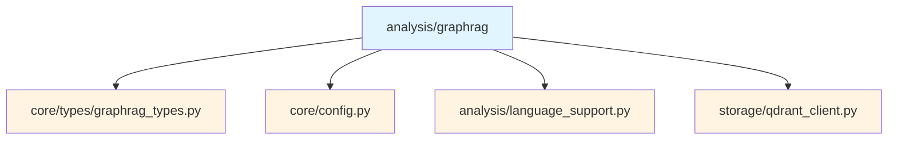
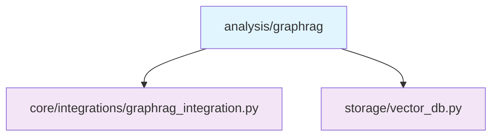
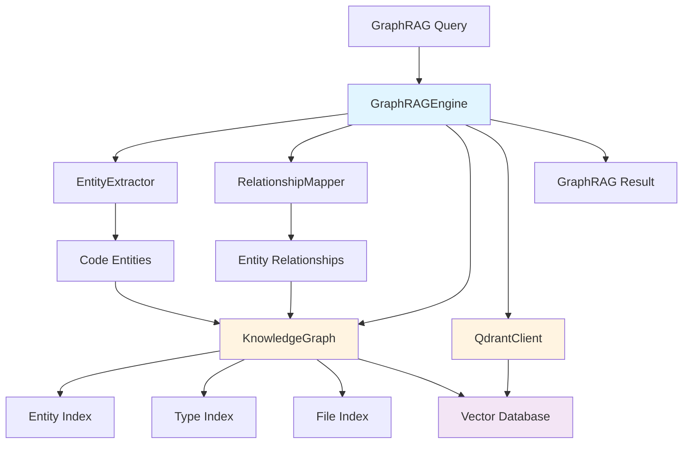
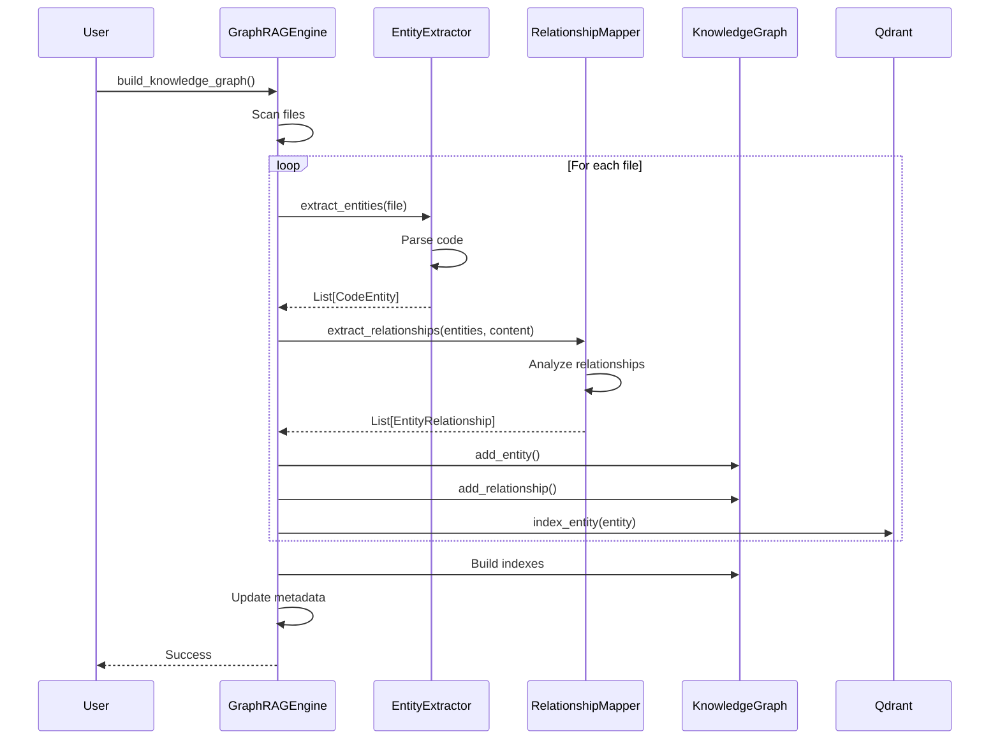
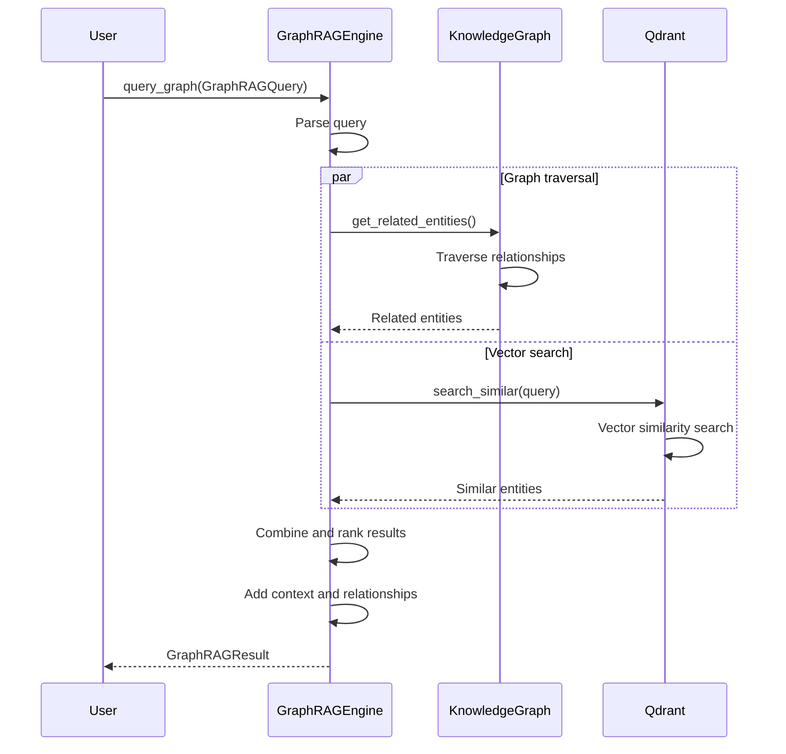

# GraphRAG Submodule

> [根目录](../../../../CLAUDE.md) > [src](../../../) > [pysearch](../../) > [analysis](../) > **graphrag**

---

## Change Log (Changelog)

### 2026-01-19 - Submodule Documentation Initial Version
- Created comprehensive GraphRAG documentation
- Documented core, engine, and type definitions
- Added usage examples and architecture diagrams

---

## Submodule Overview

### Responsibility
The **GraphRAG** submodule implements Graph-based Retrieval-Augmented Generation for enhanced code understanding and intelligent search.

### Role in Parent Module
- **Knowledge Graph Construction**: Builds code entity and relationship graphs
- **Graph Queries**: Enables graph traversal and pattern matching
- **Vector Integration**: Combines graph structure with semantic embeddings
- **RAG Enhancement**: Provides context for code generation and analysis

### Key Design Decisions
- **Graph-Based**: Uses graph structures for code relationships
- **Bidirectional**: Supports both structural and semantic relationships
- **Vector-Enhanced**: Integrates embeddings for similarity search
- **Multi-Hop**: Enables multi-hop relationship traversal

---

## File Inventory

| File | Responsibility | Key Classes/Functions |
|------|---------------|----------------------|
| `__init__.py` | GraphRAG interface | Re-exports main classes |
| `core.py` | GraphRAG core | `EntityExtractor`, `RelationshipMapper` |
| `engine.py` | GraphRAG engine | `GraphRAGEngine`, `KnowledgeGraph` |

---

## Dependency Relationships

### Internal Upstream Dependencies


### Internal Downstream Dependencies


### External Dependencies
- `qdrant-client`: Vector database client
- `numpy`: Numerical operations
- `asyncio`: Async operations
- `dataclasses`: Type definitions

---

## Key Interfaces

### Entity Extractor (core.py)

#### Overview
Extracts code entities from source files using AST/tree-sitter parsing.

#### Implementation
```python
class EntityExtractor:
    def __init__(self, config: SearchConfig)

    # Entity extraction
    async def extract_entities(
        self,
        file_path: Path,
        content: str | None = None
    ) -> list[CodeEntity]:
        """
        Extract entities from a file.

        Args:
            file_path: Path to the file
            content: File content (read from file if None)

        Returns:
            List of extracted entities
        """

    async def extract_entities_from_directory(
        self,
        directory: Path,
        pattern: str = "**/*.py"
    ) -> dict[Path, list[CodeEntity]]:
        """Extract entities from all files in a directory."""

    # Language-specific extraction
    async def extract_python_entities(
        self,
        content: str,
        file_path: Path
    ) -> list[CodeEntity]:
        """Extract entities from Python code."""

    async def extract_javascript_entities(
        self,
        content: str,
        file_path: Path
    ) -> list[CodeEntity]:
        """Extract entities from JavaScript code."""

    async def extract_go_entities(
        self,
        content: str,
        file_path: Path
    ) -> list[CodeEntity]:
        """Extract entities from Go code."""

    # Entity properties
    async def extract_entity_properties(
        self,
        entity: CodeEntity,
        content: str
    ) -> dict[str, Any]:
        """Extract additional properties from an entity."""

    async def calculate_entity_complexity(
        self,
        entity: CodeEntity,
        content: str
    ) -> float:
        """Calculate complexity score for an entity."""
```

#### Usage Example
```python
from pysearch.analysis.graphrag import EntityExtractor

extractor = EntityExtractor(config)

# Extract entities from a file
entities = await extractor.extract_entities(Path("example.py"))

for entity in entities:
    print(f"{entity.entity_type}: {entity.name}")
    print(f"  Location: {entity.file_path}:{entity.start_line}")
    if entity.signature:
        print(f"  Signature: {entity.signature}")
    if entity.docstring:
        print(f"  Docstring: {entity.docstring[:50]}...")
```

### Relationship Mapper (core.py)

#### Overview
Maps relationships between code entities based on usage, imports, and structure.

#### Implementation
```python
class RelationshipMapper:
    def __init__(self, config: SearchConfig)

    # Relationship extraction
    async def extract_relationships(
        self,
        entities: list[CodeEntity],
        content: str,
        file_path: Path
    ) -> list[EntityRelationship]:
        """
        Extract relationships between entities.

        Args:
            entities: List of entities in the file
            content: File content
            file_path: Path to the file

        Returns:
            List of relationships
        """

    async def extract_relationships_from_directory(
        self,
        directory: Path,
        pattern: str = "**/*.py"
    ) -> dict[Path, list[EntityRelationship]]:
        """Extract relationships from all files in a directory."""

    # Relationship types
    async def extract_import_relationships(
        self,
        content: str,
        file_path: Path
    ) -> list[EntityRelationship]:
        """Extract import relationships."""

    async def extract_call_relationships(
        self,
        entities: list[CodeEntity],
        content: str
    ) -> list[EntityRelationship]:
        """Extract function call relationships."""

    async def extract_inheritance_relationships(
        self,
        entities: list[CodeEntity]
    ) -> list[EntityRelationship]:
        """Extract inheritance relationships."""

    async def extract_containment_relationships(
        self,
        entities: list[CodeEntity]
    ) -> list[EntityRelationship]:
        """Extract containment (class contains method) relationships."""

    # Relationship scoring
    async def calculate_relationship_weight(
        self,
        relationship: EntityRelationship
    ) -> float:
        """Calculate weight/importance of a relationship."""

    async def calculate_relationship_confidence(
        self,
        relationship: EntityRelationship
    ) -> float:
        """Calculate confidence score for a relationship."""
```

#### Usage Example
```python
from pysearch.analysis.graphrag import RelationshipMapper

mapper = RelationshipMapper(config)

# Extract relationships
entities = await extractor.extract_entities(Path("example.py"))
relationships = await mapper.extract_relationships(
    entities,
    content=Path("example.py").read_text(),
    file_path=Path("example.py")
)

for rel in relationships:
    source = entities[rel.source_entity_id]
    target = entities[rel.target_entity_id]
    print(f"{source.name} --[{rel.relation_type}]--> {target.name}")
    print(f"  Weight: {rel.weight}, Confidence: {rel.confidence}")
```

### GraphRAG Engine (engine.py)

#### Overview
Main engine for building and querying knowledge graphs.

#### GraphRAGEngine
```python
class GraphRAGEngine:
    def __init__(
        self,
        config: SearchConfig,
        qdrant_config: QdrantConfig | None = None
    )

    # Lifecycle
    async def initialize(self) -> None:
        """Initialize the engine and connect to vector database."""

    async def close(self) -> None:
        """Close the engine and release resources."""

    # Knowledge graph construction
    async def build_knowledge_graph(
        self,
        force_rebuild: bool = False,
        paths: list[Path] | None = None
    ) -> bool:
        """
        Build the knowledge graph from code.

        Args:
            force_rebuild: Rebuild entire graph from scratch
            paths: Specific paths to index (None = all paths)

        Returns:
            True if successful, False otherwise
        """

    async def get_graph_progress(self) -> GraphProgress:
        """Get knowledge graph construction progress."""

    async def cancel_construction(self) -> None:
        """Cancel current graph construction."""

    # Graph queries
    async def query_graph(
        self,
        query: GraphRAGQuery
    ) -> GraphRAGResult | None:
        """
        Query the knowledge graph.

        Args:
            query: GraphRAG query specification

        Returns:
            GraphRAG results with entities and relationships
        """

    async def find_related_entities(
        self,
        entity_id: str,
        relation_types: list[RelationType] | None = None,
        max_hops: int = 1,
        limit: int = 10
    ) -> list[tuple[CodeEntity, EntityRelationship]]:
        """
        Find entities related to a given entity.

        Args:
            entity_id: Starting entity ID
            relation_types: Filter by relationship types
            max_hops: Maximum hops in graph traversal
            limit: Max results

        Returns:
            List of (entity, relationship) tuples
        """

    async def find_path(
        self,
        source_id: str,
        target_id: str,
        max_hops: int = 3
    ) -> list[CodeEntity] | None:
        """
        Find shortest path between two entities.

        Args:
            source_id: Source entity ID
            target_id: Target entity ID
            max_hops: Maximum hops to search

        Returns:
            List of entities in the path, or None if no path found
        """

    # Graph operations
    async def add_entity(self, entity: CodeEntity) -> bool:
        """Add an entity to the graph."""

    async def add_relationship(self, relationship: EntityRelationship) -> bool:
        """Add a relationship to the graph."""

    async def remove_entity(self, entity_id: str) -> bool:
        """Remove an entity and its relationships."""

    async def update_entity(self, entity: CodeEntity) -> bool:
        """Update an existing entity."""

    # Graph analytics
    async def get_graph_stats(self) -> dict[str, Any]:
        """Get graph statistics."""

    async def find_communities(
        self,
        min_size: int = 3
    ) -> list[list[CodeEntity]]:
        """Find communities (clusters) in the graph."""

    async def calculate_centrality(
        self,
        entity_id: str
    ) -> dict[str, float]:
        """Calculate centrality measures for an entity."""

    # Export/Import
    async def export_graph(
        self,
        format: str = "json"
    ) -> str:
        """Export knowledge graph to string."""

    async def import_graph(
        self,
        data: str,
        format: str = "json"
    ) -> bool:
        """Import knowledge graph from string."""
```

#### GraphProgress
Tracks graph construction progress.

```python
@dataclass
class GraphProgress:
    """Progress tracking for graph construction."""

    current_phase: str = "idle"
    percent_complete: float = 0.0
    entities_extracted: int = 0
    relationships_extracted: int = 0
    files_processed: int = 0
    total_files: int = 0
    current_file: str | None = None
    errors: list[str] = field(default_factory=list)
    start_time: float | None = None
    estimated_remaining: float | None = None
```

#### Usage Example
```python
from pysearch.analysis.graphrag import GraphRAGEngine
from pysearch.core.types import GraphRAGQuery

# Initialize
engine = GraphRAGEngine(config, qdrant_config)
await engine.initialize()

# Build knowledge graph
success = await engine.build_knowledge_graph(force_rebuild=False)

# Monitor progress
progress = await engine.get_graph_progress()
print(f"Progress: {progress.percent_complete:.1f}%")
print(f"Entities: {progress.entities_extracted}")
print(f"Relationships: {progress.relationships_extracted}")

# Query the graph
query = GraphRAGQuery(
    pattern="database connection handling",
    max_hops=2,
    min_confidence=0.6,
    include_relationships=True
)

result = await engine.query_graph(query)

# Access results
for entity in result.entities:
    print(f"{entity.name} ({entity.entity_type})")
    print(f"  {entity.signature}")
    print(f"  Confidence: {entity.confidence}")

for rel in result.relationships:
    print(f"  --[{rel.relation_type}]--> weight: {rel.weight}")

# Find related entities
related = await engine.find_related_entities(
    entity_id="func_main_123",
    relation_types=[RelationType.CALLS, RelationType.USES],
    max_hops=2,
    limit=10
)

for entity, rel in related:
    print(f"{entity.name} --[{rel.relation_type}]-->")
```

### Knowledge Graph (in-memory representation)

#### Overview
In-memory representation of the knowledge graph with fast lookups.

#### Implementation
```python
@dataclass
class KnowledgeGraph:
    """In-memory knowledge graph representation."""

    entities: dict[str, CodeEntity]
    relationships: list[EntityRelationship]
    entity_index: dict[str, list[str]]          # name -> IDs
    type_index: dict[EntityType, list[str]]     # type -> IDs
    file_index: dict[Path, list[str]]           # file -> IDs
    metadata: dict[str, Any]
    version: str = "1.0"
    created_at: float | None = None
    updated_at: float | None = None

    # CRUD operations
    def add_entity(self, entity: CodeEntity) -> None
    def add_relationship(self, relationship: EntityRelationship) -> None
    def get_entity(self, entity_id: str) -> CodeEntity | None
    def get_entities_by_name(self, name: str) -> list[CodeEntity]
    def get_entities_by_type(self, entity_type: EntityType) -> list[CodeEntity]
    def get_entities_in_file(self, file_path: Path) -> list[CodeEntity]

    # Graph traversal
    def get_related_entities(
        self,
        entity_id: str,
        relation_types: list[RelationType] | None = None,
        max_hops: int = 1
    ) -> list[tuple[CodeEntity, EntityRelationship]]

    # Graph analysis
    def find_shortest_path(
        self,
        source_id: str,
        target_id: str
    ) -> list[CodeEntity] | None

    def find_cycles(self) -> list[list[str]]:
        """Find circular dependencies in the graph."""

    # Statistics
    def get_stats(self) -> dict[str, Any]:
        """Get graph statistics."""
```

#### Usage Example
```python
from pysearch.analysis.graphrag import KnowledgeGraph
from pysearch.core.types import CodeEntity, EntityType

# Create graph
graph = KnowledgeGraph()

# Add entities
entity = CodeEntity(
    id="func_main_1",
    name="main",
    entity_type=EntityType.FUNCTION,
    file_path=Path("app.py"),
    start_line=10,
    end_line=15,
    signature="def main() -> None:",
    docstring="Main entry point"
)
graph.add_entity(entity)

# Add relationships
relationship = EntityRelationship(
    id="rel_1",
    source_entity_id="func_main_1",
    target_entity_id="func_helper_2",
    relation_type=RelationType.CALLS,
    confidence=0.95
)
graph.add_relationship(relationship)

# Query graph
related = graph.get_related_entities(
    "func_main_1",
    relation_types=[RelationType.CALLS],
    max_hops=1
)

for entity, rel in related:
    print(f"{entity.name} called with confidence {rel.confidence}")
```

---

## Architecture Diagram



---

## Data Flow

### Graph Construction Flow


### Graph Query Flow


---

## Graph Schema

### Entity Types
```python
EntityType.FUNCTION     # Functions
EntityType.CLASS        # Classes
EntityType.METHOD       # Methods
EntityType.VARIABLE     # Variables
EntityType.CONSTANT     # Constants
EntityType.MODULE       # Modules
EntityType.PACKAGE      # Packages
EntityType.IMPORT       # Imports
EntityType.DECORATOR    # Decorators
EntityType.ATTRIBUTE    # Attributes
EntityType.PARAMETER    # Parameters
EntityType.RETURN_TYPE  # Return types
EntityType.EXCEPTION    # Exceptions
```

### Relationship Types
```python
# Structural
RelationType.CONTAINS      # Class contains method
RelationType.INHERITS      # Class inheritance
RelationType.IMPLEMENTS    # Interface implementation
RelationType.EXTENDS       # Extension
RelationType.OVERRIDES     # Method overriding

# Usage
RelationType.CALLS         # Function calls
RelationType.USES          # General usage
RelationType.IMPORTS       # Imports
RelationType.REFERENCES    # References
RelationType.INSTANTIATES  # Object instantiation

# Data flow
RelationType.RETURNS       # Return type
RelationType.ACCEPTS       # Parameters
RelationType.ASSIGNS       # Assignments
RelationType.MODIFIES      # State modification

# Dependency
RelationType.DEPENDS_ON    # Dependencies
RelationType.REQUIRES      # Requirements
RelationType.PROVIDES      # Provisions

# Semantic
RelationType.SIMILAR_TO    # Similarity
RelationType.RELATED_TO    # Related
RelationType.EQUIVALENT_TO  # Equivalence
```

---

## Testing

### Related Test Files
- `tests/integration/test_graphrag.py` - GraphRAG integration tests
- `tests/unit/analysis/` - Unit tests for analysis components

### Test Coverage
- Entity extraction accuracy
- Relationship detection
- Graph traversal
- Vector integration
- Query performance
- Multi-hop relationships

---

## Usage Examples

### Complete GraphRAG Workflow
```python
from pysearch.analysis.graphrag import GraphRAGEngine
from pysearch.core.types import GraphRAGQuery

# Initialize
engine = GraphRAGEngine(config, qdrant_config)
await engine.initialize()

# Build knowledge graph
await engine.build_knowledge_graph(force_rebuild=False)

# Query with GraphRAG
query = GraphRAGQuery(
    pattern="database error handling patterns",
    max_hops=2,
    min_confidence=0.6,
    include_relationships=True,
    context_window=5
)

result = await engine.query_graph(query)

# Process results
print(f"Found {len(result.entities)} entities")
print(f"Found {len(result.relationships)} relationships")

for entity in result.entities:
    print(f"\n{entity.name} ({entity.entity_type})")
    print(f"  File: {entity.file_path}:{entity.start_line}")
    if entity.signature:
        print(f"  Signature: {entity.signature}")
    if entity.docstring:
        print(f"  Docstring: {entity.docstring[:100]}...")

# Show relationships
for rel in result.relationships:
    print(f"{rel.source_entity_id} --[{rel.relation_type}]--> {rel.target_entity_id}")
    print(f"  Confidence: {rel.confidence}, Weight: {rel.weight}")
```

### Finding Related Code
```python
# Find all code related to a specific function
related = await engine.find_related_entities(
    entity_id="func_database_connect_123",
    relation_types=[
        RelationType.CALLS,
        RelationType.USES,
        RelationType.IMPORTS
    ],
    max_hops=2,
    limit=20
)

print("Related code:")
for entity, rel in related:
    print(f"  {entity.name} ({entity.entity_type})")
    print(f"    Relation: {rel.relation_type}")
    print(f"    File: {entity.file_path}:{entity.start_line}")
```

### Path Finding
```python
# Find shortest path between two functions
path = await engine.find_path(
    source_id="func_main_1",
    target_id="func_database_query_45",
    max_hops=3
)

if path:
    print("Call path:")
    for i, entity in enumerate(path):
        if i < len(path) - 1:
            print(f"{entity.name} -> ", end="")
        else:
            print(f"{entity.name}")
```

### Graph Analytics
```python
# Get graph statistics
stats = await engine.get_graph_stats()
print(f"Total entities: {stats['total_entities']}")
print(f"Total relationships: {stats['total_relationships']}")
print(f"Entity type distribution: {stats['entity_type_counts']}")

# Find communities (clusters)
communities = await engine.find_communities(min_size=3)
print(f"Found {len(communities)} communities")

for i, community in enumerate(communities[:5]):
    print(f"\nCommunity {i + 1}:")
    for entity in community:
        print(f"  - {entity.name} ({entity.entity_type})")

# Calculate centrality
centrality = await engine.calculate_centrality("func_main_1")
print(f"Centrality measures: {centrality}")
```

---

## Common Patterns

### Incremental Graph Updates
```python
async def update_graph_on_file_change(file_path: Path):
    """Update knowledge graph when a file changes."""

    # Remove old entities and relationships
    old_entities = await graph.get_entities_in_file(file_path)
    for entity in old_entities:
        await engine.remove_entity(entity.id)

    # Extract new entities
    entities = await extractor.extract_entities(file_path)

    # Extract new relationships
    relationships = await mapper.extract_relationships(
        entities,
        file_path.read_text(),
        file_path
    )

    # Add to graph
    for entity in entities:
        await engine.add_entity(entity)

    for rel in relationships:
        await engine.add_relationship(rel)
```

### Context-Aware Search
```python
async def search_with_context(
    query: str,
    context_entity_id: str
) -> list[CodeEntity]:
    """Search with context from a specific entity."""

    # Get context entity
    context_entity = await graph.get_entity(context_entity_id)
    if not context_entity:
        return []

    # Find related entities for context
    related, _ = await zip(*await graph.find_related_entities(
        context_entity_id,
        max_hops=1
    ))

    # Build context-aware query
    graph_query = GraphRAGQuery(
        pattern=query,
        entity_types=[e.entity_type for e in related],
        max_hops=2
    )

    # Query graph
    result = await engine.query_graph(graph_query)
    return result.entities
```

### Graph Export/Import
```python
# Export graph
exported = await engine.export_graph(format="json")

# Save to file
Path("knowledge_graph.json").write_text(exported)

# Import graph
data = Path("knowledge_graph.json").read_text()
success = await engine.import_graph(data, format="json")
```

---

## Performance Considerations

### Graph Construction
- **Parallel Processing**: Extract entities from multiple files concurrently
- **Incremental Updates**: Only reprocess changed files
- **Lazy Loading**: Load relationships on demand for large graphs

### Query Performance
- **Indexing**: Use entity, type, and file indexes for fast lookups
- **Caching**: Cache frequently accessed relationships
- **Limit Hops**: Restrict max_hops for better performance

### Memory Management
- **Streaming**: Process large graphs in chunks
- **Pagination**: Use limit for large result sets
- **Cleanup**: Periodically remove unused entities

---

## Related Files
- `src/pysearch/core/types/graphrag_types.py` - GraphRAG type definitions
- `src/pysearch/storage/qdrant_client.py` - Vector database integration
- `src/pysearch/core/integrations/graphrag_integration.py` - Core integration
- `tests/integration/test_graphrag.py` - Integration tests
