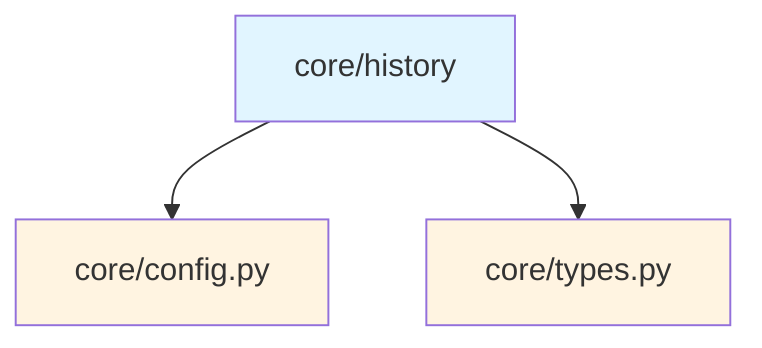
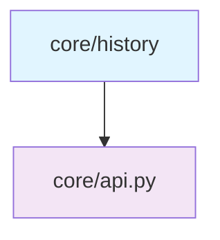
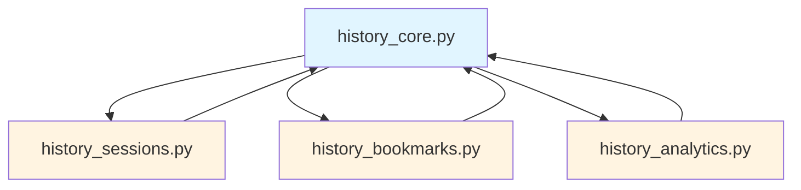
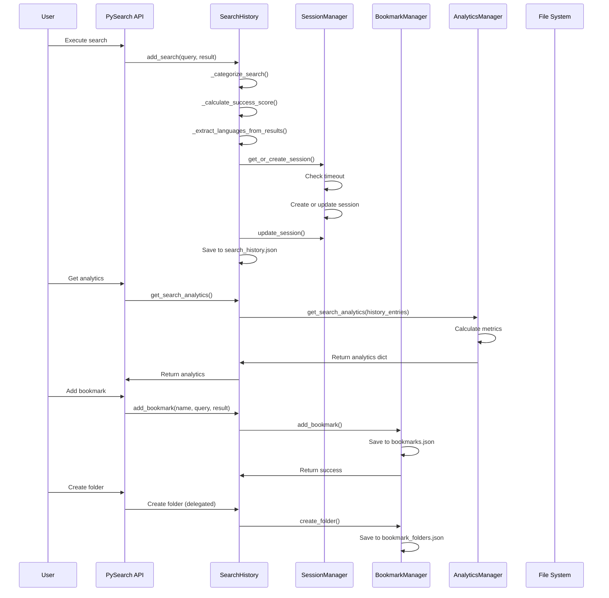
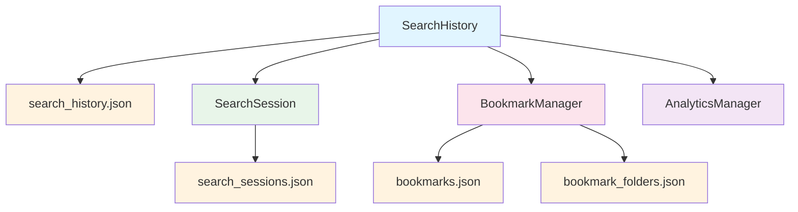

# Core History Submodule

> [根目录](../../../../CLAUDE.md) > [src](../../../) > [pysearch](../../) > [core](../) > **history**

---

## Change Log (Changelog)

### 2026-01-19 - Submodule Documentation Initial Version
- Created comprehensive history management documentation
- Documented core history, sessions, bookmarks, and analytics
- Added usage examples and data flow diagrams

---

## Submodule Overview

### Responsibility
The **Core History** submodule provides comprehensive search history tracking, session management, bookmarking, and analytics capabilities for PySearch.

### Role in Parent Module
- **Search Tracking**: Records all search operations with detailed metadata
- **Session Management**: Groups related searches into sessions
- **Bookmark Organization**: Allows users to save and organize favorite searches
- **Analytics**: Provides insights into search patterns and behavior

### Key Design Decisions
- **Modular Organization**: Split into focused modules for single responsibility
- **Lazy Loading**: Additional managers are loaded on-demand to avoid circular imports
- **Persistent Storage**: JSON-based storage for all history data
- **Automatic Categorization**: Searches are automatically categorized by type

---

## File Inventory

| File | Responsibility | Key Classes/Functions |
|------|---------------|----------------------|
| `__init__.py` | History interface | Re-exports main classes for backward compatibility |
| `history_core.py` | Core history tracking | `SearchHistory`, `SearchHistoryEntry`, `SearchCategory` |
| `history_sessions.py` | Session management | `SearchSession`, `SessionManager` |
| `history_bookmarks.py` | Bookmark management | `BookmarkFolder`, `BookmarkManager` |
| `history_analytics.py` | Search analytics | `AnalyticsManager` |

---

## Dependency Relationships

### Internal Upstream Dependencies


### Internal Downstream Dependencies


### Submodule Internal Dependencies


### External Dependencies
- `json`: Persistent storage
- `time`: Timestamp handling
- `collections.deque`: Efficient history storage
- `dataclasses`: Type definitions
- `hashlib`: Session ID generation

---

## Key Interfaces

### Core History (history_core.py)

#### SearchCategory
Enumeration of search categories for organization.

```python
class SearchCategory(str, Enum):
    FUNCTION = "function"
    CLASS = "class"
    VARIABLE = "variable"
    IMPORT = "import"
    COMMENT = "comment"
    STRING = "string"
    REGEX = "regex"
    GENERAL = "general"
```

#### SearchHistoryEntry
Individual search record with enhanced metadata.

```python
@dataclass(slots=True)
class SearchHistoryEntry:
    timestamp: float                       # When the search occurred
    query_pattern: str                     # Search pattern used
    use_regex: bool                        # Regex mode enabled
    use_ast: bool                          # AST mode enabled
    context: int                           # Context lines
    files_matched: int                     # Number of files with matches
    items_count: int                       # Total result count
    elapsed_ms: float                      # Search duration
    filters: str | None = None             # Filter description
    session_id: str | None = None          # Session identifier
    category: SearchCategory = GENERAL     # Auto-categorized type
    languages: set[str] | None = None      # Languages in results
    paths: list[str] | None = None         # Paths searched
    success_score: float = 0.0             # 0-1 quality score
    user_rating: int | None = None         # 1-5 user rating
    tags: set[str] | None = None           # User-defined tags
```

#### SearchHistory
Main history management class.

```python
class SearchHistory:
    def __init__(self, cfg: SearchConfig, max_entries: int = 1000)

    # History management
    def add_search(self, query: Query, result: SearchResult) -> None
    def get_history(self, limit: int | None = None) -> list[SearchHistoryEntry]
    def get_frequent_patterns(self, limit: int = 10) -> list[tuple[str, int]]
    def get_recent_patterns(self, days: int = 7, limit: int = 20) -> list[str]
    def clear_history(self) -> None
    def get_stats(self) -> dict[str, int]

    # Bookmarks (delegates to BookmarkManager)
    def add_bookmark(self, name: str, query: Query, result: SearchResult) -> None
    def get_bookmarks(self) -> dict[str, SearchHistoryEntry]
    def remove_bookmark(self, name: str) -> bool

    # Sessions (delegates to SessionManager)
    def get_current_session(self) -> SearchSession | None
    def get_sessions(self, limit: int | None = None) -> list[SearchSession]

    # Analytics (delegates to AnalyticsManager)
    def get_search_analytics(self, days: int = 30) -> dict[str, Any]
    def get_pattern_suggestions(self, partial_pattern: str, limit: int = 5) -> list[str]
```

**Usage Example:**
```python
from pysearch.core.history import SearchHistory
from pysearch.core.config import SearchConfig

config = SearchConfig()
history = SearchHistory(config)

# Record a search
history.add_search(query, results)

# Get recent searches
recent = history.get_history(limit=10)
for entry in recent:
    print(f"{entry.query_pattern}: {entry.items_count} results")

# Get analytics
analytics = history.get_search_analytics(days=30)
print(f"Success rate: {analytics['success_rate']:.2%}")
```

### Session Management (history_sessions.py)

#### SearchSession
Represents a search session with related queries.

```python
@dataclass(slots=True)
class SearchSession:
    session_id: str                        # Unique session identifier
    start_time: float                      # Session start timestamp
    end_time: float | None = None          # Session end timestamp
    queries: list[str] | None = None       # Queries in this session
    total_searches: int = 0                # Total searches in session
    successful_searches: int = 0           # Searches with results
    primary_paths: set[str] | None = None  # Main paths searched
    primary_languages: set[str] | None = None  # Languages used
```

#### SessionManager
Manages search sessions with automatic timeout.

```python
class SessionManager:
    def __init__(self, cfg: SearchConfig)
    def load(self) -> None
    def save_sessions(self) -> None

    # Session management
    def get_or_create_session(self, current_time: float) -> SearchSession
    def update_session(self, session: SearchSession, query: Query, result: SearchResult) -> None
    def get_current_session(self) -> SearchSession | None
    def get_sessions(self, limit: int | None = None) -> list[SearchSession]
    def get_session_by_id(self, session_id: str) -> SearchSession | None
    def end_current_session(self) -> None

    # Analytics
    def get_session_analytics(self, days: int = 30) -> dict[str, Any]
    def cleanup_old_sessions(self, days: int = 90) -> int
```

**Usage Example:**
```python
from pysearch.core.history.history_sessions import SessionManager

manager = SessionManager(config)

# Get current session (auto-creates if needed)
session = manager.get_current_session(time.time())
print(f"Session {session.session_id}: {session.total_searches} searches")

# Get session analytics
analytics = manager.get_session_analytics(days=30)
print(f"Average searches per session: {analytics['average_searches_per_session']:.1f}")
```

### Bookmark Management (history_bookmarks.py)

#### BookmarkFolder
Organize bookmarks into folders.

```python
@dataclass(slots=True)
class BookmarkFolder:
    name: str                              # Folder name
    description: str | None = None         # Folder description
    created_time: float | None = None      # Creation timestamp
    bookmarks: set[str] | None = None      # Bookmark names in folder
```

#### BookmarkManager
Manages bookmarked searches with folder organization.

```python
class BookmarkManager:
    def __init__(self, cfg: SearchConfig)
    def load(self) -> None
    def save_bookmarks(self) -> None
    def save_folders(self) -> None

    # Bookmark management
    def add_bookmark(self, name: str, query: Query, result: SearchResult) -> None
    def get_bookmarks(self) -> dict[str, SearchHistoryEntry]
    def remove_bookmark(self, name: str) -> bool
    def search_bookmarks(self, pattern: str) -> list[tuple[str, SearchHistoryEntry]]

    # Folder management
    def create_folder(self, name: str, description: str | None = None) -> bool
    def delete_folder(self, name: str) -> bool
    def get_folders(self) -> dict[str, BookmarkFolder]

    # Folder organization
    def add_bookmark_to_folder(self, bookmark_name: str, folder_name: str) -> bool
    def remove_bookmark_from_folder(self, bookmark_name: str, folder_name: str) -> bool
    def get_bookmarks_in_folder(self, folder_name: str) -> list[SearchHistoryEntry]

    # Statistics
    def get_bookmark_stats(self) -> dict[str, Any]
```

**Usage Example:**
```python
from pysearch.core.history.history_bookmarks import BookmarkManager

manager = BookmarkManager(config)

# Add a bookmark
manager.add_bookmark("find_main", query, results)

# Create a folder and organize
manager.create_folder("Python Functions", "Python-related searches")
manager.add_bookmark_to_folder("find_main", "Python Functions")

# Search bookmarks
results = manager.search_bookmarks("main")
for name, entry in results:
    print(f"{name}: {entry.query_pattern}")
```

### Analytics (history_analytics.py)

#### AnalyticsManager
Provides comprehensive search analytics and insights.

```python
class AnalyticsManager:
    def __init__(self, cfg: SearchConfig)

    # Analytics
    def get_search_analytics(
        self, history_entries: list[SearchHistoryEntry], days: int = 30
    ) -> dict[str, Any]

    # Pattern suggestions
    def get_pattern_suggestions(
        self, history_entries: list[SearchHistoryEntry],
        partial_pattern: str, limit: int = 5
    ) -> list[str]

    # Insights and recommendations
    def get_performance_insights(
        self, history_entries: list[SearchHistoryEntry]
    ) -> dict[str, Any]

    # Usage patterns
    def get_usage_patterns(
        self, history_entries: list[SearchHistoryEntry]
    ) -> dict[str, Any]

    # User feedback
    def rate_search(
        self, history_entries: list[SearchHistoryEntry],
        pattern: str, rating: int
    ) -> bool

    def add_tags_to_search(
        self, history_entries: list[SearchHistoryEntry],
        pattern: str, tags: set[str]
    ) -> bool

    def search_history_by_tags(
        self, history_entries: list[SearchHistoryEntry],
        tags: set[str]
    ) -> list[SearchHistoryEntry]
```

**Usage Example:**
```python
from pysearch.core.history.history_analytics import AnalyticsManager

manager = AnalyticsManager(config)

# Get comprehensive analytics
analytics = manager.get_search_analytics(history_entries, days=30)
print(f"Total searches: {analytics['total_searches']}")
print(f"Success rate: {analytics['success_rate']:.2%}")
print(f"Average search time: {analytics['average_search_time']:.1f}ms")

# Get pattern suggestions
suggestions = manager.get_pattern_suggestions(history_entries, "def ", limit=5)
for suggestion in suggestions:
    print(f"  {suggestion}")

# Get performance insights
insights = manager.get_performance_insights(history_entries)
print("Insights:")
for insight in insights['insights']:
    print(f"  - {insight}")
print("Recommendations:")
for rec in insights['recommendations']:
    print(f"  - {rec}")
```

---

## Data Flow



---

## Storage Architecture



### Storage Locations
All files are stored in the cache directory (typically `.pysearch-cache/` or user home):

| File | Purpose | Format |
|------|---------|--------|
| `search_history.json` | Main search history | JSON array of entries |
| `search_sessions.json` | Session data | JSON dict of sessions |
| `bookmarks.json` | Saved bookmarks | JSON dict of entries |
| `bookmark_folders.json` | Bookmark folders | JSON dict of folders |

---

## Testing

### Related Test Files
- `tests/unit/core/test_history_min.py` - Core history tests
- `tests/integration/test_multi_repo_search_history.py` - History integration tests

### Test Coverage
- History entry creation and storage
- Session management and timeout
- Bookmark CRUD operations
- Analytics calculations
- Pattern suggestions

---

## Usage Examples

### Complete History Workflow
```python
from pysearch import PySearch, SearchConfig
from pysearch.core.history import SearchHistory

# Setup
config = SearchConfig(paths=["src"])
history = SearchHistory(config)

# Perform searches
results1 = engine.search("def main")
history.add_search(query1, results1)

results2 = engine.search("class.*Handler", use_regex=True)
history.add_search(query2, results2)

# Get analytics
analytics = history.get_search_analytics(days=7)
print(f"Total searches: {analytics['total_searches']}")
print(f"Most common categories: {analytics['most_common_categories']}")

# Get pattern suggestions
suggestions = history.get_pattern_suggestions("def ", limit=5)
print("Suggestions:", suggestions)
```

### Bookmark Organization
```python
# Create folder structure
manager = history._bookmark_manager  # Access through history

manager.create_folder("API Endpoints", "REST API endpoint searches")
manager.create_folder("Database Queries", "Database-related searches")
manager.create_folder("Test Cases", "Test and validation searches")

# Add bookmarks
manager.add_bookmark("get_users", query1, results1)
manager.add_bookmark("find_user", query2, results2)
manager.add_bookmark("user_query", query3, results3)

# Organize
manager.add_bookmark_to_folder("get_users", "API Endpoints")
manager.add_bookmark_to_folder("find_user", "API Endpoints")
manager.add_bookmark_to_folder("user_query", "Database Queries")

# Get bookmarks in folder
api_bookmarks = manager.get_bookmarks_in_folder("API Endpoints")
```

### Session Analysis
```python
# Get current session info
session = history.get_current_session()
if session:
    print(f"Current session: {session.session_id}")
    print(f"Searches: {session.total_searches}")
    print(f"Languages: {session.primary_languages}")

# Get all sessions
sessions = history.get_sessions(limit=10)
for session in sessions:
    duration = (session.end_time or time.time()) - session.start_time
    print(f"{session.session_id}: {session.total_searches} searches, {duration:.0f}s")

# Session analytics
analytics = history._session_manager.get_session_analytics(days=30)
print(f"Average session duration: {analytics['average_session_duration']:.0f}s")
```

### Advanced Analytics
```python
# Performance insights
insights = history.get_search_analytics(days=30).get('performance_insights')
if insights:
    print("Performance Insights:")
    for insight in insights['insights']:
        print(f"  - {insight}")
    for rec in insights['recommendations']:
        print(f"  Recommendation: {rec}")

# Usage patterns
patterns = history._analytics_manager.get_usage_patterns(history_entries)
print(f"Most active hour: {patterns['temporal_patterns']['most_active_hour']}")
print(f"Regex usage rate: {patterns['search_patterns']['regex_usage_rate']:.2%}")

# User feedback
history._analytics_manager.rate_search(history_entries, "def main", 5)
history._analytics_manager.add_tags_to_search(
    history_entries,
    "class.*Handler",
    {"api", "endpoint", "rest"}
)

# Search by tags
tagged_searches = history._analytics_manager.search_history_by_tags(
    history_entries,
    {"api", "endpoint"}
)
```

---

## Common Patterns

### Automatic Categorization
Searches are automatically categorized based on pattern analysis:

```python
def _categorize_search(self, query: Query) -> SearchCategory:
    pattern = query.pattern.lower()

    if any(keyword in pattern for keyword in ["def ", "function", "func ", "()"]):
        return SearchCategory.FUNCTION
    if any(keyword in pattern for keyword in ["class ", "interface", "struct"]):
        return SearchCategory.CLASS
    if any(keyword in pattern for keyword in ["import", "require", "from "]):
        return SearchCategory.IMPORT
    # ... more patterns

    return SearchCategory.GENERAL
```

### Success Score Calculation
Search quality is automatically scored:

```python
def _calculate_success_score(self, result: SearchResult) -> float:
    if result.stats.items == 0:
        return 0.0

    score = 0.3  # Base score

    # Bonus for reasonable results
    if 1 <= result.stats.items <= 20:
        score += 0.4
    elif 21 <= result.stats.items <= 100:
        score += 0.2

    # Bonus for multiple files
    if result.stats.files_matched > 1:
        score += 0.2

    # Bonus for fast search
    if result.stats.elapsed_ms < 100:
        score += 0.1

    return min(1.0, score)
```

### Session Timeout Management
Sessions automatically expire after inactivity:

```python
SESSION_TIMEOUT = 30 * 60  # 30 minutes

def get_or_create_session(self, current_time: float) -> SearchSession:
    # Check if current session expired
    if (current_time - self._last_search_time > self._session_timeout):
        # End current session
        if self._current_session:
            self._current_session.end_time = self._last_search_time

        # Create new session
        session_id = hashlib.md5(f"{current_time}".encode()).hexdigest()[:8]
        self._current_session = SearchSession(session_id=session_id, start_time=current_time)

    return self._current_session
```

---

## Related Files
- `src/pysearch/core/api.py` - Uses history for tracking
- `src/pysearch/core/config.py` - Configuration for cache directory
- `src/pysearch/core/types.py` - Type definitions used
- `tests/unit/core/test_history_min.py` - Unit tests
