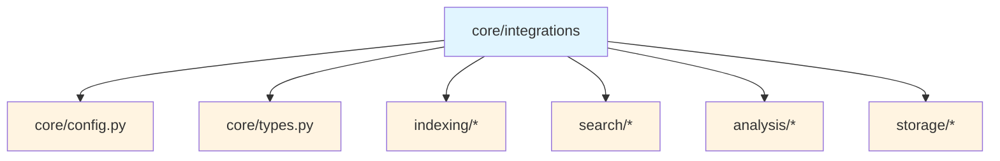
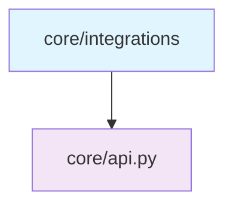
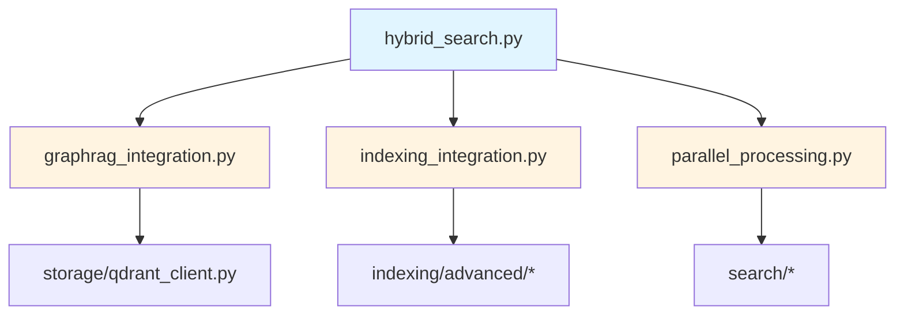
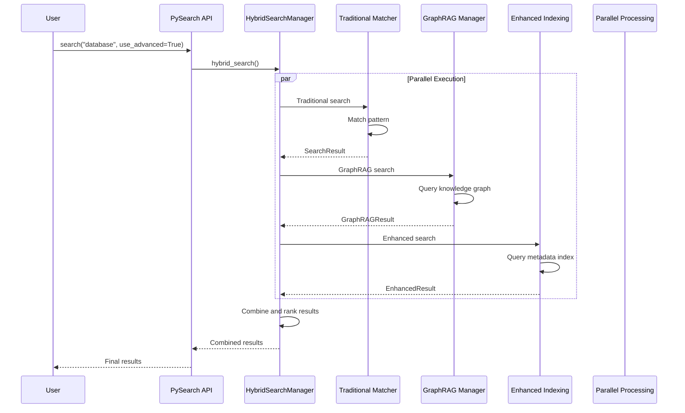
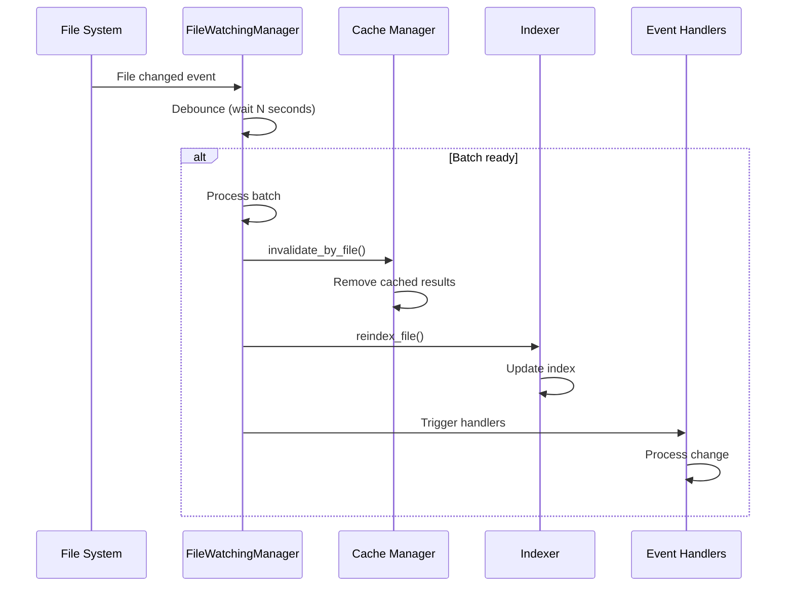

# Core Integrations Submodule

> [根目录](../../../../CLAUDE.md) > [src](../../../) > [pysearch](../../) > [core](../) > **integrations**

---

## Change Log (Changelog)

### 2026-01-19 - Submodule Documentation Initial Version
- Created comprehensive integrations documentation
- Documented all 8 integration managers
- Added dependency relationships and usage examples

---

## Submodule Overview

### Responsibility
The **Core Integrations** submodule provides specialized integration modules that extend PySearch with semantic features while keeping the core API clean and focused.

### Role in Parent Module
- **Feature Extension**: Adds semantic capabilities without cluttering the main API
- **Coordination**: Manages complex interactions between components
- **Optional Features**: Enables/disables semantic features dynamically
- **Performance**: Provides parallel processing and optimization strategies

### Key Design Decisions
- **Internal Implementation**: These modules are implementation details, not public APIs
- **Lazy Initialization**: Integrations are activated only when needed
- **Pluggable Architecture**: Each integration can be enabled/disabled independently
- **Separation of Concerns**: Each module focuses on a single integration domain

---

## File Inventory

| File | Responsibility | Key Classes/Functions |
|------|---------------|----------------------|
| `__init__.py` | Package interface | No exports (internal modules) |
| `hybrid_search.py` | Advanced search coordinator | `HybridSearchManager` - hybrid search |
| `cache_integration.py` | Cache management | `CacheIntegrationManager` - result caching |
| `dependency_integration.py` | Dependency analysis | `DependencyIntegrationManager` - code dependencies |
| `indexing_integration.py` | Enhanced indexing | `IndexingIntegrationManager` - metadata indexing |
| `file_watching.py` | File monitoring | `FileWatchingManager` - real-time updates |
| `graphrag_integration.py` | GraphRAG support | `GraphRAGIntegrationManager` - knowledge graphs |
| `multi_repo_integration.py` | Multi-repository | `MultiRepoManager` - cross-repo search |
| `parallel_processing.py` | Parallel execution | `ParallelProcessingManager` - concurrent processing |

---

## Dependency Relationships

### Internal Upstream Dependencies


### Internal Downstream Dependencies


### Submodule Internal Dependencies


### External Dependencies
- `concurrent.futures`: Parallel processing
- `asyncio`: Async operations
- `watchdog`: File system monitoring
- `qdrant-client`: Vector database (optional)
- `numpy`: Numerical operations (optional)

---

## Key Interfaces

### Advanced Search Manager

#### Overview
Coordinates hybrid search combining traditional search, GraphRAG, and enhanced indexing.

#### Key Methods
```python
class HybridSearchManager:
    def __init__(self, config: SearchConfig)

    # Hybrid search
    async def hybrid_search(
        self, pattern: str,
        use_traditional: bool = True,
        use_graphrag: bool = False,
        use_enhanced: bool = False
    ) -> dict[str, Any]

    # Configuration
    def enable_graphrag(self) -> bool
    def enable_metadata_indexing(self) -> bool

    # Status
    def get_capabilities(self) -> dict[str, bool]
```

#### Usage Example
```python
manager = HybridSearchManager(config)

# Hybrid search combining all methods
result = await manager.hybrid_search(
    "database connection",
    use_traditional=True,
    use_graphrag=True,
    use_enhanced=True
)

# Result contains
{
    "traditional": SearchResult,
    "graphrag": GraphRAGResult,
    "enhanced": EnhancedIndexResult,
    "combined": list[SearchItem]
}
```

### Cache Integration Manager

#### Overview
Manages file content caching and result caching with TTL-based expiration.

#### Key Methods
```python
class CacheIntegrationManager:
    def __init__(self, config: SearchConfig)

    # Cache operations
    def cache_result(self, key: str, result: SearchResult, ttl: float = 3600) -> bool
    def get_cached_result(self, key: str) -> SearchResult | None
    def invalidate(self, key: str) -> bool
    def invalidate_by_file(self, file_path: str) -> int

    # Cache statistics
    def get_stats(self) -> dict[str, Any]
    def clear_cache(self) -> None

    # Integration
    def on_file_changed(self, file_path: str) -> None
```

#### Usage Example
```python
manager = CacheIntegrationManager(config)

# Cache a search result
cache_key = f"search:{query.pattern}:{hash(query)}"
manager.cache_result(cache_key, result, ttl=3600)

# Retrieve from cache
cached = manager.get_cached_result(cache_key)
if cached:
    print("Cache hit!")

# Invalidate on file change
manager.on_file_changed("src/main.py")
```

### Dependency Integration Manager

#### Overview
Handles dependency graph analysis, circular dependency detection, and refactoring suggestions.

#### Key Methods
```python
class DependencyIntegrationManager:
    def __init__(self, config: SearchConfig)

    # Analysis
    def analyze_directory(self, directory: Path) -> DependencyGraph
    def analyze_file(self, file_path: Path) -> list[Dependency]

    # Graph operations
    def detect_cycles(self, graph: DependencyGraph) -> list[list[str]]
    def get_metrics(self, graph: DependencyGraph) -> DependencyMetrics
    def find_impact(self, module: str, graph: DependencyGraph) -> dict[str, Any]

    # Refactoring
    def suggest_refactorings(self, graph: DependencyGraph) -> list[RefactoringSuggestion]

    # Visualization
    def export_graph(self, graph: DependencyGraph, format: str = "dot") -> str
```

#### Usage Example
```python
manager = DependencyIntegrationManager(config)

# Analyze codebase
graph = manager.analyze_directory(Path("src"))

# Check for cycles
cycles = manager.detect_cycles(graph)
if cycles:
    print(f"Found {len(cycles)} circular dependencies")
    for cycle in cycles:
        print(" -> ".join(cycle))

# Get metrics
metrics = manager.get_metrics(graph)
print(f"Total modules: {metrics.total_modules}")
print(f"Circular dependencies: {metrics.circular_dependencies}")

# Impact analysis
impact = manager.find_impact("src.core.database", graph)
print(f"Modules affected: {impact['total_affected_modules']}")

# Refactoring suggestions
suggestions = manager.suggest_refactorings(graph)
for suggestion in suggestions:
    print(f"{suggestion.type}: {suggestion.description}")
```

### IndexingIntegrationManager

#### Overview
Manages advanced metadata indexing with complexity analysis and dependency tracking.

#### Key Methods
```python
class IndexingIntegrationManager:
    def __init__(self, config: SearchConfig)

    # Index management
    async def refresh_index(self, force: bool = False) -> bool
    async def get_progress(self) -> IndexingProgress
    def cancel_indexing(self) -> None

    # Search
    async def search_index(self, query: str, filters: dict | None = None) -> list[EntityMetadata]

    # Statistics
    def get_index_stats(self) -> IndexStats

    # Configuration
    def enable_semantic_indexing(self, enabled: bool = True) -> None
    def set_complexity_threshold(self, threshold: float) -> None
```

#### Usage Example
```python
manager = IndexingIntegrationManager(config)

# Refresh the index
await manager.refresh_index(force=False)

# Check progress
progress = await manager.get_progress()
print(f"Indexing: {progress.percent_complete:.1f}%")

# Search the index
results = await manager.search_index(
    "database connection",
    filters={"language": "Python", "min_complexity": 0.5}
)

# Get statistics
stats = manager.get_index_stats()
print(f"Total entities: {stats.total_entities}")
print(f"Index size: {stats.index_size_mb:.2f} MB")
```

### File Watching Manager

#### Overview
Provides real-time file change monitoring with debouncing and batch processing.

#### Key Methods
```python
class FileWatchingManager:
    def __init__(self, config: SearchConfig)

    # Watch management
    def start_watching(self) -> None
    def stop_watching(self) -> None
    def is_watching(self) -> bool

    # Event handlers
    def on_file_changed(self, handler: Callable[[Path], None]) -> None
    def on_file_created(self, handler: Callable[[Path], None]) -> None
    def on_file_deleted(self, handler: Callable[[Path], None]) -> None

    # Statistics
    def get_stats(self) -> dict[str, Any]

    # Configuration
    def set_debounce_interval(self, seconds: float) -> None
    def set_batch_size(self, size: int) -> None
```

#### Usage Example
```python
manager = FileWatchingManager(config)

# Setup event handlers
@manager.on_file_changed
def handle_change(file_path: Path):
    print(f"File changed: {file_path}")
    # Invalidate cache, re-index, etc.

@manager.on_file_created
def handle_create(file_path: Path):
    print(f"File created: {file_path}")

@manager.on_file_deleted
def handle_delete(file_path: Path):
    print(f"File deleted: {file_path}")

# Start watching
manager.start_watching()

# Check status
if manager.is_watching():
    stats = manager.get_stats()
    print(f"Watching {stats['watched_files']} files")
```

### GraphRAG Integration Manager

#### Overview
Handles knowledge graph construction, querying, and vector database integration.

#### Key Methods
```python
class GraphRAGIntegrationManager:
    def __init__(self, config: SearchConfig, qdrant_config: QdrantConfig)

    # Lifecycle
    async def initialize(self) -> None
    async def close(self) -> None

    # Knowledge graph
    async def build_knowledge_graph(self, force_rebuild: bool = False) -> bool
    async def query_graph(self, query: GraphRAGQuery) -> GraphRAGResult | None

    # Vector operations
    async def index_entities(self, entities: list[CodeEntity]) -> bool
    async def search_similar(self, entity: CodeEntity, limit: int = 10) -> list[CodeEntity]

    # Graph operations
    def get_graph_stats(self) -> dict[str, Any]
    def export_graph(self, format: str = "json") -> str
```

#### Usage Example
```python
manager = GraphRAGIntegrationManager(config, qdrant_config)
await manager.initialize()

# Build knowledge graph
success = await manager.build_knowledge_graph(force_rebuild=False)

# Query the graph
from pysearch.core.types import GraphRAGQuery

query = GraphRAGQuery(
    pattern="database connection handling",
    max_hops=2,
    min_confidence=0.6
)
result = await manager.query_graph(query)

# Access results
for entity in result.entities:
    print(f"{entity.name}: {entity.entity_type}")
    print(f"  {entity.signature}")

# Get statistics
stats = manager.get_graph_stats()
print(f"Total entities: {stats['total_entities']}")
print(f"Total relationships: {stats['total_relationships']}")

await manager.close()
```

### Multi-Repo Integration Manager

#### Overview
Coordinates search across multiple repositories with parallel execution.

#### Key Methods
```python
class MultiRepoManager:
    def __init__(self, config: SearchConfig)

    # Repository management
    def add_repository(self, repo_path: Path, name: str) -> bool
    def remove_repository(self, name: str) -> bool
    def list_repositories(self) -> list[RepositoryInfo]

    # Search
    async def search_all(self, query: Query) -> dict[str, SearchResult]
    async def search_repositories(
        self, query: Query, repos: list[str]
    ) -> dict[str, SearchResult]

    # Health monitoring
    def get_health_status(self) -> dict[str, RepositoryHealth]
    async def check_repository(self, name: str) -> RepositoryHealth

    # Statistics
    def get_combined_stats(self) -> dict[str, Any]
```

#### Usage Example
```python
manager = MultiRepoManager(config)

# Add repositories
manager.add_repository(Path("/path/to/repo1"), "backend")
manager.add_repository(Path("/path/to/repo2"), "frontend")

# List repositories
repos = manager.list_repositories()
for repo in repos:
    print(f"{repo.name}: {repo.path}")

# Search all repositories
results = await manager.search_all(query)
for repo_name, result in results.items():
    print(f"{repo_name}: {result.stats.items} results")

# Search specific repositories
results = await manager.search_repositories(query, ["backend"])

# Health check
health = await manager.check_repository("backend")
print(f"Status: {health.status}")
print(f"Indexed files: {health.indexed_files}")
```

### Parallel Processing Manager

#### Overview
Manages parallel search execution with configurable worker pools.

#### Key Methods
```python
class ParallelProcessingManager:
    def __init__(self, config: SearchConfig)

    # Execution
    async def execute_parallel(
        self, tasks: list[Callable], max_workers: int = None
    ) -> list[Any]

    async def search_parallel(
        self, query: Query, paths: list[Path]
    ) -> list[SearchResult]

    # Configuration
    def set_max_workers(self, workers: int) -> None
    def get_optimal_workers(self) -> int

    # Statistics
    def get_performance_stats(self) -> dict[str, Any]
```

#### Usage Example
```python
manager = ParallelProcessingManager(config)

# Parallel search across paths
paths = [Path("src"), Path("tests"), Path("docs")]
results = await manager.search_parallel(query, paths)

# Combine results
combined = SearchResult()
for result in results:
    combined.items.extend(result.items)
    combined.stats.files_scanned += result.stats.files_scanned

# Performance stats
stats = manager.get_performance_stats()
print(f"Average task time: {stats['avg_task_time_ms']:.1f}ms")
print(f"Parallelization speedup: {stats['speedup']:.2f}x")
```

---

## Data Flow

### Advanced Search Flow


### File Watching Flow


---

## Integration Matrix

| Integration | Core | Optional | External Deps | Async |
|------------|------|----------|---------------|-------|
| Advanced Search | No | Yes | None | Yes |
| Cache Integration | Yes | No | None | No |
| Dependency Integration | No | Yes | None | No |
| Enhanced Indexing | No | Yes | None | Yes |
| File Watching | No | Yes | watchdog | No |
| GraphRAG Integration | No | Yes | qdrant-client | Yes |
| Multi-Repo Integration | No | Yes | None | Yes |
| Parallel Processing | No | Yes | None | Yes |

---

## Testing

### Related Test Files
- `tests/integration/test_enhanced_indexing.py` - Enhanced indexing tests
- `tests/integration/test_graphrag.py` - GraphRAG integration tests
- `tests/integration/test_multi_repo_*.py` - Multi-repo tests
- `tests/unit/core/test_file_watcher_*.py` - File watching tests

### Test Coverage
- Integration initialization and lifecycle
- Feature enable/disable mechanisms
- Parallel execution correctness
- File change detection and handling
- Cross-repository search coordination

---

## Usage Examples

### Complete Advanced Search Setup
```python
from pysearch import PySearch, SearchConfig
from pysearch.core.integrations.hybrid_search import HybridSearchManager

# Configure
config = SearchConfig(
    paths=["src"],
    enable_graphrag=True,
    enable_metadata_indexing=True
)

# Initialize
engine = PySearch(config)
manager = HybridSearchManager(config)

# Enable features
manager.enable_graphrag()
manager.enable_metadata_indexing()

# Perform hybrid search
result = await manager.hybrid_search(
    "database connection",
    use_traditional=True,
    use_graphrag=True,
    use_enhanced=True
)

# Access combined results
for item in result['combined']:
    print(f"{item.file}:{item.start_line} - {item.lines[0]}")
```

### Setting Up File Watching
```python
from pysearch.core.integrations.file_watching import FileWatchingManager

manager = FileWatchingManager(config)

# Configure
manager.set_debounce_interval(1.0)  # 1 second
manager.set_batch_size(10)  # Process up to 10 changes at once

# Setup handlers
@manager.on_file_changed
def on_change(file_path: Path):
    print(f"Reindexing: {file_path}")
    # Trigger reindexing

@manager.on_file_deleted
def on_delete(file_path: Path):
    print(f"Cleaning up: {file_path}")
    # Clean up cache

# Start watching
manager.start_watching()

try:
    # Main application loop
    while True:
        time.sleep(1)
finally:
    manager.stop_watching()
```

### Multi-Repository Search
```python
from pysearch.core.integrations.multi_repo_integration import MultiRepoManager

manager = MultiRepoManager(config)

# Add repositories
manager.add_repository(Path("/projects/backend"), "backend")
manager.add_repository(Path("/projects/frontend"), "frontend")
manager.add_repository(Path("/projects/shared"), "shared")

# Search all repositories
query = Query(pattern="class.*Service", use_regex=True)
results = await manager.search_all(query)

# Display results
for repo_name, result in results.items():
    print(f"\n{repo_name}:")
    for item in result.items[:5]:  # Top 5 per repo
        print(f"  {item.file}:{item.start_line}")

# Health check
health_status = await manager.check_repository("backend")
print(f"Backend health: {health_status.status}")
```

### Dependency Analysis
```python
from pysearch.core.integrations.dependency_integration import DependencyIntegrationManager

manager = DependencyIntegrationManager(config)

# Analyze codebase
graph = manager.analyze_directory(Path("src"))

# Check for circular dependencies
cycles = manager.detect_cycles(graph)
if cycles:
    print("Circular dependencies detected:")
    for cycle in cycles:
        print(" -> ".join(cycle))

# Get refactoring suggestions
suggestions = manager.suggest_refactorings(graph)
for suggestion in suggestions:
    print(f"\n{suggestion.type}: {suggestion.description}")
    print(f"  Impact: {suggestion.impact}")
    print(f"  Effort: {suggestion.effort}")

# Export graph
dot_graph = manager.export_graph(graph, format="dot")
with open("dependencies.dot", "w") as f:
    f.write(dot_graph)
```

---

## Common Patterns

### Integration Initialization
```python
# Lazy initialization pattern
class PySearch:
    def __init__(self, config: SearchConfig):
        self._config = config
        self._integrations = {}

    def get_integration(self, name: str):
        if name not in self._integrations:
            self._integrations[name] = self._create_integration(name)
        return self._integrations[name]
```

### Feature Enablement
```python
# Optional feature activation
if config.enable_graphrag:
    try:
        manager = GraphRAGIntegrationManager(config, qdrant_config)
        await manager.initialize()
        self._graphrag = manager
    except ImportError:
        logger.warning("GraphRAG dependencies not available")
```

### Error Handling
```python
# Graceful degradation
try:
    result = await manager.hybrid_search(query)
except Exception as e:
    logger.error(f"Advanced search failed: {e}")
    # Fallback to traditional search
    result = await self._traditional_search(query)
```

---

## Related Files
- `src/pysearch/core/api.py` - Main API using integrations
- `src/pysearch/core/config.py` - Configuration for integrations
- `src/pysearch/indexing/` - Indexing integrations
- `src/pysearch/storage/` - Storage integrations
- `tests/integration/` - Integration tests
