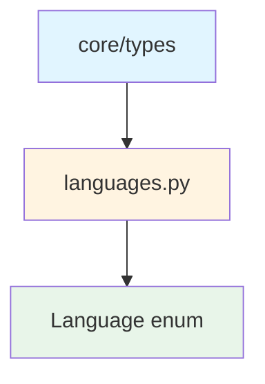
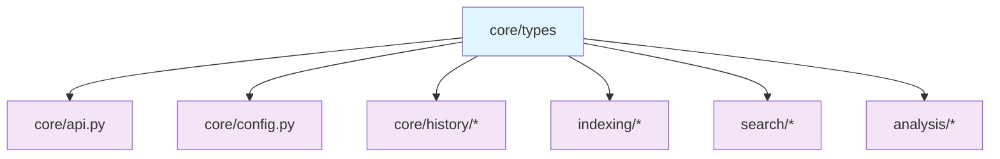
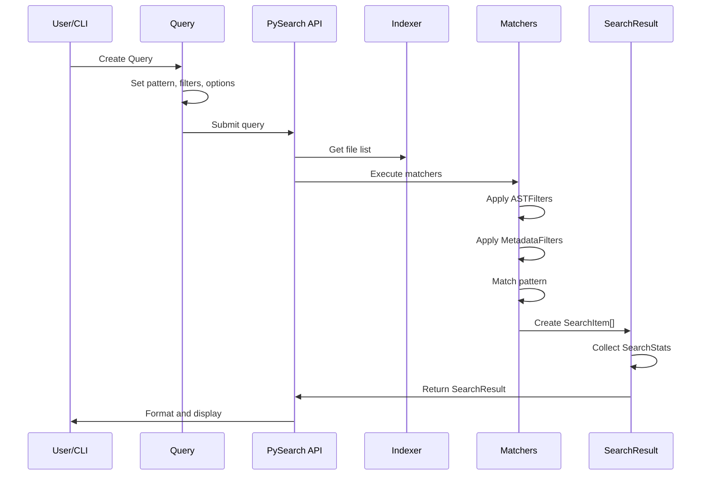

# Core Types Submodule

> [根目录](../../../../CLAUDE.md) > [src](../../../) > [pysearch](../../) > [core](../) > **types**

---

## Change Log (Changelog)

### 2026-01-19 - Submodule Documentation Initial Version
- Created comprehensive type system documentation
- Documented basic types and GraphRAG types
- Added dependency relationships and usage examples

---

## Submodule Overview

### Responsibility
The **Core Types** submodule defines all fundamental data structures, enumerations, and data classes used throughout the PySearch system. It serves as the foundation for type safety and data exchange between components.

### Role in Parent Module
- **Single Source of Truth**: All core types are defined here and re-exported
- **Type System Foundation**: Provides the type contracts used across all modules
- **Data Contracts**: Defines the shape of search queries, results, and configuration
- **GraphRAG Support**: Specialized types for knowledge graph operations

### Key Design Decisions
- **Modular Organization**: Basic types and GraphRAG types are separated for clarity
- **Backward Compatibility**: All types are re-exported from `__init__.py`
- **Dataclasses**: Use `@dataclass(slots=True)` for performance
- **Immutable by Default**: Most types use frozen dataclasses where appropriate

---

## File Inventory

| File | Responsibility | Key Classes/Functions |
|------|---------------|----------------------|
| `__init__.py` | Type exports and re-exports | Re-exports all types for backward compatibility |
| `basic_types.py` | Core search types | `Query`, `SearchResult`, `SearchItem`, `SearchStats`, `ASTFilters`, `MetadataFilters` |
| `graphrag_types.py` | GraphRAG-specific types | `CodeEntity`, `EntityRelationship`, `KnowledgeGraph`, `GraphRAGQuery`, `GraphRAGResult` |

---

## Dependency Relationships

### Internal Upstream Dependencies


### Internal Downstream Dependencies


### External Dependencies
- `dataclasses`: For type definitions
- `enum`: For enumerations
- `pathlib`: For file path handling
- `typing`: For type hints

---

## Key Interfaces

### Basic Types

#### Query
The primary search query specification.

```python
@dataclass(slots=True)
class Query:
    pattern: str                          # Search pattern (text, regex, or semantic)
    use_regex: bool = False               # Enable regex mode
    use_ast: bool = False                 # Enable AST-based matching
    use_semantic: bool = False            # Enable semantic search
    use_boolean: bool = False             # Enable boolean logic
    context: int = 2                      # Context lines around matches
    output: OutputFormat = OutputFormat.TEXT
    filters: ASTFilters | None = None     # AST filters for structural matching
    metadata_filters: MetadataFilters | None = None  # File metadata filters
    search_docstrings: bool = True        # Search in docstrings
    search_comments: bool = True          # Search in comments
    search_strings: bool = True           # Search in string literals
    count_only: bool = False              # Count-only mode
    max_per_file: int | None = None       # Max results per file
```

**Usage Example:**
```python
from pysearch.core.types import Query, ASTFilters

# Regex search with AST filters
filters = ASTFilters(func_name=".*_handler", decorator="lru_cache")
query = Query(
    pattern="def ",
    use_regex=True,
    use_ast=True,
    filters=filters,
    context=5
)
```

#### SearchResult
Container for search results with statistics.

```python
@dataclass(slots=True)
class SearchResult:
    items: list[SearchItem]               # Match results
    stats: SearchStats                    # Performance statistics
```

#### SearchItem
Individual search result with context.

```python
@dataclass(slots=True)
class SearchItem:
    file: Path                            # File path
    start_line: int                       # Start line (1-based)
    end_line: int                         # End line (1-based)
    lines: list[str]                      # Content lines with context
    match_spans: list[MatchSpan]          # Precise match positions
```

#### ASTFilters
Configuration for AST-based filtering.

```python
@dataclass(slots=True)
class ASTFilters:
    func_name: str | None = None          # Function name pattern
    class_name: str | None = None         # Class name pattern
    decorator: str | None = None          # Decorator pattern
    imported: str | None = None           # Import pattern
```

#### MetadataFilters
Advanced file metadata-based filters.

```python
@dataclass(slots=True)
class MetadataFilters:
    min_size: int | None = None           # Minimum file size (bytes)
    max_size: int | None = None           # Maximum file size (bytes)
    modified_after: float | None = None   # Unix timestamp
    modified_before: float | None = None  # Unix timestamp
    min_lines: int | None = None          # Minimum line count
    max_lines: int | None = None          # Maximum line count
    author_pattern: str | None = None     # Author regex pattern
    languages: set[Language] | None = None  # Language filter
```

### GraphRAG Types

#### CodeEntity
Represents a code entity in the knowledge graph.

```python
@dataclass(slots=True)
class CodeEntity:
    id: str                               # Unique identifier
    name: str                             # Entity name
    entity_type: EntityType               # Type of entity
    file_path: Path                       # File location
    start_line: int                       # Start line
    end_line: int                         # End line
    signature: str | None = None          # Function/method signature
    docstring: str | None = None          # Documentation
    properties: dict[str, Any]            # Additional properties
    embedding: list[float] | None = None  # Vector embedding
    confidence: float = 1.0               # Extraction confidence
    language: Language = Language.UNKNOWN
    scope: str | None = None              # Scope information
    access_modifier: str | None = None    # Public/private/protected
```

#### EntityRelationship
Relationship between two code entities.

```python
@dataclass(slots=True)
class EntityRelationship:
    id: str                               # Unique identifier
    source_entity_id: str                 # Source entity ID
    target_entity_id: str                 # Target entity ID
    relation_type: RelationType           # Type of relationship
    properties: dict[str, Any]            # Additional properties
    confidence: float = 1.0               # Extraction confidence
    weight: float = 1.0                   # Relationship strength
    context: str | None = None            # Contextual information
    file_path: Path | None = None         # File location
    line_number: int | None = None        # Line number
```

#### KnowledgeGraph
Complete knowledge graph structure.

```python
@dataclass(slots=True)
class KnowledgeGraph:
    entities: dict[str, CodeEntity]       # All entities
    relationships: list[EntityRelationship]  # All relationships
    entity_index: dict[str, list[str]]    # Name -> IDs mapping
    type_index: dict[EntityType, list[str]]  # Type -> IDs mapping
    file_index: dict[Path, list[str]]     # File -> IDs mapping
    metadata: dict[str, Any]              # Graph metadata
    version: str = "1.0"
    created_at: float | None = None
    updated_at: float | None = None
```

**Methods:**
```python
def add_entity(self, entity: CodeEntity) -> None
def add_relationship(self, relationship: EntityRelationship) -> None
def get_entity(self, entity_id: str) -> CodeEntity | None
def get_entities_by_name(self, name: str) -> list[CodeEntity]
def get_entities_by_type(self, entity_type: EntityType) -> list[CodeEntity]
def get_related_entities(
    self, entity_id: str,
    relation_types: list[RelationType] | None = None,
    max_hops: int = 1
) -> list[tuple[CodeEntity, EntityRelationship]]
```

#### GraphRAGQuery
Query specification for GraphRAG operations.

```python
@dataclass(slots=True)
class GraphRAGQuery:
    pattern: str                          # Search pattern or question
    entity_types: list[EntityType] | None = None  # Entity types to focus on
    relation_types: list[RelationType] | None = None  # Relationship types
    include_relationships: bool = True    # Include relationship info
    max_hops: int = 2                     # Max graph traversal hops
    min_confidence: float = 0.5           # Min confidence threshold
    semantic_threshold: float = 0.7       # Semantic similarity threshold
    use_vector_search: bool = True        # Use vector similarity
    context_window: int = 5               # Context window size
    ranking_strategy: str = "relevance"   # Ranking strategy
```

### Enumerations

#### OutputFormat
```python
class OutputFormat(str, Enum):
    TEXT = "text"                         # Plain text output
    JSON = "json"                         # JSON format
    HIGHLIGHT = "highlight"               # Syntax-highlighted output
```

#### BooleanOperator
```python
class BooleanOperator(str, Enum):
    AND = "AND"
    OR = "OR"
    NOT = "NOT"
```

#### EntityType (GraphRAG)
```python
class EntityType(str, Enum):
    FUNCTION = "function"
    CLASS = "class"
    METHOD = "method"
    VARIABLE = "variable"
    CONSTANT = "constant"
    MODULE = "module"
    PACKAGE = "package"
    IMPORT = "import"
    DECORATOR = "decorator"
    # ... and more
```

#### RelationType (GraphRAG)
```python
class RelationType(str, Enum):
    # Structural
    CONTAINS = "contains"
    INHERITS = "inherits"
    IMPLEMENTS = "implements"
    EXTENDS = "extends"

    # Usage
    CALLS = "calls"
    USES = "uses"
    IMPORTS = "imports"
    REFERENCES = "references"

    # Data flow
    RETURNS = "returns"
    ACCEPTS = "accepts"
    ASSIGNS = "assigns"
    MODIFIES = "modifies"

    # ... and more
```

---

## Data Flow



---

## Testing

### Related Test Files
- `tests/unit/api/test_api_*.py` - API usage of types
- `tests/unit/core/test_metadata_filters_expanded.py` - Metadata filter tests
- `tests/integration/test_graphrag.py` - GraphRAG type tests

### Test Coverage
- Basic type instantiation and validation
- Query construction with filters
- Search result serialization
- Knowledge graph operations

---

## Usage Examples

### Basic Query Construction
```python
from pysearch.core.types import Query, ASTFilters, MetadataFilters, Language

# Simple text search
query = Query(pattern="def main")

# Regex search
query = Query(pattern=r"def \w+_handler", use_regex=True)

# AST-based search
filters = ASTFilters(func_name="main", decorator="lru_cache")
query = Query(pattern="def", use_ast=True, filters=filters)

# Complex query with metadata
metadata = MetadataFilters(
    min_lines=50,
    languages={Language.PYTHON},
    modified_after=1704067200  # 2024-01-01
)
query = Query(
    pattern="class.*Test",
    use_regex=True,
    context=5,
    metadata_filters=metadata
)
```

### Working with Results
```python
from pysearch.core.types import SearchResult, SearchItem, SearchStats

# Create a result
items = [
    SearchItem(
        file=Path("example.py"),
        start_line=10,
        end_line=12,
        lines=["def main():", "    pass", ""]
    )
]
stats = SearchStats(
    files_scanned=100,
    files_matched=1,
    items=1,
    elapsed_ms=45.2
)
result = SearchResult(items=items, stats=stats)

# Access results
for item in result.items:
    print(f"Found in {item.file}:{item.start_line}")
    print(f"Lines {item.start_line}-{item.end_line}")
```

### GraphRAG Usage
```python
from pysearch.core.types import (
    CodeEntity, EntityType, RelationType,
    EntityRelationship, KnowledgeGraph, GraphRAGQuery
)

# Create a knowledge graph
graph = KnowledgeGraph()

# Add entities
entity = CodeEntity(
    id="func_main_1",
    name="main",
    entity_type=EntityType.FUNCTION,
    file_path=Path("app.py"),
    start_line=10,
    end_line=15,
    signature="def main() -> None:",
    docstring="Main entry point"
)
graph.add_entity(entity)

# Add relationships
rel = EntityRelationship(
    id="rel_1",
    source_entity_id="func_main_1",
    target_entity_id="func_helper_2",
    relation_type=RelationType.CALLS,
    confidence=0.95
)
graph.add_relationship(rel)

# Query the graph
query = GraphRAGQuery(
    pattern="database connection",
    max_hops=2,
    min_confidence=0.7
)
```

---

## Common Patterns

### Type Conversion
```python
# Query to dict for serialization
query_dict = {
    'pattern': query.pattern,
    'use_regex': query.use_regex,
    'use_ast': query.use_ast,
    'context': query.context
}

# Dict to Query
query = Query(**query_dict)
```

### Filter Composition
```python
# Combine multiple filters
ast_filters = ASTFilters(
    func_name=r".*Handler$",
    class_name="Controller"
)
metadata_filters = MetadataFilters(
    min_lines=20,
    languages={Language.PYTHON}
)
query = Query(
    pattern="class ",
    use_ast=True,
    filters=ast_filters,
    metadata_filters=metadata_filters
)
```

---

## Related Files
- `src/pysearch/core/api.py` - Main API using these types
- `src/pysearch/core/config.py` - Configuration related to types
- `src/pysearch/core/history/` - History types
- `tests/unit/core/test_types.py` - Type system tests
