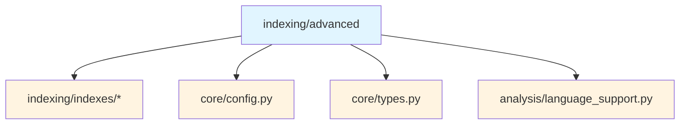
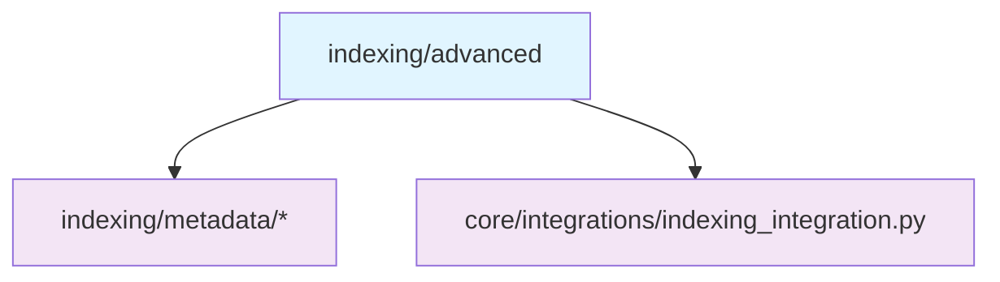
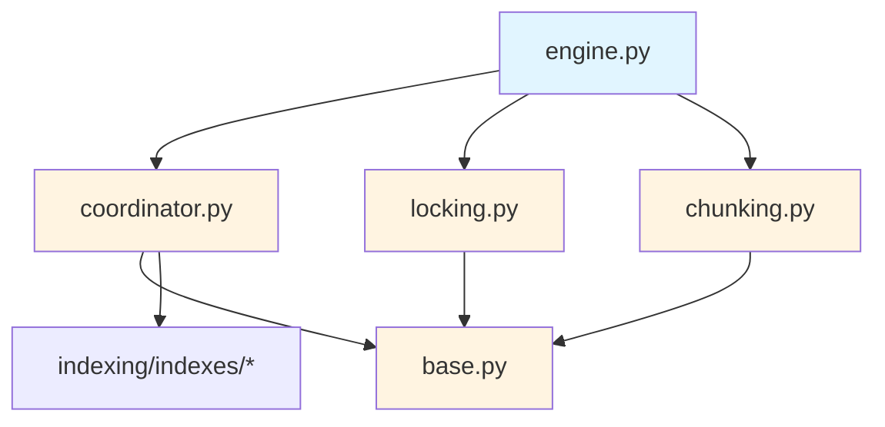
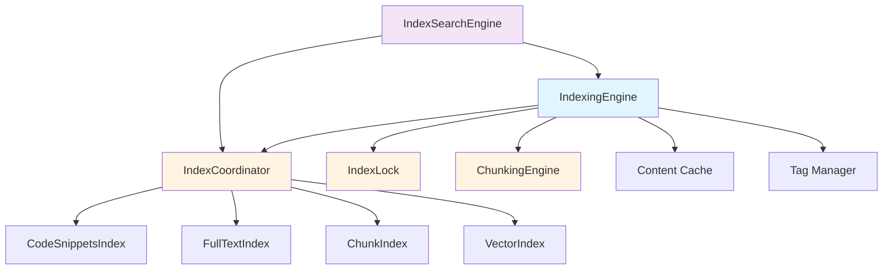
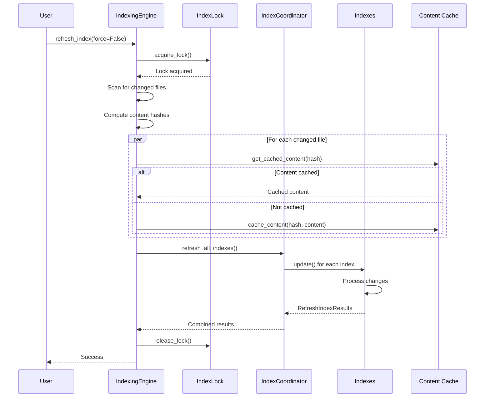
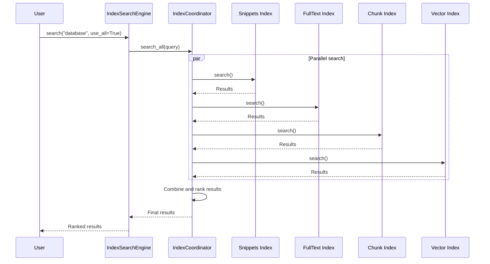

# Advanced Indexing Submodule

> [根目录](../../../../CLAUDE.md) > [src](../../../) > [pysearch](../../) > [indexing](../) > **advanced**

---

## Change Log (Changelog)

### 2026-01-19 - Submodule Documentation Initial Version
- Created comprehensive advanced indexing documentation
- Documented engine, coordinator, base, locking, chunking, and integration
- Added usage examples and architecture diagrams

---

## Submodule Overview

### Responsibility
The **Advanced Indexing** submodule provides sophisticated indexing capabilities with content addressing, tag-based management, and multi-index architecture.

### Role in Parent Module
- **Indexing Engine**: Advanced indexing with smart caching and deduplication
- **Index Coordination**: Manages multiple specialized indexes
- **Base Classes**: Common interfaces for all indexes
- **Concurrency Control**: Prevents race conditions during indexing
- **Chunking**: Code-aware content segmentation
- **Integration**: High-level API for index_search

### Key Design Decisions
- **Content Addressing**: SHA256-based deduplication for efficiency
- **Tag Management**: Three-part tags (directory + branch + artifact)
- **Multi-Index**: Different indexes for different use cases
- **Async-First**: All operations are asynchronous for performance
- **Locking**: Prevents concurrent indexing conflicts

---

## File Inventory

| File | Responsibility | Key Classes/Functions |
|------|---------------|----------------------|
| `__init__.py` | Advanced interface | Re-exports public API classes |
| `engine.py` | Indexing engine | `IndexingEngine` |
| `coordinator.py` | Index coordination | `IndexCoordinator` |
| `base.py` | Base classes | `CodebaseIndex`, `IndexTag`, `RefreshIndexResults` |
| `locking.py` | Concurrency control | `IndexLock` |
| `chunking.py` | Content chunking | `ChunkingEngine`, `ChunkingConfig` |
| `integration.py` | High-level API | `IndexSearchEngine` |

---

## Dependency Relationships

### Internal Upstream Dependencies


### Internal Downstream Dependencies


### Submodule Internal Dependencies


### External Dependencies
- `asyncio`: Async operations
- `aiofiles`: Async file operations
- `hashlib`: Content hashing
- `dataclasses`: Type definitions

---

## Key Interfaces

### Base Classes (base.py)

#### CodebaseIndex
Abstract base class for all specialized indexes.

```python
class CodebaseIndex(ABC):
    """Base class for all enhanced codebase indexes."""

    @property
    @abstractmethod
    def artifact_id(self) -> str:
        """Unique identifier for this index type."""

    @property
    @abstractmethod
    def relative_expected_time(self) -> float:
        """
        Relative time estimate for indexing this index.
        0.0 = fastest, 1.0 = slowest
        Used for scheduling and progress reporting.
        """

    @abstractmethod
    async def initialize(self) -> None:
        """Initialize the index (create database, etc.)."""

    @abstractmethod
    async def close(self) -> None:
        """Close the index and release resources."""

    @abstractmethod
    async def update(
        self,
        tag: IndexTag,
        results: RefreshIndexResults,
        files_to_add: dict[Path, str],
        files_to_remove: set[Path],
        files_to_update: dict[Path, tuple[str, str]]
    ) -> None:
        """
        Update the index with changed files.

        Args:
            tag: Index tag identifying this update
            results: Results object to track indexing statistics
            files_to_add: New files to index {path: content}
            files_to_remove: Files to remove from index
            files_to_update: Files to update {path: (old_content, new_content)}
        """

    @abstractmethod
    async def search(
        self,
        query: str,
        filters: dict[str, Any] | None = None,
        limit: int = 10
    ) -> list[SearchResult]:
        """Search the index."""
```

#### IndexTag
Identifies an indexing operation with three-part tag.

```python
@dataclass(frozen=True)
class IndexTag:
    """Identifies a specific index update operation."""

    directory: str           # Root directory being indexed
    branch: str              # Branch name (or "main", "develop", etc.)
    artifact: str            # Artifact type ("snippets", "fulltext", etc.)

    def to_string(self) -> str:
        """Convert to string format."""
        return f"{self.directory}:{self.branch}:{self.artifact}"

    @classmethod
    def from_string(cls, tag_str: str) -> "IndexTag":
        """Parse from string format."""
        directory, branch, artifact = tag_str.split(":")
        return cls(directory=directory, branch=branch, artifact=artifact)
```

#### RefreshIndexResults
Tracks indexing operation results.

```python
@dataclass
class RefreshIndexResults:
    """Results from an index refresh operation."""

    files_added: int = 0
    files_updated: int = 0
    files_removed: int = 0
    files_skipped: int = 0
    errors: list[tuple[Path, str]] = field(default_factory=list)

    @property
    def total_files(self) -> int:
        """Total files processed."""
        return self.files_added + self.files_updated + self.files_removed

    def add_error(self, file_path: Path, error: str) -> None:
        """Add an error to the results."""
        self.errors.append((file_path, error))
```

### Indexing Engine (engine.py)

#### Overview
Main engine for advanced indexing with content addressing and smart caching.

#### Key Features
- **Content Addressing**: SHA256-based deduplication
- **Global Cache**: Cross-branch content sharing
- **Smart Diffing**: Minimizes reindexing
- **Progress Tracking**: Real-time indexing progress
- **Cancellation**: Graceful cancellation support

#### Implementation
```python
class IndexingEngine:
    def __init__(
        self,
        config: SearchConfig,
        cache_dir: Path | None = None
    )

    # Lifecycle
    async def initialize(self) -> None
    async def close(self) -> None

    # Indexing operations
    async def refresh_index(
        self,
        force: bool = False,
        paths: list[Path] | None = None
    ) -> bool:
        """
        Refresh the index.

        Args:
            force: Force full reindex
            paths: Specific paths to index (None = all paths)

        Returns:
            True if successful, False otherwise
        """

    async def get_progress(self) -> IndexingProgress:
        """Get current indexing progress."""

    def cancel_indexing(self) -> None:
        """Cancel the current indexing operation."""

    # Content addressing
    async def compute_content_hash(self, content: str) -> str:
        """Compute SHA256 hash of content."""

    async def get_cached_content(self, content_hash: str) -> str | None:
        """Get content from global cache by hash."""

    async def cache_content(self, content_hash: str, content: str) -> None:
        """Cache content in global cache."""

    # Tag management
    async def create_tag(
        self,
        directory: str,
        branch: str,
        artifact: str
    ) -> IndexTag:
        """Create a new index tag."""

    async def remove_tag(self, tag: IndexTag) -> None:
        """Remove an index tag and its data."""

    async def list_tags(
        self,
        directory: str | None = None
    ) -> list[IndexTag]:
        """List all tags (optionally filtered by directory)."""

    # Statistics
    async def get_stats(self) -> dict[str, Any]:
        """Get indexing statistics."""
```

#### IndexingProgress
Tracks indexing operation progress.

```python
@dataclass
class IndexingProgress:
    """Progress tracking for indexing operations."""

    current_operation: str = "idle"
    percent_complete: float = 0.0
    files_processed: int = 0
    total_files: int = 0
    current_file: str | None = None
    errors: list[str] = field(default_factory=list)
    start_time: float | None = None
    estimated_remaining: float | None = None  # seconds
```

#### Usage Example
```python
from pysearch.indexing.advanced import IndexingEngine

# Initialize
engine = IndexingEngine(config)
await engine.initialize()

# Refresh index
success = await engine.refresh_index(force=False)

# Check progress
progress = await engine.get_progress()
print(f"Progress: {progress.percent_complete:.1f}%")
print(f"Current file: {progress.current_file}")

# Cancel if needed
if progress.percent_complete < 50:
    engine.cancel_indexing()

# Get statistics
stats = await engine.get_stats()
print(f"Total indexed files: {stats['total_files']}")
print(f"Cache size: {stats['cache_size_mb']:.2f} MB")
```

### Index Coordinator (coordinator.py)

#### Overview
Manages multiple specialized indexes and coordinates their operations.

#### Implementation
```python
class IndexCoordinator:
    def __init__(self, config: SearchConfig)

    # Lifecycle
    async def initialize(self) -> None
    async def close(self) -> None

    # Index management
    async def register_index(
        self,
        name: str,
        index: CodebaseIndex
    ) -> None:
        """Register an index with the coordinator."""

    async def unregister_index(self, name: str) -> None:
        """Unregister an index."""

    async def get_index(self, name: str) -> CodebaseIndex | None:
        """Get a registered index."""

    async def list_indexes(self) -> list[str]:
        """List all registered index names."""

    # Bulk operations
    async def refresh_all_indexes(
        self,
        force: bool = False
    ) -> dict[str, RefreshIndexResults]:
        """Refresh all registered indexes."""

    async def search_all(
        self,
        query: str,
        indexes: list[str] | None = None,
        limit: int = 10
    ) -> list[SearchResult]:
        """
        Search across multiple indexes and merge results.

        Args:
            query: Search query
            indexes: List of index names to search (None = all)
            limit: Max results per index

        Returns:
            Combined and ranked results from all indexes
        """

    # Statistics
    async def get_coordinator_stats(self) -> dict[str, Any]:
        """Get statistics for all indexes."""
```

#### Usage Example
```python
from pysearch.indexing.advanced import IndexCoordinator
from pysearch.indexing.indexes import (
    CodeSnippetsIndex,
    FullTextIndex,
    ChunkIndex
)

# Initialize coordinator
coordinator = IndexCoordinator(config)
await coordinator.initialize()

# Register indexes
await coordinator.register_index(
    "snippets",
    CodeSnippetsIndex(Path("/tmp/snippets"))
)
await coordinator.register_index(
    "fulltext",
    FullTextIndex(Path("/tmp/fulltext"))
)
await coordinator.register_index(
    "chunks",
    ChunkIndex(Path("/tmp/chunks"))
)

# Refresh all indexes
results = await coordinator.refresh_all_indexes(force=False)
for name, result in results.items():
    print(f"{name}: {result.total_files} files")

# Search across all indexes
search_results = await coordinator.search_all(
    "database connection",
    limit=20
)

for result in search_results:
    print(f"{result.file}:{result.start_line} - {result.score:.3f}")
```

### Index Locking (locking.py)

#### Overview
Prevents concurrent indexing operations that could corrupt indexes.

#### Implementation
```python
class IndexLock:
    """Lock manager for preventing concurrent indexing."""

    def __init__(self, lock_dir: Path | None = None)

    async def acquire(
        self,
        tag: IndexTag,
        timeout: float = 300.0
    ) -> bool:
        """
        Acquire a lock for the given index tag.

        Args:
            tag: Index tag to lock
            timeout: Maximum time to wait for lock (seconds)

        Returns:
            True if lock acquired, False if timeout
        """

    async def release(self, tag: IndexTag) -> None:
        """Release the lock for the given index tag."""

    async def is_locked(self, tag: IndexTag) -> bool:
        """Check if the given index tag is locked."""

    async def get_lock_info(self, tag: IndexTag) -> dict[str, Any] | None:
        """Get information about a lock (who holds it, when acquired, etc.)."""

    async def cleanup_stale_locks(self, max_age: float = 3600) -> int:
        """Remove locks older than max_age seconds."""
```

#### Usage Example
```python
from pysearch.indexing.advanced import IndexLock, IndexTag

lock = IndexLock()
tag = IndexTag(directory="src", branch="main", artifact="snippets")

# Acquire lock
if await lock.acquire(tag, timeout=60):
    try:
        # Perform indexing
        await do_indexing()
    finally:
        # Always release lock
        await lock.release(tag)
else:
    print("Could not acquire lock (timeout or already locked)")

# Check lock status
if await lock.is_locked(tag):
    info = await lock.get_lock_info(tag)
    print(f"Lock held by: {info['holder']}")
    print(f"Acquired: {info['acquired_at']}")

# Cleanup stale locks
cleaned = await lock.cleanup_stale_locks(max_age=3600)
print(f"Cleaned {cleaned} stale locks")
```

### Chunking Engine (chunking.py)

#### Overview
Provides code-aware content segmentation for better semantic indexing.

#### ChunkingConfig
```python
@dataclass
class ChunkingConfig:
    """Configuration for code chunking."""

    strategy: str = "hybrid"              # structural, semantic, fixed, hybrid
    max_chunk_size: int = 1500            # Max characters per chunk
    min_chunk_size: int = 100             # Min characters per chunk
    overlap: int = 200                    # Overlap between chunks
    respect_boundaries: bool = True       # Respect code boundaries
    language: str | None = None           # Language-specific chunking
```

#### ChunkingEngine
```python
class ChunkingEngine:
    def __init__(self, config: ChunkingConfig)

    # Chunking operations
    async def chunk_file(
        self,
        file_path: Path,
        content: str | None = None
    ) -> list[CodeChunk]:
        """
        Chunk a file into code-aware segments.

        Args:
            file_path: Path to the file
            content: File content (read from file if None)

        Returns:
            List of code chunks
        """

    async def chunk_content(
        self,
        content: str,
        language: str,
        file_path: Path | None = None
    ) -> list[CodeChunk]:
        """Chunk content based on language."""

    # Strategy-specific chunking
    async def chunk_structural(
        self,
        content: str,
        language: str
    ) -> list[CodeChunk]:
        """Chunk by code structure (functions, classes, etc.)."""

    async def chunk_semantic(
        self,
        content: str,
        language: str
    ) -> list[CodeChunk]:
        """Chunk by semantic coherence."""

    async def chunk_fixed(
        self,
        content: str
    ) -> list[CodeChunk]:
        """Chunk by fixed size with overlap."""

    async def chunk_hybrid(
        self,
        content: str,
        language: str
    ) -> list[CodeChunk]:
        """Combine multiple strategies."""
```

#### CodeChunk Model
```python
@dataclass
class CodeChunk:
    """A chunk of code content."""

    id: str                               # Unique chunk ID
    file_path: Path                        # Source file
    start_line: int                        # Start line
    end_line: int                          # End line
    content: str                           # Chunk content
    language: str                          # Programming language
    chunk_type: str                        # structural, semantic, fixed
    embedding: list[float] | None = None   # Vector embedding
    metadata: dict[str, Any] | None = None  # Additional metadata
    parent_chunk_id: str | None = None     # For hierarchical chunking
```

#### Usage Example
```python
from pysearch.indexing.advanced.chunking import ChunkingEngine, ChunkingConfig

# Configure chunking
config = ChunkingConfig(
    strategy="hybrid",
    max_chunk_size=1500,
    overlap=200,
    respect_boundaries=True
)

engine = ChunkingEngine(config)

# Chunk a file
chunks = await engine.chunk_file(Path("example.py"))

for chunk in chunks:
    print(f"Chunk {chunk.id}: lines {chunk.start_line}-{chunk.end_line}")
    print(f"Type: {chunk.chunk_type}")
    print(f"Content: {chunk.content[:100]}...")
```

### Enhanced Search Integration (integration.py)

#### Overview
High-level API that combines all advanced indexing features.

#### IndexSearchEngine
```python
class IndexSearchEngine:
    def __init__(self, config: SearchConfig)

    # Lifecycle
    async def initialize(self) -> None
    async def close(self) -> None

    # Indexing
    async def index_project(
        self,
        force_reindex: bool = False
    ) -> IndexingProgress:
        """Index the entire project."""

    # Search
    async def search(
        self,
        query: str,
        use_snippets: bool = True,
        use_fulltext: bool = True,
        use_chunks: bool = True,
        use_vectors: bool = False,
        limit: int = 10
    ) -> list[SearchResult]:
        """
        Enhanced search with multiple index types.

        Args:
            query: Search query
            use_snippets: Use code snippets index
            use_fulltext: Use full-text index
            use_chunks: Use chunk index
            use_vectors: Use vector index (if available)
            limit: Max results

        Returns:
            Combined and ranked results
        """

    # Analytics
    async def get_index_health(self) -> dict[str, Any]:
        """Get health status of all indexes."""
```

#### Usage Example
```python
from pysearch.indexing.advanced.integration import IndexSearchEngine

# Initialize
engine = IndexSearchEngine(config)
await engine.initialize()

# Index project
progress = await engine.index_project(force_reindex=False)
print(f"Indexing: {progress.percent_complete:.1f}%")

# Enhanced search
results = await engine.search(
    "database connection",
    use_snippets=True,
    use_fulltext=True,
    use_chunks=True,
    use_vectors=True,
    limit=20
)

for result in results:
    print(f"{result.file}:{result.start_line}")
    print(f"Score: {result.score:.3f}")
```

---

## Architecture Diagram



---

## Data Flow

### Indexing Flow


### Search Flow


---

## Testing

### Related Test Files
- `tests/integration/test_metadata_indexing.py` - Integration tests
- `tests/unit/indexing/` - Unit tests for specific components

### Test Coverage
- Index coordination
- Lock acquisition and release
- Chunking strategies
- Content addressing
- Concurrent operations
- Progress tracking

---

## Usage Examples

### Complete Indexing Workflow
```python
from pysearch.indexing.advanced import IndexingEngine
from pysearch.indexing.advanced.integration import IndexSearchEngine

# Initialize
engine = IndexingEngine(config)
await engine.initialize()

# Initial indexing
success = await engine.refresh_index(force=True)
print(f"Indexing {'succeeded' if success else 'failed'}")

# Incremental update
success = await engine.refresh_index(force=False)

# Monitor progress
progress = await engine.get_progress()
print(f"Progress: {progress.percent_complete:.1f}%")
print(f"Current: {progress.current_file}")

# Get statistics
stats = await engine.get_stats()
print(f"Total files: {stats['total_files']}")
print(f"Cache hits: {stats['cache_hits']}")
```

### Custom Index Configuration
```python
from pysearch.indexing.advanced import IndexCoordinator
from pysearch.indexing.indexes import CodeSnippetsIndex

# Create coordinator
coordinator = IndexCoordinator(config)
await coordinator.initialize()

# Register custom index
snippets_index = CodeSnippetsIndex(
    Path("/tmp/my_snippets"),
    max_file_size_mb=10,
    languages=["Python", "JavaScript"]
)

await coordinator.register_index("my_snippets", snippets_index)

# Use custom index
results = await coordinator.search_all(
    "def main",
    indexes=["my_snippets"],
    limit=10
)
```

### Advanced Chunking
```python
from pysearch.indexing.advanced.chunking import ChunkingEngine, ChunkingConfig

# Configure for Python
config = ChunkingConfig(
    strategy="structural",
    max_chunk_size=2000,
    overlap=300,
    respect_boundaries=True,
    language="Python"
)

engine = ChunkingEngine(config)

# Chunk Python file
chunks = await engine.chunk_file(Path("example.py"))

# Create embeddings for chunks
for chunk in chunks:
    embedding = await create_embedding(chunk.content)
    chunk.embedding = embedding

# Use chunks for vector search
# ... (see indexes submodule)
```

---

## Common Patterns

### Graceful Shutdown
```python
async def with_shutdown_handler(engine: IndexingEngine):
    """Handle shutdown signals gracefully."""
    try:
        # Main loop
        while True:
            await asyncio.sleep(1)
    except (KeyboardInterrupt, asyncio.CancelledError):
        print("Shutting down...")
        await engine.close()
```

### Progress Monitoring
```python
async def monitor_progress(engine: IndexingEngine):
    """Monitor indexing progress in real-time."""
    while True:
        progress = await engine.get_progress()
        print(f"\r{progress.percent_complete:.1f}% - {progress.current_file}", end="")

        if progress.percent_complete >= 100:
            break

        await asyncio.sleep(0.5)
```

### Error Handling
```python
try:
    success = await engine.refresh_index(force=False)
    if not success:
        progress = await engine.get_progress()
        for error in progress.errors:
            print(f"Error: {error}")
except Exception as e:
    print(f"Indexing failed: {e}")
    # Cleanup
    await engine.close()
```

---

## Performance Considerations

### Content Addressing Benefits
- **Deduplication**: Same content across branches is stored once
- **Faster Updates**: Only changed content needs reindexing
- **Cache Sharing**: Global cache accessible to all branches

### Index Coordination
- **Parallel Indexing**: Multiple indexes can update concurrently
- **Load Balancing**: Distribute work across available indexes
- **Selective Updates**: Only update affected indexes

### Lock Strategy
- **Per-Tag Locks**: Different tags can update independently
- **Timeout Protection**: Prevent deadlocks with timeouts
- **Stale Lock Cleanup**: Automatic cleanup of abandoned locks

---

## Related Files
- `src/pysearch/indexing/indexes/*` - Specialized index implementations
- `src/pysearch/indexing/metadata/*` - Metadata indexing
- `src/pysearch/core/integrations/indexing_integration.py` - Core integration
- `tests/integration/test_metadata_indexing.py` - Integration tests
