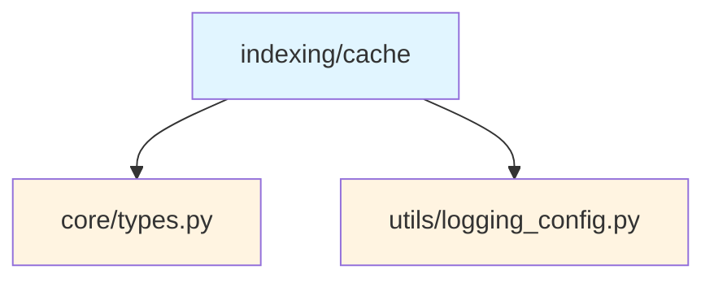
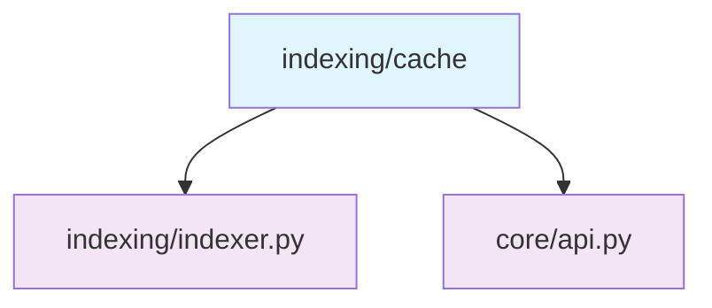
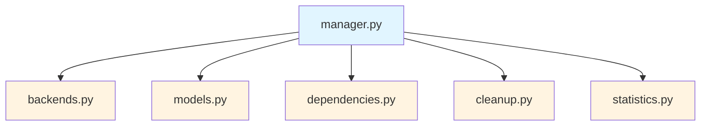
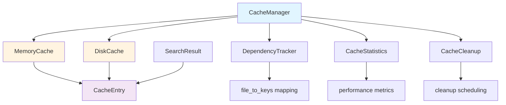
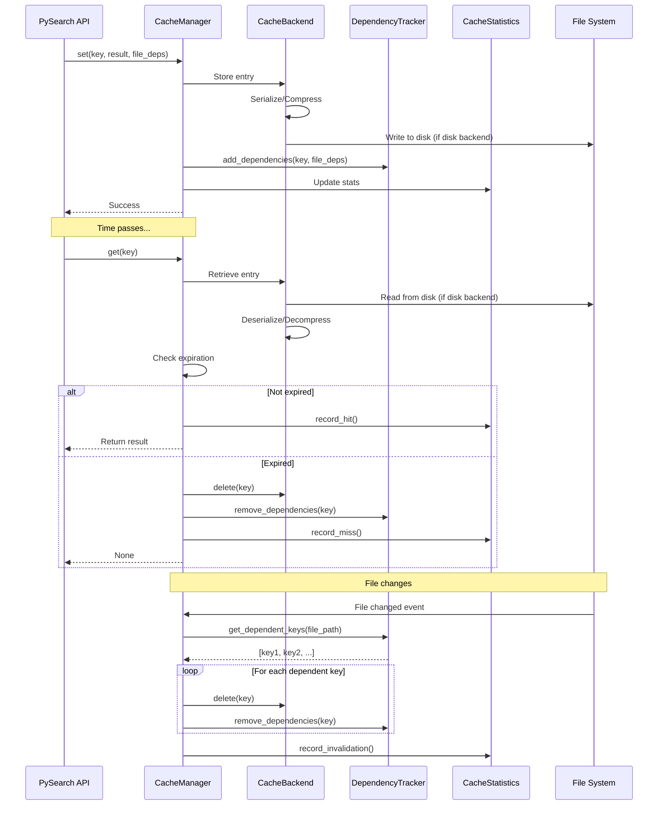

# Cache Submodule

> [根目录](../../../../CLAUDE.md) > [src](../../../) > [pysearch](../../) > [indexing](../) > **cache**

---

## Change Log (Changelog)

### 2026-01-19 - Submodule Documentation Initial Version
- Created comprehensive cache documentation
- Documented manager, backends, cleanup, dependencies, and statistics
- Added usage examples and architecture diagrams

---

## Submodule Overview

### Responsibility
The **Cache** submodule provides comprehensive caching capabilities for search results with multiple backend options, automatic invalidation, and performance tracking.

### Role in Parent Module
- **Performance Optimization**: Reduces redundant file processing and search operations
- **Resource Management**: Controls memory and disk usage through eviction policies
- **Data Freshness**: Ensures cached data is invalidated when source files change
- **Monitoring**: Tracks cache performance metrics for optimization

### Key Design Decisions
- **Multi-Backend Support**: Memory and disk backends for different use cases
- **Dependency Tracking**: File-based automatic cache invalidation
- **Pluggable Eviction**: Configurable cleanup and eviction policies
- **Statistics Tracking**: Built-in performance monitoring

---

## File Inventory

| File | Responsibility | Key Classes/Functions |
|------|---------------|----------------------|
| `__init__.py` | Cache interface | Re-exports public API classes |
| `manager.py` | Cache management | `CacheManager` - main cache interface |
| `backends.py` | Cache backends | `CacheBackend`, `MemoryCache`, `DiskCache` |
| `models.py` | Data models | `CacheEntry`, `CacheStats` |
| `dependencies.py` | Dependency tracking | `DependencyTracker` - file-based invalidation |
| `cleanup.py` | Cache cleanup | `CacheCleanup` - eviction policies |
| `statistics.py` | Performance stats | `CacheStatistics` - metrics tracking |

---

## Dependency Relationships

### Internal Upstream Dependencies


### Internal Downstream Dependencies


### Submodule Internal Dependencies


### External Dependencies
- `pickle`: Object serialization
- `json`: Data persistence
- `time`: Timestamp handling
- `pathlib`: File path operations
- `abc`: Abstract base classes

---

## Key Interfaces

### CacheManager (manager.py)

The main cache management interface.

#### Initialization
```python
class CacheManager:
    def __init__(
        self,
        backend: str = "memory",           # "memory" or "disk"
        cache_dir: Path | str | None = None,
        max_size: int = 1000,              # Max entries
        default_ttl: float = 3600,         # Default TTL (seconds)
        compression: bool = False,         # Enable compression
        auto_cleanup: bool = True,         # Auto cleanup expired
        cleanup_interval: float = 300      # Cleanup interval (seconds)
    )
```

#### Core Methods
```python
# Cache operations
def get(self, key: str) -> SearchResult | None
def set(
    self,
    key: str,
    value: SearchResult,
    ttl: float | None = None,
    file_dependencies: set[str] | None = None
) -> bool
def delete(self, key: str) -> bool
def clear(self) -> None

# Invalidation
def invalidate_by_file(self, file_path: str) -> int
def invalidate_by_pattern(self, pattern: str) -> int

# Maintenance
def cleanup_expired(self) -> int
def get_stats(self) -> dict[str, Any]
def shutdown(self) -> None

# Context manager
def __enter__(self) -> CacheManager
def __exit__(self, exc_type, exc_val, exc_tb) -> None
```

#### Usage Example
```python
from pysearch.indexing.cache import CacheManager

# Initialize with disk backend
cache = CacheManager(
    backend="disk",
    cache_dir="/tmp/pysearch_cache",
    max_size=5000,
    default_ttl=7200,  # 2 hours
    compression=True
)

# Cache a search result
cache.set(
    key="search:def main",
    value=search_result,
    ttl=3600,
    file_dependencies={"src/main.py", "src/utils.py"}
)

# Retrieve from cache
result = cache.get("search:def main")
if result:
    print("Cache hit!")
else:
    print("Cache miss, performing search...")

# Invalidate when file changes
cache.invalidate_by_file("src/main.py")

# Get statistics
stats = cache.get_stats()
print(f"Hit rate: {stats['hit_rate']:.2%}")
print(f"Total entries: {stats['total_entries']}")

# Cleanup
cache.cleanup_expired()

# Shutdown
cache.shutdown()
```

### Cache Backends (backends.py)

#### CacheBackend (Abstract Base)
```python
class CacheBackend(ABC):
    @abstractmethod
    def get(self, key: str) -> CacheEntry | None: ...

    @abstractmethod
    def set(self, key: str, entry: CacheEntry) -> bool: ...

    @abstractmethod
    def delete(self, key: str) -> bool: ...

    @abstractmethod
    def clear(self) -> None: ...

    @abstractmethod
    def keys(self) -> list[str]: ...

    @abstractmethod
    def size(self) -> int: ...
```

#### MemoryCache
In-memory caching with LRU eviction.

```python
class MemoryCache(CacheBackend):
    def __init__(
        self,
        max_size: int = 1000,
        eviction_policy: str = "lru"  # "lru" or "fifo"
    )

    # Fast in-memory operations
    def get(self, key: str) -> CacheEntry | None
    def set(self, key: str, entry: CacheEntry) -> bool
    def delete(self, key: str) -> bool
    def clear(self) -> None
    def keys(self) -> list[str]
    def size(self) -> int
```

**Use Case**: Fast temporary caching for development/testing.

#### DiskCache
Persistent disk-based caching with compression.

```python
class DiskCache(CacheBackend):
    def __init__(
        self,
        cache_dir: Path | str,
        max_size: int = 1000,
        compression: bool = False,
        serialize: str = "pickle"  # "pickle" or "json"
    )

    # Persistent operations
    def get(self, key: str) -> CacheEntry | None
    def set(self, key: str, entry: CacheEntry) -> bool
    def delete(self, key: str) -> bool
    def clear(self) -> None
    def keys(self) -> list[str]
    def size(self) -> int

    # Disk-specific
    def optimize(self) -> None  # Compact storage
    def get_disk_usage(self) -> dict[str, int]
```

**Use Case**: Long-term caching for large projects.

### Cache Models (models.py)

#### CacheEntry
Represents a single cache entry.

```python
@dataclass(slots=True)
class CacheEntry:
    key: str                              # Cache key
    value: SearchResult                    # Cached result
    created_at: float                      # Creation timestamp
    last_accessed: float                   # Last access timestamp
    ttl: float                             # Time-to-live (seconds)
    size_bytes: int                        # Entry size
    compressed: bool = False               # Is compressed
    file_dependencies: set[str] = field(default_factory=set)

    @property
    def is_expired(self) -> bool:          # Check expiration
```

#### CacheStats
Cache performance statistics.

```python
@dataclass(slots=True)
class CacheStats:
    total_entries: int = 0
    hits: int = 0
    misses: int = 0
    evictions: int = 0
    invalidations: int = 0
    total_size_bytes: int = 0
    avg_access_time_ms: float = 0.0

    @property
    def hit_rate(self) -> float:           # Calculate hit rate
```

### Dependency Tracker (dependencies.py)

Tracks file dependencies for automatic invalidation.

```python
class DependencyTracker:
    def __init__(self)

    # Dependency management
    def add_dependencies(self, key: str, files: set[str]) -> None
    def remove_dependencies(self, key: str) -> None
    def get_dependent_keys(self, file_path: str) -> set[str]
    def clear_all_dependencies(self) -> None

    # Statistics
    def get_dependency_count(self) -> int
    def get_file_count(self) -> int
    def get_dependencies_for_key(self, key: str) -> set[str]
```

**Usage Example**:
```python
tracker = DependencyTracker()

# Add dependencies
tracker.add_dependencies("search:1", {"src/a.py", "src/b.py"})
tracker.add_dependencies("search:2", {"src/b.py", "src/c.py"})

# Find dependent cache keys
dependents = tracker.get_dependent_keys("src/b.py")
# Returns: {"search:1", "search:2"}

# Remove dependencies
tracker.remove_dependencies("search:1")
```

### Cache Cleanup (cleanup.py)

Manages cache cleanup and eviction.

```python
class CacheCleanup:
    def __init__(
        self,
        cleanup_callback: Callable[[], int],
        cleanup_interval: float = 300,     # 5 minutes
        auto_cleanup: bool = True
    )

    # Lifecycle
    def start(self) -> None
    def stop(self) -> None
    def shutdown(self) -> None

    # Manual cleanup
    def cleanup_now(self) -> int

    # Configuration
    def set_interval(self, interval: float) -> None
    def is_running(self) -> bool
```

### Cache Statistics (statistics.py)

Tracks cache performance metrics.

```python
class CacheStatistics:
    def __init__(self)

    # Recording
    def record_hit(self) -> None
    def record_miss(self) -> None
    def record_eviction(self, count: int = 1) -> None
    def record_invalidation(self, count: int = 1) -> None
    def update_access_time(self, elapsed_ms: float) -> None
    def update_entry_count(self, count: int) -> None
    def add_size(self, size_bytes: int) -> None

    # Statistics
    def get_stats_dict(self, additional: dict | None = None) -> dict[str, Any]
    def reset_stats(self) -> None

    # Calculated metrics
    @property
    def hit_rate(self) -> float
    @property
    def total_requests(self) -> int
```

**Stats Output Example**:
```python
{
    "total_entries": 1523,
    "hits": 4521,
    "misses": 892,
    "evictions": 234,
    "invalidations": 56,
    "total_size_bytes": 52428800,
    "hit_rate": 0.835,
    "avg_access_time_ms": 2.3,
    "file_dependencies": 1234
}
```

---

## Architecture Diagram



---

## Data Flow



---

## Eviction Policies

### LRU (Least Recently Used)
Default policy for memory cache.

```python
# Evicts entries that haven't been accessed recently
cache = CacheManager(
    backend="memory",
    max_size=1000,
    eviction_policy="lru"
)
```

### FIFO (First In, First Out)
Simple first-in-first-out eviction.

```python
cache = CacheManager(
    backend="memory",
    max_size=1000,
    eviction_policy="fifo"
)
```

### TTL-based Expiration
Entries expire after a fixed time-to-live.

```python
# Set entry-specific TTL
cache.set("key", value, ttl=3600)  # 1 hour

# Global default TTL
cache = CacheManager(default_ttl=7200)  # 2 hours
```

---

## Testing

### Related Test Files
- `tests/unit/core/test_cache_manager.py` - Cache manager tests
- `tests/unit/core/test_cache_manager_disk_cleanup.py` - Disk cleanup tests
- `tests/unit/core/test_cache_manager_disk_index.py` - Disk index tests
- `tests/unit/core/test_cache_manager_eviction.py` - Eviction policy tests

### Test Coverage
- Cache hit/miss scenarios
- Expiration handling
- Dependency-based invalidation
- Backend operations
- Statistics tracking
- Concurrent access

---

## Usage Examples

### Basic Caching
```python
from pysearch.indexing.cache import CacheManager

# Initialize
cache = CacheManager(backend="memory", max_size=1000)

# Store result
cache.set("my_search_key", search_result, ttl=3600)

# Retrieve
result = cache.get("my_search_key")
if result:
    print(f"Found {result.stats.items} results in cache")
```

### File-Based Invalidation
```python
from pysearch import Path

# Cache with dependencies
result = perform_search("src/**/*.py")

# Track which files this result depends on
files = {str(item.file) for item in result.items}
cache.set("search:src", result, file_dependencies=files)

# When a file changes, invalidate dependent cache entries
cache.invalidate_by_file("src/main.py")

# This removes all cache entries that depended on src/main.py
```

### Statistics Monitoring
```python
# Get cache statistics
stats = cache.get_stats()

print(f"Cache Performance:")
print(f"  Entries: {stats['total_entries']}")
print(f"  Hit rate: {stats['hit_rate']:.2%}")
print(f"  Avg access time: {stats['avg_access_time_ms']:.2f}ms")
print(f"  Size: {stats['total_size_bytes'] / 1024 / 1024:.2f} MB")
print(f"  File dependencies: {stats['file_dependencies']}")
```

### Context Manager Usage
```python
# Automatic cleanup
with CacheManager(backend="disk", cache_dir="/tmp/cache") as cache:
    cache.set("key", value)
    result = cache.get("key")

# Cache is automatically shut down when exiting context
```

### Custom Cleanup
```python
# Manual cleanup
expired_count = cache.cleanup_expired()
print(f"Removed {expired_count} expired entries")

# Pattern-based invalidation
count = cache.invalidate_by_pattern("search:src/*")
print(f"Invalidated {count} entries matching pattern")

# Clear all
cache.clear()
```

---

## Common Patterns

### Cache Key Generation
```python
import hashlib

def generate_cache_key(query: Query) -> str:
    """Generate a unique cache key from a query."""
    key_parts = [
        query.pattern,
        str(query.use_regex),
        str(query.use_ast),
        str(query.context),
        str(query.filters),
        str(query.metadata_filters)
    ]
    key_string = ":".join(key_parts)
    return hashlib.md5(key_string.encode()).hexdigest()

# Usage
key = generate_cache_key(query)
cache.set(key, result)
```

### Cache Warming
```python
async def warm_cache(cache: CacheManager, common_queries: list[Query]):
    """Pre-populate cache with common searches."""
    for query in common_queries:
        result = await perform_search(query)
        key = generate_cache_key(query)
        cache.set(key, result, ttl=7200)  # 2 hours
```

### Stale-While-Revalidate
```python
def get_with_stale_revalidate(cache: CacheManager, key: str):
    """Return stale cache immediately while revalidating."""
    entry = cache.backend.get(key)

    if entry is None:
        return None  # Cache miss

    # Return cached value even if expired
    result = entry.value

    # If expired, trigger async refresh
    if entry.is_expired:
        asyncio.create_task(refresh_cache(key))

    return result

async def refresh_cache(key: str):
    """Refresh cache entry in background."""
    new_result = await perform_search_for_key(key)
    cache.set(key, new_result)
```

---

## Performance Considerations

### Memory Cache
- **Pros**: Fast (microsecond access), no disk I/O
- **Cons**: Limited by RAM, lost on restart
- **Best For**: Development, small projects, temporary caching

### Disk Cache
- **Pros**: Persistent, can handle large datasets
- **Cons**: Slower (millisecond access), disk wear
- **Best For**: Production, large projects, long-running processes

### Compression Trade-offs
```python
# With compression (slower but less disk space)
cache = CacheManager(compression=True)

# Without compression (faster but more disk space)
cache = CacheManager(compression=False)
```

### TTL Tuning
```python
# Short TTL for frequently changing code
cache.set("key", result, ttl=300)  # 5 minutes

# Long TTL for stable code
cache.set("key", result, ttl=86400)  # 24 hours
```

---

## Related Files
- `src/pysearch/indexing/indexer.py` - Uses cache for file metadata
- `src/pysearch/core/api.py` - Uses cache for search results
- `tests/unit/core/test_cache_manager_*.py` - Cache tests
