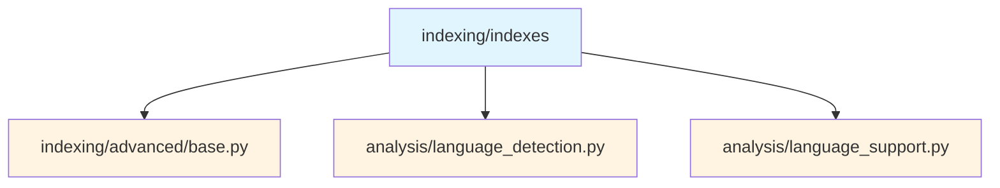
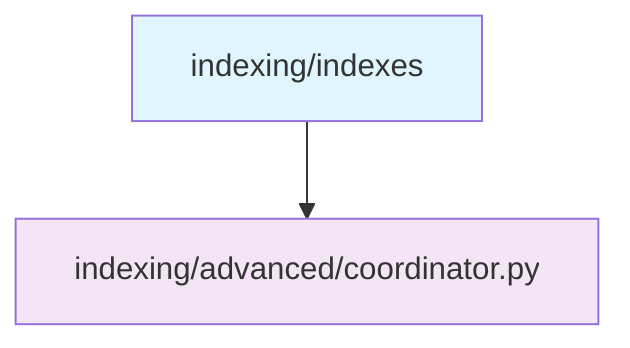
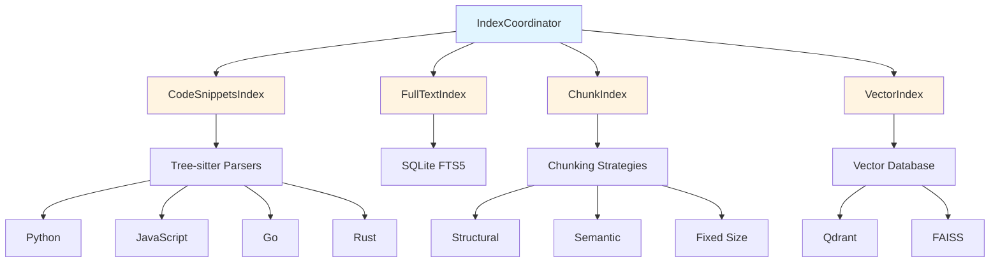
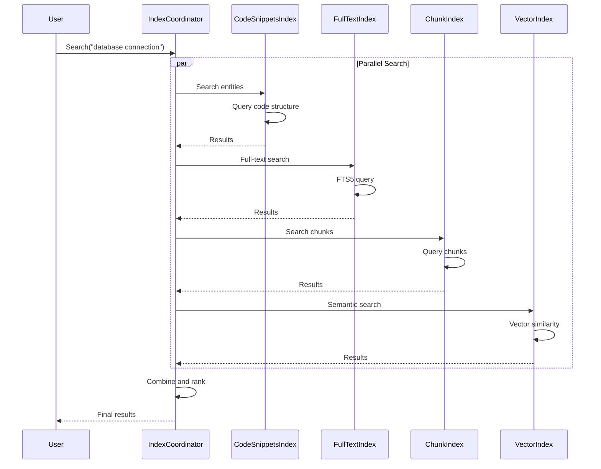

# Indexes Submodule

> [根目录](../../../../CLAUDE.md) > [src](../../../) > [pysearch](../../) > [indexing](../) > **indexes**

---

## Change Log (Changelog)

### 2026-01-19 - Submodule Documentation Initial Version
- Created comprehensive indexes documentation
- Documented code snippets, full-text, chunk, and vector indexes
- Added usage examples and architecture diagrams

---

## Submodule Overview

### Responsibility
The **Indexes** submodule provides specialized index implementations for different search scenarios, each optimized for specific types of queries.

### Role in Parent Module
- **Code Structure Index**: Tree-sitter based entity extraction
- **Full-Text Search**: Fast text-based search with FTS5
- **Chunk Index**: Intelligent code chunking for embeddings
- **Vector Index**: Semantic similarity search with vector databases

### Key Design Decisions
- **Specialized Indexes**: Each index type optimized for specific use cases
- **Common Interface**: All indexes implement `CodebaseIndex`
- **Complementary**: Indexes work together for comprehensive search
- **Optional**: Vector index is optional due to dependencies

---

## File Inventory

| File | Responsibility | Key Classes/Functions |
|------|---------------|----------------------|
| `__init__.py` | Indexes interface | Re-exports index classes |
| `code_snippets_index.py` | Code structure index | `CodeSnippetsIndex` |
| `full_text_index.py` | Full-text search | `FullTextIndex` |
| `chunk_index.py` | Code chunking | `ChunkIndex` |
| `vector_index.py` | Vector search | `VectorIndex` (optional) |

---

## Dependency Relationships

### Internal Upstream Dependencies


### Internal Downstream Dependencies


### External Dependencies
- `sqlite3`: Full-text search (built-in)
- `tree-sitter`: Code parsing (optional)
- `qdrant-client`: Vector database (optional)
- `numpy`: Vector operations (optional)

---

## Key Interfaces

### Base Interface

All indexes implement the `CodebaseIndex` interface from `advanced/base.py`:

```python
class CodebaseIndex(ABC):
    @property
    @abstractmethod
    def artifact_id(self) -> str:
        """Unique identifier for this index."""

    @property
    @abstractmethod
    def relative_expected_time(self) -> float:
        """Relative time estimate for indexing (0.0-1.0)."""

    @abstractmethod
    async def update(
        self,
        tag: IndexTag,
        results: RefreshIndexResults,
        files_to_add: dict[Path, str],
        files_to_remove: set[Path],
        files_to_update: dict[Path, tuple[str, str]]
    ) -> None:
        """Update the index with changed files."""

    @abstractmethod
    async def search(
        self,
        query: str,
        filters: dict[str, Any] | None = None,
        limit: int = 10
    ) -> list[SearchResult]:
        """Search the index."""
```

### Code Snippets Index

#### Overview
Extracts top-level code structures using tree-sitter queries for multiple languages.

#### Key Features
- **Language Support**: Python, JavaScript, TypeScript, Go, Rust, etc.
- **Entity Types**: Functions, classes, methods, imports, etc.
- **AST-Based**: Uses tree-sitter for accurate parsing
- **Fast Queries**: SQLite storage with indexes

#### Implementation
```python
class CodeSnippetsIndex(CodebaseIndex):
    def __init__(self, index_dir: Path)
    async def initialize(self) -> None
    async def close(self) -> None

    # Index operations
    async def update(self, tag, results, files_to_add, files_to_remove, files_to_update) -> None
    async def search(self, query: str, filters: dict | None = None, limit: int = 10) -> list[SearchResult]

    # Entity queries
    async def get_entities(self, file_path: Path) -> list[CodeEntity]
    async def get_entity_by_id(self, entity_id: str) -> CodeEntity | None

    # Language-specific extraction
    async def extract_python_entities(self, content: str, file_path: Path) -> list[CodeEntity]
    async def extract_javascript_entities(self, content: str, file_path: Path) -> list[CodeEntity]
    async def extract_go_entities(self, content: str, file_path: Path) -> list[CodeEntity]
```

#### Usage Example
```python
from pysearch.indexing.indexes import CodeSnippetsIndex

# Initialize
index = CodeSnippetsIndex(Path("/tmp/snippets_index"))
await index.initialize()

# Update index with new files
await index.update(
    tag=IndexTag(...),
    results=RefreshIndexResults(...),
    files_to_add={Path("example.py"): "content..."},
    files_to_remove=set(),
    files_to_update={}
)

# Search for functions
results = await index.search(
    "database connection",
    filters={"entity_type": "function"},
    limit=10
)

for result in results:
    print(f"{result.file}:{result.start_line} - {result.lines[0]}")
```

### Full-Text Search Index

#### Overview
Provides fast text-based search using SQLite FTS5 with trigram tokenization.

#### Key Features
- **FTS5**: Full-text search extension
- **Trigram Tokenization**: Better for code (handles CamelCase, snake_case)
- **Ranking**: BM25 ranking algorithm
- **Fast**: Optimized for text queries

#### Implementation
```python
class FullTextIndex(CodebaseIndex):
    def __init__(self, index_dir: Path)
    async def initialize(self) -> None
    async def close(self) -> None

    # Index operations
    async def update(self, tag, results, files_to_add, files_to_remove, files_to_update) -> None
    async def search(self, query: str, filters: dict | None = None, limit: int = 10) -> list[SearchResult]

    # Advanced search
    async def search_with_ranking(
        self, query: str, limit: int = 10
    ) -> list[tuple[SearchResult, float]]

    async def search_phrase(self, phrase: str, limit: int = 10) -> list[SearchResult]
    async def search_regex(self, pattern: str, limit: int = 10) -> list[SearchResult]

    # Statistics
    async def get_index_stats(self) -> dict[str, Any]
```

#### Usage Example
```python
from pysearch.indexing.indexes import FullTextIndex

# Initialize
index = FullTextIndex(Path("/tmp/fts_index"))
await index.initialize()

# Update index
await index.update(...)

# Full-text search
results = await index.search("def main")
for result in results:
    print(f"{result.file}:{result.start_line}")

# Phrase search (exact match)
results = await index.search_phrase('"def main"')

# Search with ranking
ranked_results = await index.search_with_ranking("database")
for result, score in ranked_results:
    print(f"Score: {score:.2f} - {result.file}")
```

### Chunk Index

#### Overview
Intelligent code chunking with language-aware strategies for embeddings.

#### Key Features
- **Code-Aware**: Respects code structure and syntax
- **Configurable**: Multiple chunking strategies
- **Language-Specific**: Different strategies per language
- **Embedding-Ready**: Optimized for vector embeddings

#### Chunking Strategies
- **Structural**: Chunk by functions, classes, blocks
- **Semantic**: Chunk by semantic coherence
- **Fixed Size**: Fixed-size chunks with overlap
- **Hybrid**: Combines multiple strategies

#### Implementation
```python
class ChunkIndex(CodebaseIndex):
    def __init__(
        self,
        index_dir: Path,
        chunking_config: ChunkingConfig | None = None
    )
    async def initialize(self) -> None
    async def close(self) -> None

    # Index operations
    async def update(self, tag, results, files_to_add, files_to_remove, files_to_update) -> None
    async def search(self, query: str, filters: dict | None = None, limit: int = 10) -> list[SearchResult]

    # Chunking
    async def chunk_file(self, file_path: Path, content: str) -> list[CodeChunk]
    async def chunk_content(
        self, content: str, language: str
    ) -> list[CodeChunk]

    # Chunk queries
    async def get_chunks(self, file_path: Path) -> list[CodeChunk]
    async def get_chunk_by_id(self, chunk_id: str) -> CodeChunk | None
```

#### CodeChunk Model
```python
@dataclass
class CodeChunk:
    id: str                               # Unique chunk ID
    file_path: Path                        # Source file
    start_line: int                        # Start line
    end_line: int                          # End line
    content: str                           # Chunk content
    language: str                          # Programming language
    chunk_type: str                        # structural, semantic, fixed
    embedding: list[float] | None = None   # Vector embedding
    metadata: dict[str, Any] | None = None  # Additional metadata
```

#### Usage Example
```python
from pysearch.indexing.indexes import ChunkIndex
from pysearch.indexing.advanced.chunking import ChunkingConfig

# Configure chunking
config = ChunkingConfig(
    strategy="hybrid",
    max_chunk_size=1500,
    overlap=200,
    min_chunk_size=100
)

# Initialize
index = ChunkIndex(Path("/tmp/chunk_index"), chunking_config=config)
await index.initialize()

# Update index
await index.update(...)

# Get chunks for a file
chunks = await index.get_chunks(Path("example.py"))
for chunk in chunks:
    print(f"Chunk {chunk.id}: lines {chunk.start_line}-{chunk.end_line}")
    print(f"Content: {chunk.content[:100]}...")
```

### Vector Index

#### Overview
Vector database integration for semantic similarity search.

#### Key Features
- **Vector Storage**: Efficient vector similarity search
- **Multiple Backends**: Qdrant, FAISS, etc.
- **Semantic Search**: Embedding-based similarity
- **Hybrid Search**: Combine with keyword search

#### Implementation (Optional)
```python
class VectorIndex(CodebaseIndex):
    def __init__(
        self,
        index_dir: Path,
        vector_config: VectorConfig | None = None
    )
    async def initialize(self) -> None
    async def close(self) -> None

    # Index operations
    async def update(self, tag, results, files_to_add, files_to_remove, files_to_update) -> None
    async def search(self, query: str, filters: dict | None = None, limit: int = 10) -> list[SearchResult]

    # Vector operations
    async def search_similar(
        self, query_vector: list[float], limit: int = 10
    ) -> list[tuple[SearchResult, float]]

    async def search_by_text(
        self, text: str, limit: int = 10
    ) -> list[tuple[SearchResult, float]]

    async def add_vectors(
        self, vectors: dict[str, list[float]]
    ) -> None

    async def delete_vectors(self, ids: list[str]) -> None
```

#### Usage Example
```python
from pysearch.indexing.indexes import VectorIndex

# Initialize (requires qdrant-client)
try:
    index = VectorIndex(Path("/tmp/vector_index"))
    await index.initialize()

    # Semantic search
    results = await index.search_by_text("database connection handling", limit=10)

    for result, similarity in results:
        print(f"Similarity: {similarity:.3f} - {result.file}:{result.start_line}")

except ImportError:
    print("Vector index not available (requires qdrant-client)")
```

---

## Architecture Diagram



---

## Index Comparison

| Index Type | Best For | Speed | Accuracy | Dependencies |
|------------|----------|-------|----------|--------------|
| **Code Snippets** | Structure queries | Fast | High | tree-sitter |
| **Full-Text** | Keyword search | Very Fast | Medium | sqlite3 |
| **Chunk** | Embedding prep | Medium | High | None |
| **Vector** | Semantic search | Medium | Very High | qdrant-client |

---

## Data Flow



---

## Testing

### Related Test Files
- `tests/integration/test_enhanced_indexing.py` - Index integration tests
- `tests/unit/indexing/test_*.py` - Unit tests for specific indexes

### Test Coverage
- Entity extraction accuracy
- Search result ranking
- Chunking strategies
- Vector similarity
- Concurrent updates
- Cross-language support

---

## Usage Examples

### Combined Search
```python
from pysearch.indexing.advanced.coordinator import IndexCoordinator

# Initialize coordinator with multiple indexes
coordinator = IndexCoordinator(config)

# Register indexes
await coordinator.register_index("snippets", CodeSnippetsIndex(...))
await coordinator.register_index("fulltext", FullTextIndex(...))
await coordinator.register_index("chunks", ChunkIndex(...))

# Combined search
results = await coordinator.search_all(
    "database connection",
    indexes=["snippets", "fulltext", "chunks"],
    limit=20
)

# Results from all indexes, combined and ranked
for result in results:
    print(f"{result.file}:{result.start_line} - {result.score:.3f}")
```

### Language-Specific Extraction
```python
# Python entities
python_entities = await snippets_index.extract_python_entities(
    content=Path("example.py").read_text(),
    file_path=Path("example.py")
)

# JavaScript entities
js_entities = await snippets_index.extract_javascript_entities(
    content=Path("app.js").read_text(),
    file_path=Path("app.js")
)
```

### Chunking Strategies
```python
from pysearch.indexing.advanced.chunking import ChunkingConfig

# Structural chunking (by functions/classes)
config = ChunkingConfig(strategy="structural")

# Semantic chunking (by meaning)
config = ChunkingConfig(strategy="semantic")

# Fixed-size chunking
config = ChunkingConfig(
    strategy="fixed",
    chunk_size=1000,
    overlap=100
)

# Hybrid (combines all)
config = ChunkingConfig(
    strategy="hybrid",
    max_chunk_size=1500,
    overlap=200
)

index = ChunkIndex(Path("/tmp/chunks"), chunking_config=config)
```

### Vector Search Workflow
```python
# 1. Create embeddings for chunks
chunks = await chunk_index.get_chunks(Path("example.py"))
for chunk in chunks:
    embedding = await create_embedding(chunk.content)
    chunk.embedding = embedding

# 2. Add to vector index
vectors = {chunk.id: chunk.embedding for chunk in chunks}
await vector_index.add_vectors(vectors)

# 3. Semantic search
query_text = "database error handling"
results = await vector_index.search_by_text(query_text, limit=10)

for result, similarity in results:
    print(f"{similarity:.3f} - {result.file}:{result.start_line}")
```

---

## Common Patterns

### Index Selection Strategy
```python
def select_indexes_for_query(query: str) -> list[str]:
    """Choose appropriate indexes based on query type."""

    # Code structure query
    if any(keyword in query.lower() for keyword in ["def ", "class ", "function"]):
        return ["snippets"]

    # Semantic query
    if len(query.split()) > 3:  # Longer queries tend to be semantic
        return ["vector", "chunks"]

    # Keyword query
    return ["fulltext"]
```

### Result Fusion
```python
def fuse_results(
    snippets_results: list[SearchResult],
    fulltext_results: list[SearchResult],
    vector_results: list[SearchResult]
) -> list[SearchResult]:
    """Combine results from multiple indexes."""

    # Assign weights to each index
    weights = {
        "snippets": 1.0,
        "fulltext": 0.8,
        "vector": 1.2
    }

    # Combine scores
    all_results = []

    for result in snippets_results:
        result.score *= weights["snippets"]
        all_results.append(result)

    for result in fulltext_results:
        result.score *= weights["fulltext"]
        all_results.append(result)

    for result in vector_results:
        result.score *= weights["vector"]
        all_results.append(result)

    # Remove duplicates and re-sort
    seen = set()
    unique_results = []
    for result in sorted(all_results, key=lambda r: r.score, reverse=True):
        key = (result.file, result.start_line)
        if key not in seen:
            seen.add(key)
            unique_results.append(result)

    return unique_results[:10]
```

### Incremental Updates
```python
async def update_indexes(file_path: Path, content: str):
    """Update all indexes when a file changes."""

    # Read old content
    old_content = file_path.read_text()

    # Update each index
    for index in [snippets_index, fulltext_index, chunk_index]:
        await index.update(
            tag=IndexTag(...),
            results=RefreshIndexResults(...),
            files_to_add={},
            files_to_remove=set(),
            files_to_update={file_path: (old_content, content)}
        )
```

---

## Performance Considerations

### Indexing Speed
- **Code Snippets**: Medium (tree-sitter parsing)
- **Full-Text**: Fast (FTS5 indexing)
- **Chunk**: Medium (chunking + embedding)
- **Vector**: Slow (requires embeddings)

### Query Speed
- **Code Snippets**: Fast (SQL queries)
- **Full-Text**: Very Fast (FTS5)
- **Chunk**: Fast (SQL queries)
- **Vector**: Medium (vector similarity)

### Storage Requirements
- **Code Snippets**: Low (metadata only)
- **Full-Text**: Medium (full content)
- **Chunk**: High (content + embeddings)
- **Vector**: Very High (vectors + metadata)

---

## Related Files
- `src/pysearch/indexing/advanced/base.py` - Base index interface
- `src/pysearch/indexing/advanced/coordinator.py` - Index coordination
- `src/pysearch/indexing/advanced/chunking.py` - Chunking strategies
- `tests/integration/test_enhanced_indexing.py` - Integration tests
