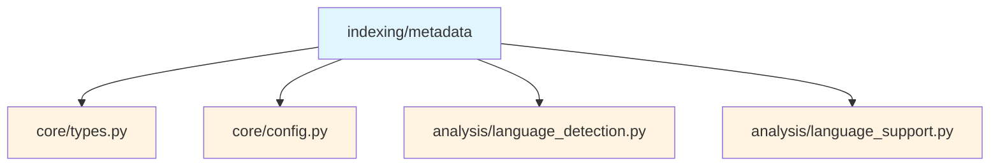
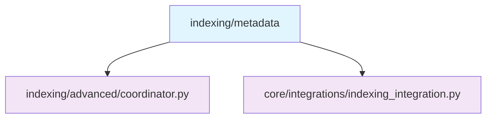
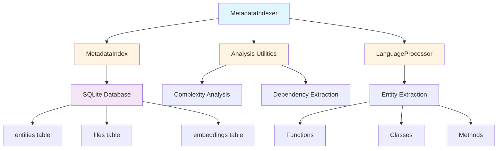
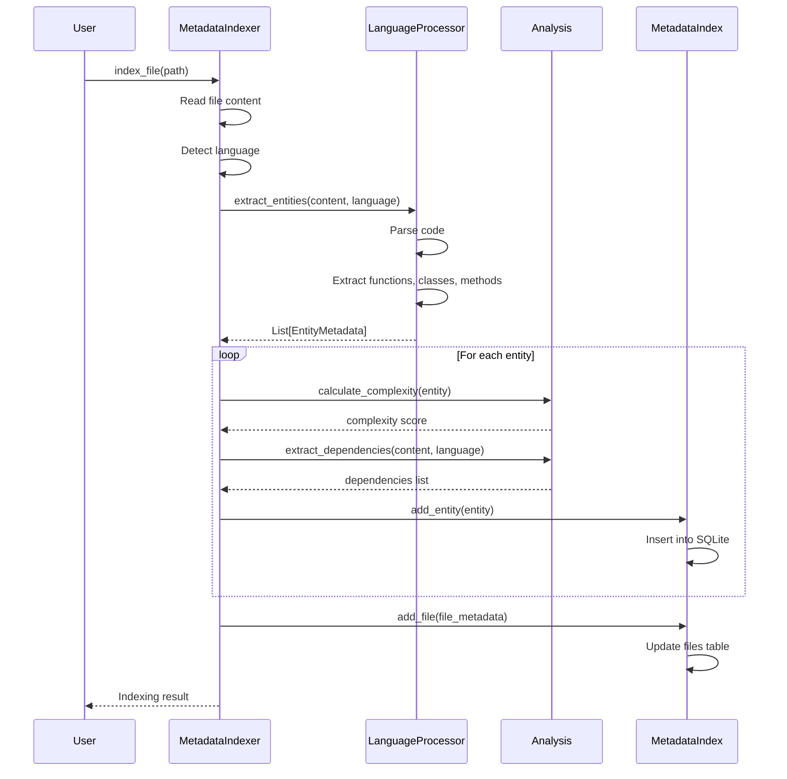

# Metadata Submodule

> [根目录](../../../../CLAUDE.md) > [src](../../../) > [pysearch](../../) > [indexing](../) > **metadata**

---

## Change Log (Changelog)

### 2026-01-19 - Submodule Documentation Initial Version
- Created comprehensive metadata documentation
- Documented models, database, indexer, and analysis
- Added usage examples and architecture diagrams

---

## Submodule Overview

### Responsibility
The **Metadata** submodule provides entity-level indexing with SQLite storage, enabling fast metadata-based queries and code analysis.

### Role in Parent Module
- **Entity Extraction**: Extracts code entities (functions, classes, methods)
- **Metadata Storage**: SQLite database for persistent metadata
- **Fast Queries**: Efficient metadata-based filtering and search
- **Code Analysis**: Complexity analysis and dependency tracking

### Key Design Decisions
- **SQLite Storage**: Embedded database for zero-configuration deployment
- **Entity-Level Indexing**: Granular indexing at the entity level, not just file level
- **Schema Versioning**: Database schema versioning for migrations
- **Async Operations**: Support for async indexing operations

---

## File Inventory

| File | Responsibility | Key Classes/Functions |
|------|---------------|----------------------|
| `__init__.py` | Metadata interface | Re-exports public API classes |
| `models.py` | Data models | `EntityMetadata`, `FileMetadata`, `IndexQuery`, `IndexStats` |
| `database.py` | Database operations | `MetadataIndex` - SQLite storage |
| `indexer.py` | Metadata indexer | `MetadataIndexer` - entity extraction and indexing |
| `analysis.py` | Analysis utilities | Complexity analysis, dependency extraction |

---

## Dependency Relationships

### Internal Upstream Dependencies


### Internal Downstream Dependencies


### External Dependencies
- `sqlite3`: Embedded database (built-in)
- `asyncio`: Async operations
- `aiofiles`: Async file operations
- `dataclasses`: Type definitions

---

## Key Interfaces

### Data Models (models.py)

#### EntityMetadata
Metadata for a code entity.

```python
@dataclass(slots=True)
class EntityMetadata:
    id: str                               # Unique entity ID
    name: str                             # Entity name
    type: str                             # Entity type (function, class, etc.)
    file_path: str                        # File path
    start_line: int                       # Start line
    end_line: int                         # End line
    signature: str | None = None          # Function/method signature
    docstring: str | None = None          # Documentation
    complexity: float = 0.0               # Cyclomatic complexity
    dependencies: list[str] | None = None # Dependencies
    language: str = "unknown"             # Programming language
    parent_id: str | None = None          # Parent entity ID
    properties: dict[str, Any] | None = None  # Additional properties
    embedding: list[float] | None = None  # Vector embedding
    indexed_at: float | None = None       # Index timestamp
```

#### FileMetadata
Enhanced metadata for a file.

```python
@dataclass(slots=True)
class FileMetadata:
    file_path: str                        # File path
    language: str                         # Programming language
    size_bytes: int                       # File size
    line_count: int                       # Line count
    entity_count: int = 0                 # Number of entities
    complexity: float = 0.0               # File complexity
    last_modified: float | None = None    # Modification time
    indexed_at: float | None = None       # Index timestamp
    hash: str | None = None               # Content hash
```

#### IndexQuery
Query specification for metadata index.

```python
@dataclass(slots=True)
class IndexQuery:
    text: str | None = None               # Text search
    entity_types: list[str] | None = None # Filter by entity type
    languages: list[str] | None = None    # Filter by language
    min_complexity: float | None = None   # Min complexity
    max_complexity: float | None = None   # Max complexity
    file_pattern: str | None = None       # File path pattern
    has_docstring: bool | None = None     # Has documentation
    limit: int = 100                      # Result limit
    offset: int = 0                       # Result offset
```

#### IndexStats
Statistics for the metadata index.

```python
@dataclass(slots=True)
class IndexStats:
    total_entities: int = 0               # Total entities
    total_files: int = 0                  # Total files
    entity_type_counts: dict[str, int] | None = None  # Counts by type
    language_counts: dict[str, int] | None = None     # Counts by language
    avg_complexity: float = 0.0           # Average complexity
    index_size_mb: float = 0.0            # Index size
    last_updated: float | None = None     # Last update timestamp
```

### Metadata Database (database.py)

#### MetadataIndex
SQLite-based metadata storage and querying.

```python
class MetadataIndex:
    def __init__(self, db_path: Path | str)

    # Database management
    async def initialize(self) -> None
    async def close(self) -> None
    async def clear(self) -> None

    # Entity operations
    async def add_entity(self, entity: EntityMetadata) -> bool
    async def add_entities(self, entities: list[EntityMetadata]) -> int
    async def get_entity(self, entity_id: str) -> EntityMetadata | None
    async def update_entity(self, entity: EntityMetadata) -> bool
    async def delete_entity(self, entity_id: str) -> bool

    # Query operations
    async def query(self, query: IndexQuery) -> list[EntityMetadata]
    async def search_text(self, text: str, limit: int = 100) -> list[EntityMetadata]
    async def get_entities_by_type(self, entity_type: str) -> list[EntityMetadata]
    async def get_entities_by_file(self, file_path: str) -> list[EntityMetadata]
    async def get_entities_by_language(self, language: str) -> list[EntityMetadata]

    # File operations
    async def add_file(self, metadata: FileMetadata) -> bool
    async def get_file(self, file_path: str) -> FileMetadata | None
    async def delete_file(self, file_path: str) -> bool
    async def get_all_files(self) -> list[FileMetadata]

    # Statistics
    async def get_stats(self) -> IndexStats
    async def get_complexity_distribution(self) -> dict[str, int]
```

#### Usage Example
```python
from pysearch.indexing.metadata import MetadataIndex, IndexQuery

# Initialize
index = MetadataIndex("/tmp/metadata.db")
await index.initialize()

# Query entities
query = IndexQuery(
    entity_types=["function", "method"],
    languages=["Python"],
    min_complexity=5.0
)
entities = await index.query(query)

for entity in entities:
    print(f"{entity.name}: complexity={entity.complexity}")

# Text search
results = await index.search_text("database connection", limit=10)

# Get statistics
stats = await index.get_stats()
print(f"Total entities: {stats.total_entities}")
print(f"Average complexity: {stats.avg_complexity:.2f}")
```

### Metadata Indexer (indexer.py)

#### MetadataIndexer
Entity extraction and indexing coordinator.

```python
class MetadataIndexer:
    def __init__(
        self,
        config: SearchConfig,
        db_path: Path | str | None = None
    )

    # Index management
    async def initialize(self) -> None
    async def close(self) -> None

    async def index_file(self, file_path: Path) -> list[EntityMetadata]
    async def index_directory(
        self, directory: Path,
        pattern: str = "**/*.py"
    ) -> dict[str, Any]

    async def update_file(self, file_path: Path) -> bool
    async def remove_file(self, file_path: Path) -> bool

    # Query operations
    async def query(self, query: IndexQuery) -> list[EntityMetadata]
    async def search(self, text: str, limit: int = 100) -> list[EntityMetadata]

    # Statistics
    async def get_stats(self) -> IndexStats
    async def get_progress(self) -> IndexingProgress
```

#### Usage Example
```python
from pysearch.indexing.metadata import MetadataIndexer

# Initialize
indexer = MetadataIndexer(config, db_path="/tmp/metadata.db")
await indexer.initialize()

# Index a directory
result = await indexer.index_directory(
    Path("src"),
    pattern="**/*.py"
)

print(f"Indexed {result['files_processed']} files")
print(f"Extracted {result['entities_extracted']} entities")

# Query the index
entities = await indexer.search("database")
for entity in entities:
    print(f"{entity.file_path}:{entity.start_line} - {entity.name}")

# Get statistics
stats = await indexer.get_stats()
print(f"Total entities: {stats.total_entities}")
```

### Analysis Utilities (analysis.py)

#### Complexity Analysis
```python
def calculate_complexity(entity: EntityMetadata) -> float:
    """Calculate cyclomatic complexity of an entity."""

def analyze_file_complexity(file_path: Path, content: str) -> dict[str, Any]:
    """Analyze complexity of all entities in a file."""
```

#### Dependency Extraction
```python
def extract_dependencies(
    content: str,
    language: str
) -> list[str]:
    """Extract dependencies from code content."""

def build_dependency_graph(
    entities: list[EntityMetadata]
) -> dict[str, list[str]]:
    """Build dependency graph from entities."""
```

#### Usage Example
```python
from pysearch.indexing.metadata.analysis import (
    calculate_complexity,
    extract_dependencies
)

# Calculate complexity
complexity = calculate_complexity(entity)
print(f"Complexity: {complexity}")

# Extract dependencies
content = Path("example.py").read_text()
deps = extract_dependencies(content, "Python")
print(f"Dependencies: {deps}")
```

---

## Architecture Diagram



---

## Database Schema

### entities Table
```sql
CREATE TABLE entities (
    id TEXT PRIMARY KEY,
    name TEXT NOT NULL,
    type TEXT NOT NULL,
    file_path TEXT NOT NULL,
    start_line INTEGER NOT NULL,
    end_line INTEGER NOT NULL,
    signature TEXT,
    docstring TEXT,
    complexity REAL DEFAULT 0.0,
    dependencies TEXT,  -- JSON array
    language TEXT DEFAULT 'unknown',
    parent_id TEXT,
    properties TEXT,  -- JSON object
    embedding TEXT,  -- JSON array (optional)
    indexed_at REAL,
    FOREIGN KEY (parent_id) REFERENCES entities(id),
    FOREIGN KEY (file_path) REFERENCES files(file_path)
);

CREATE INDEX idx_entities_type ON entities(type);
CREATE INDEX idx_entities_language ON entities(language);
CREATE INDEX idx_entities_complexity ON entities(complexity);
CREATE INDEX idx_entities_file ON entities(file_path);
```

### files Table
```sql
CREATE TABLE files (
    file_path TEXT PRIMARY KEY,
    language TEXT NOT NULL,
    size_bytes INTEGER NOT NULL,
    line_count INTEGER NOT NULL,
    entity_count INTEGER DEFAULT 0,
    complexity REAL DEFAULT 0.0,
    last_modified REAL,
    indexed_at REAL,
    hash TEXT
);

CREATE INDEX idx_files_language ON files(language);
```

---

## Data Flow



---

## Testing

### Related Test Files
- `tests/unit/core/test_indexer_metadata.py` - Metadata indexer tests
- `tests/integration/tenable_metadata_indexing.py` - Enhanced indexing integration

### Test Coverage
- Entity extraction from various languages
- Complexity calculation accuracy
- Dependency extraction
- Database operations
- Query performance
- Concurrent indexing

---

## Usage Examples

### Basic Metadata Indexing
```python
from pysearch.indexing.metadata import MetadataIndexer

# Initialize
indexer = MetadataIndexer(config)
await indexer.initialize()

# Index a single file
entities = await indexer.index_file(Path("example.py"))
print(f"Extracted {len(entities)} entities")

# Index entire directory
result = await indexer.index_directory(Path("src"))
print(f"Files: {result['files_processed']}")
print(f"Entities: {result['entities_extracted']}")
```

### Advanced Queries
```python
from pysearch.indexing.metadata import IndexQuery

# Complex query
query = IndexQuery(
    text="database",
    entity_types=["function", "method"],
    languages=["Python"],
    min_complexity=5.0,
    has_docstring=True,
    limit=50
)

entities = await indexer.query(query)

for entity in entities:
    print(f"{entity.file_path}:{entity.start_line}")
    print(f"  {entity.signature}")
    print(f"  Complexity: {entity.complexity}")
    if entity.docstring:
        print(f"  {entity.docstring[:50]}...")
```

### Complexity Analysis
```python
# Get complexity distribution
stats = await indexer.get_stats()

print("Complexity Distribution:")
for complexity, count in stats.complexity_distribution.items():
    print(f"  {complexity}: {count} entities")

# Find complex functions
query = IndexQuery(
    entity_types=["function"],
    min_complexity=10.0,
    limit=20
)

complex_functions = await indexer.query(query)
for func in complex_functions:
    print(f"{func.name}: {func.complexity} - {func.file_path}:{func.start_line}")
```

### Language-Specific Queries
```python
# Python classes
python_classes = await indexer.query(IndexQuery(
    entity_types=["class"],
    languages=["Python"]
))

# JavaScript functions
js_functions = await indexer.query(IndexQuery(
    entity_types=["function"],
    languages=["JavaScript", "TypeScript"]
))

# Multi-language search
all_handlers = await indexer.query(IndexQuery(
    text="handler",
    entity_types=["function", "method"],
    languages=["Python", "JavaScript", "Go"]
))
```

---

## Common Patterns

### Incremental Indexing
```python
async def update_index_on_change(file_path: Path):
    """Update metadata when file changes."""
    # Remove old entities
    await indexer.remove_file(file_path)

    # Re-index file
    await indexer.update_file(file_path)
```

### Batch Indexing
```python
async def index_project(project_root: Path):
    """Index entire project with progress tracking."""
    files = list(project_root.rglob("*.py"))

    for i, file_path in enumerate(files):
        await indexer.index_file(file_path)

        # Progress reporting
        if i % 100 == 0:
            progress = await indexer.get_progress()
            print(f"Progress: {progress.percent_complete:.1f}%")
```

### Entity Relationship Queries
```python
async def get_class_methods(class_name: str):
    """Get all methods of a class."""
    # Find the class
    classes = await indexer.query(IndexQuery(
        text=class_name,
        entity_types=["class"]
    ))

    if not classes:
        return []

    class_entity = classes[0]

    # Find methods with this class as parent
    methods = await indexer.query(IndexQuery(
        entity_types=["method"],
        file_pattern=f"{class_entity.file_path}"
    ))

    # Filter by parent_id
    return [m for m in methods if m.parent_id == class_entity.id]
```

---

## Performance Considerations

### Indexing Performance
- **Batch Operations**: Use `add_entities()` for bulk inserts
- **Async I/O**: Leverage async file operations
- **Parallel Processing**: Index multiple files concurrently

### Query Performance
- **Indexes**: SQLite indexes on commonly queried columns
- **Limit Results**: Use `limit` to reduce result set size
- **Specific Filters**: Combine multiple filters for better performance

### Storage Optimization
- **Compression**: Compress docstrings and signatures
- **Selective Embedding**: Store embeddings only for frequently accessed entities
- **Pruning**: Periodically remove old or unused entities

---

## Related Files
- `src/pysearch/analysis/language_support.py` - Language-specific processing
- `src/pysearch/indexing/advanced/coordinator.py` - Index coordination
- `tests/integration/tenable_metadata_indexing.py` - Integration tests
